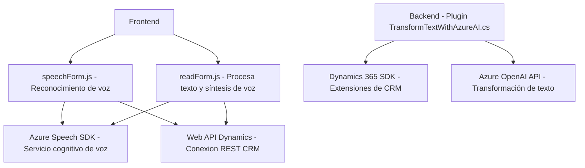

### **Breve Resumen Técnico**
El repositorio presentado implementa una solución compuesta por un **frontend basado en JavaScript** y un **plugin basado en C# para Microsoft Dynamics 365**, ambos integrados con servicios de **Azure** (Azure Speech SDK y Azure OpenAI API). El propósito general es proporcionar reconocimiento de voz, síntesis de texto, transformación en campos de formularios interactivos (frontend) y procesamiento en backend para transformar texto en un formato estructurado (plugin CRM).

---

### **Descripción de Arquitectura**
La arquitectura corresponde a una combinación de patrones:
- **Frontend en n capas:** El código presentado para el frontend utiliza una arquitectura de separación de responsabilidades y modularidad en el manejo de voz y formularios, manteniendo una capa de presentación clara.
- **Backend plugin-oriented:** El plugin de Dynamics 365 en C# sigue una **arquitectura orientada a plugins**, típica de Microsoft Dynamics CRM, donde las extensiones se basan en la interfaz `IPlugin`.
- **Integración orientada a servicios externos:** Utiliza **Azure Speech SDK** para el reconocimiento y síntesis de voz desde el frontend, y **Azure OpenAI API** para el procesamiento de datos desde el backend.
- **Modelo distribuido:** Aunque no es estrictamente una arquitectura de microservicios, la solución depende de múltiples servicios distribuidos como Azure, los cuales se invocan para realizar tareas específicas.

---

### **Tecnologías Usadas**
1. **Frontend:**
   - **JavaScript**: Para el manejo dinámico de elementos del DOM, procesamiento de datos y lógica de negocios en el navegador.
   - **Azure Speech SDK**: Reconocimiento de voz y síntesis de texto-a-voz mediante la API de Azure.
   - **Dynamics 365 Web API**: Usada para conectar el frontend a los entornos de CRM.
   - **Promesas y callbacks**: Patrón utilizado para manejar procesos asíncronos en la carga del SDK y en la interacción con APIs.

2. **Backend:**
   - **C#**: Lenguaje principal del plugin para Dynamics CRM.
   - **Microsoft Dynamics 365 SDK**: Utilizado para implementar personalización en el sistema CRM.
   - **System.Net.Http**: Para el manejo de solicitudes hacia Azure OpenAI.
   - **Azure OpenAI API**: Para procesamiento avanzado y transformación de texto con GPT-4.
   - **System.Text.Json**: Para serialización/deserialización de datos.
   - **Newtonsoft.Json.Linq**: Para manejar datos JSON (marcado como potencial).

---

### **Dependencias o Componentes Externos**
1. **Frontend:**
   - **Azure Speech SDK**: Implementado mediante una carga dinámica del script desde `https://aka.ms/csspeech/jsbrowserpackageraw`.
   - **Dynamics 365 Web API**: Para comunicación con CRM desde el navegador.

2. **Backend:**
   - **Azure OpenAI**: Servicio externo configurado con una API personalizada para transformar texto según normas avanzadas de AI.
   - **Microsoft Dynamics CRM**: Sistema de destino que utiliza el plugin.
   - **Servicios de red y manejo de JSON:** Componentes estándar para interactuar con APIs (Ej. HttpClient, JsonSerializer).

---

### **Diagrama Mermaid**

---

### **Conclusión Final**
La solución presentada es un sistema integrado que combina funcionalidades de interacción de voz en el **frontend**, procesamiento avanzado de texto en el **backend** y personalización de un sistema CRM basado en **Microsoft Dynamics 365**. La arquitectura emplea una combinación de patrones como separación de capas, orientación modular y dependencias de servicios externos distribuibles, adaptándose bien a escenarios híbridos. Esto la hace ideal para entornos empresariales donde voz y AI son esenciales para optimizar procesos de negocio.