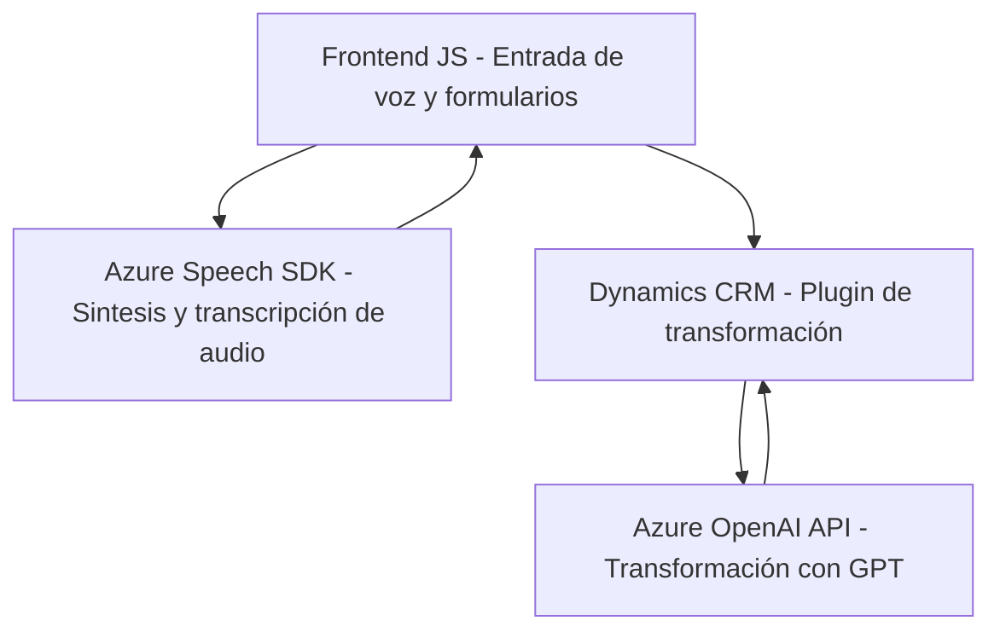

### Breve resumen técnico:
El repositorio propone una solución híbrida que combina un frontend JavaScript con funcionalidades avanzadas de voz (entrada y salida) y un backend basado en un plugin de Dynamics CRM. Estas tecnologías están integradas con servicios de nube como Azure OpenAI y Azure Speech SDK para habilitar reconocimiento de voz, síntesis de audio, y transformación de texto usando inteligencia artificial.

---

### Descripción de arquitectura:
1. **Tipo de solución**:
   - API (plugin en Dynamics CRM).
   - Frontend (JavaScript para manejo de formularios y entrada/salida de voz).
   - Servicios externos (Azure Speech SDK y Azure OpenAI).

2. **Arquitectura**:
   - **Capa frontend**: Modularidad en funciones que manejan los eventos del usuario (voz) y comunicación dinámica con SDK externos.
   - **Microservicios externos**: Uso de Azure OpenAI como procesamiento de texto mediante REST API.
   - **Plugin CRM**: Backend que opera como una lógica central procesadora y exponente REST a la nube.

3. **Patrones empleados**: 
   - **Facade Pattern**: Simplificación de interacciones con Azure Speech SDK en frontend.
   - **Plugin Pattern** (backend Dynamics CRM).
   - **Event-driven Architecture**: Dependencia en eventos asíncronos en el frontend y backend (promesas, callbacks).
   - **Modular Architecture**: Separación de responsabilidades en distintas funciones y clases que integran partes independientes.

---

### Tecnologías usadas:
- **Frontend**:
  - **JavaScript**: Para manejo de DOM y lógica de front-end.
  - **Azure Speech SDK**: Para síntesis y reconocimiento de voz.
  - **Dynamics CRM Forms API**: Interfaz para acceder y modificar formularios integrados en CRM.

- **Backend**:
  - **.NET Framework (C#)**: Para desarrollar el plugin de Dynamics CRM.
  - **Azure OpenAI API**: Para el procesamiento de texto utilizando GPT-4.
  - **Microsoft Dynamics CRM SDK**: Para implementar la lógica del plugin.
  - **Newtonsoft.Json**: Para manipulación JSON.

---

### Dependencias o componentes externos:
1. **Azure Speech SDK**: 
   - Servicio para síntesis de voz y transcripción de entrada hablada.
2. **Azure OpenAI**:
   - REST API que utiliza GPT-4 para transformar texto con reglas específicas.
3. **Microsoft Dynamics CRM**:
   - Servicios para formularios y entidades (@executionContext, Xrm.WebAPI).

---

### Diagrama Mermaid válido:

---

### Conclusión final:
La solución presentada es una arquitectura híbrida entre frontend y backend con integración de servicios en la nube. El frontend, implementado con JavaScript, interactúa directamente con formularios de Dynamics CRM para recolección de datos y habilitación de entrada/salida mediante voz utilizando Azure Speech SDK. Por otra parte, el backend define un plugin que utiliza entidades de Dynamics CRM y delega tareas de procesamiento avanzadas al servicio Azure OpenAI.

El diseño general sigue principios de modularidad, separación de responsabilidades y utiliza patrones como Facade en el frontend y Plugin en el backend. Sin embargo, podría beneficiarse de una aplicación completa de la arquitectura de microservicios, donde varios componentes y servicios en la nube gestionen módulos individuales desacoplados. Esta arquitectura es adecuada para aplicaciones de CRM avanzadas con necesidad de interacción natural y procesamiento inteligente en la nube mediante un manejo eficiente de servicios externos.