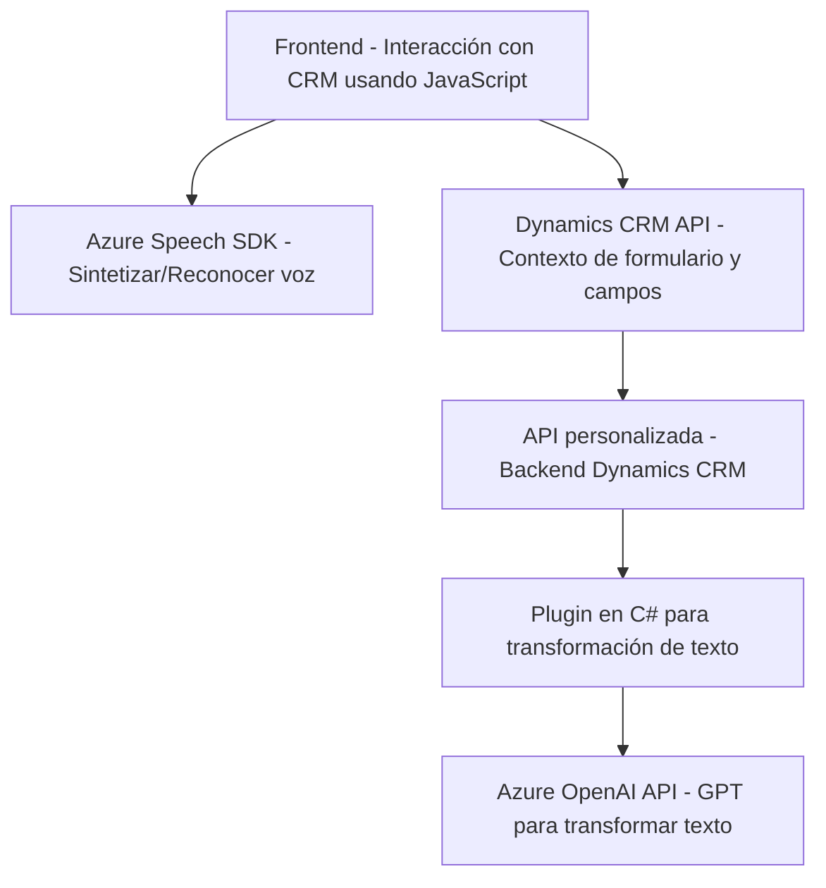

### **Breve resumen técnico**

La solución presentada se basa en tres archivos con objetivos diferentes, aunque relacionados, que integran tecnologías de frontend (JavaScript para Dynamics CRM) y plugins backend (.NET), todos conectándose al servicio de Azure OpenAI y Azure Speech SDK para crear una funcionalidad avanzada de reconocimiento, síntesis y procesamiento de voz, y transformación de texto. A través de estos componentes, se logra manipular formularios y datos en un sistema CRM con presentaciones orientadas al usuario final.

---

### **Descripción de arquitectura**

#### *Arquitectura general:*
- **Multicapa y cliente-servidor:** Los servicios están distribuidos en tres capas:
  1. **Frontend:** JavaScript interactúa con Dynamics CRM desde el navegador.
  2. **Backend:** Plugins en .NET actúan sobre el contexto del servidor.
  3. **Servicios externos:** APIs de Azure (OpenAI y Speech SDK) trabajan como servicios independientes, realizando tareas específicas como transformación de texto y síntesis/reconocimiento de voz.
- **Integración de servicios cloud:** Los componentes interactúan con Azure mediante APIs REST y bibliotecas especializadas, desenfocando responsabilidades específicas del sistema Dynamics CRM.
- **Modularidad:** La solución está dividida de manera clara en unidades de procesamiento autónomas (por ejemplo, reconocimiento de voz, transformación de texto), facilitando el mantenimiento y escalabilidad.

#### *Patrones arquitectónicos:*
- **Patrón fachada:** Los métodos principales en frontend (`startVoiceInput` y similares) actúan como puntos de entrada unificados al flujo de procesamiento.
- **Plug-in pattern:** El sistema utiliza la arquitectura de plugins de Dynamics CRM para automatizar acciones en el backend.
- **Cliente pesado:** La lógica de procesamiento en el frontend (JavaScript) se ejecuta en el navegador.
- **Patrón API Gateway:** Los servicios se integran con APIs de Azure (OpenAI y Speech SDK) como proveedores de procesamiento, delegando tareas específicas fuera del sistema local.
- **MVC implícito:** Dynamics CRM implementa indirectamente reglas de presentación (frontend), negocio (JavaScript y plugins), y servicios (Azure).

---

### **Tecnologías utilizadas**

1. **Frontend:**
   - **JavaScript**: Para lógica en el cliente y manipulación de elementos DOM en Dynamics CRM.
   - **Azure Speech SDK**: Uso tanto para síntesis (producción de audio desde texto) como reconocimiento de voz (transcripción automática).

2. **Backend:**
   - **C#:** Lenguaje utilizado en los plugins de Dynamics CRM.
   - **Microsoft Dynamics SDK (`Microsoft.Xrm.Sdk`)**: Para desarrollo específico de plugins dentro del ecosistema CRM.
   - **Azure OpenAI API**: Transformaciones inteligentes basadas en IA.

3. **Servicios externos:**
   - **Azure Speech SDK**: Integración directa mediante JavaScript.
   - **Azure OpenAI (GPT-4)**: Para la transformación avanzada de texto a datos estructurados en JSON.

4. **Otras tecnologías:**
   - **HTTP Client Libraries**: En .NET para interactuar con APIs REST.
   - **Promise y asincronía (JavaScript)**: Para manejar operaciones complejas como carga de SDK o transcripciones vocales.

---

### **Diagrama Mermaid**

---

### **Conclusión final**

La arquitectura presentada combina tecnologías cloud con capacidades integradas de sistemas CRM, apoyándose fuertemente en APIs externas y un diseño modular con separación de responsabilidades. Aunque la solución es adecuada para construir funcionalidades avanzadas sobre Dynamics CRM, hay áreas que pueden ser mejoradas, como:
1. **Manejo de errores robusto:** Evitar excepciones durante la interacción con APIs externas.
2. **Documentación:** Detallar mejor las configuraciones para entornos de producción (claves de API, seguridad, etc.).
3. **Escalabilidad:** Diseñar un sistema flexible con soporte para más usuarios concurrentes en su interacción con servicios cloud.

En resumen, la solución es eficaz y bien segmentada, pero lograría una mayor extensibilidad con refinamientos en error handling y escalabilidad en las dependencias externas.