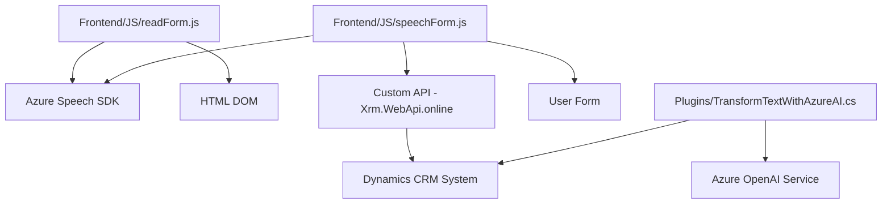
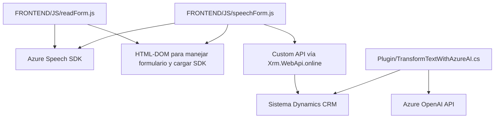

### Análisis del repositorio:
Este repositorio contiene diversas implementaciones distribuidas en archivos que apoyan funcionalidades específicas. Su principal propuesta incluye un frontend relacionado con un formulario, integración con servicios de voz de Azure y un plugin para una plataforma como Microsoft Dynamics CRM que utiliza el servicio de Azure OpenAI.

---

### Resumen técnico:
1. **Tipo de solución:** API, Frontend y Plugin. Este proyecto tiene elementos de frontend y backend, configurados para integración directa con Dynamics 365, y utiliza servicios externos como Azure Speech SDK y Azure OpenAI.
2. **Tecnologías y frameworks:** 
   - **Frontend:** JavaScript, Azure Speech SDK.
   - **Backend (Dynamics Plugin):** C# (.NET Framework), Microsoft Dynamics CRM SDK, Azure OpenAI Service, Newtonsoft.Json y System.Net.Http.
3. **Arquitectura:** Principalmente modular y orientada por componentes, principalmente alineada a un diseño **n-capas** en el backend y **modular** en frontend. Los elementos interactúan mediante APIs bien definidas. El plugin sigue un diseño muy específico para integrarse a Dynamics CRM, usando el patrón de **extensibilidad por plugin** propio de la plataforma.
4. **Componentes/dependencias externas potenciales:**
   - **Azure Speech SDK:** Usado para manejo de síntesis y reconocimiento de voz.
   - **Azure OpenAI API:** Usada para procesamiento avanzado de texto y generación de respuestas en formato definido.
   - **Microsoft Dynamics CRM SDK:** Utilizado en el plugin para integrar los servicios de CRM.
   - **Libraries:** Newtonsoft.Json, System.Text.Json, System.Net.Http.
5. **Diagrama**, que representa la interacción y los flujos generales dentro del sistema:

---

### Descripción de arquitectura:
#### General:
La arquitectura combina un frontend, basado en JavaScript, con servicios de backend que aprovechan extensiones de Dynamics CRM y procesamiento de lenguaje natural (NLP) mediante Azure OpenAI. El flujo de interacción incluye tres capas principales:
   - **Presentación (Frontend):** Procesa datos de usuario mediante interfaz web con formularios y síntesis/reconocimiento de voz.
   - **Negocio (API y lógica interna):** Utiliza plugins para Dynamics CRM y la integración de APIs individuales como Xrm.WebApi.online.
   - **Datos (almacenamiento y transformación):** Recopila y manipula datos de formularios hacia entidades en Dynamics CRM.

#### Diseño:
1. **Frontend:** Arquitectura modular basada en componentes funcionales organizados por responsabilidades (entrada por voz, síntesis de voz). Realiza integración dinámica de librerías como Azure Speech SDK.
2. **Backend:** Complementado por un plugin que sigue el patrón de extensibilidad de Dynamics CRM, y realiza transformaciones extendidas con interacción a través de API RESTful de Azure OpenAI.

---

### Tecnologías usadas:
1. **Frontend:**
   - **JavaScript:** Base de implementación del flujo interactivo de síntesis y reconocimiento de voz.
   - **Azure Speech SDK:** Servicio que habilita capacidades de reconocimiento y síntesis de voz en tiempo real.
   - **Dynamics 365 Interface (formContext):** Usada para la integración directa con los datos dinámicos de la plataforma.
   - **API personalizada:** Servicio adicional utilizado para procesamiento avanzado de transcripciones.

2. **Backend:**
   - **Microsoft Dynamics CRM SDK:** Para la integración al sistema empresarial.
   - **Azure OpenAI Service:** Para procesamiento avanzado de texto con NLP.
   - **C# (.NET Framework):** Lenguaje y framework base de desarrollo del plugin.
   - **Librerías JSON:** Manejo de datos serializados con Newtonsoft.Json y System.Text.Json.
   - **HTTP Client:** Para interactuar con servicios externos como Azure.

---

### Diagrama **Mermaid**:
El diagrama representa los elementos principales del sistema y su relación como componentes integrados.

---

### Conclusión final:
Este repositorio es un claro ejemplo de integración entre un frontend interactivo con servicios como el Azure Speech SDK y un backend extensible basado en Microsoft Dynamics CRM. La arquitectura es modular en sus implementaciones individuales, organizando los componentes en capas de presentación, negocio y datos. La capa de negocio en particular está integrada con servicios externos como Azure Speech SDK y Azure OpenAI API, demostrando la aplicabilidad de patrones modernos como el **Plugin Design Pattern** y **Lazy Loading**. Aunque funcionalmente robusto, es recomendable asegurar mejores prácticas de seguridad, como el manejo de claves API (a través de Azure Key Vault o configuraciones en ambiente).