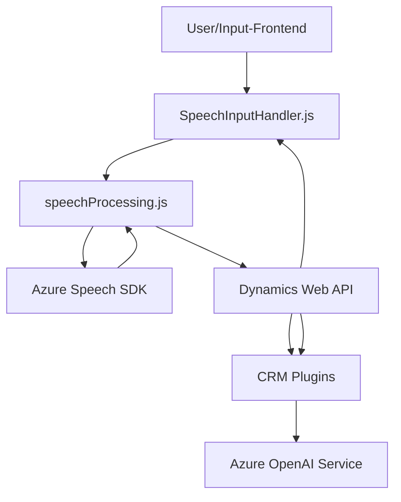

### Breve resumen técnico:
La solución presentada se centra en un sistema que transforma entradas y salidas de voz en datos estructurados para su integración con formularios de Microsoft Dynamics CRM. Utiliza **Azure Speech SDK** para la síntesis y reconocimiento de voz y **Azure OpenAI** para procesar texto en formato JSON estructurado. La funcionalidad incluye accesibilidad mejorada y avances en procesamiento lingüístico.

---

### Descripción de arquitectura:
Aunque la solución no detalla explícitamente una arquitectura macro, podemos concluir lo siguiente:
1. **Frontend (JS):** Funciona como el cliente directo para la interacción del usuario, capturando y procesando voz/texto para su integración en formularios CRM.
2. **Backend (Dynamics CRM):** Plugins de Dynamics CRM procesan y transforman los datos enviados por el cliente (via API o Azure Speech SDK).
3. **Servicios externos:** Se integran **Azure Speech SDK** y **Azure OpenAI Service** para mejorar la interacción y procesamiento de datos.

La arquitectura corresponde a un diseño **n-capas** distribuido:
- **Capa cliente**: Lógica JS interactuando con el navegador.
- **Capa de negocio**: CRM como gestor de datos y procesos.
- **Capa de integración y servicios**: APIs externas como Azure Speech y OpenAI.

---

### Tecnologías utilizadas:
1. **Frontend (JavaScript):**
   - Azure Speech SDK: Reconocimiento de voz y síntesis de texto.
   - Diseño modular en JavaScript para encapsular funcionalidades.
   - Comunicación con Microsoft Dynamics CRM mediante APIs integradas.

2. **Backend (.NET para Dynamics CRM):**
   - Dynamics SDK: Framework diseñado para eventos y extensiones CRM.
   - Azure OpenAI: Procesamiento avanzado de texto mediante REST API.
   - `Newtonsoft.Json` y `System.Text.Json`: Manipulación JSON en .NET.

---

### Dependencias y componentes externos:
1. **Dependencias internas:**
   - Lógica del CRM: Implementado como plugins (eventos predeterminados + extensibilidad).

2. **Dependencias externas:**
   - Azure Speech SDK (https://aka.ms/csspeech/jsbrowserpackageraw).
   - Azure OpenAI Service (https://openai-netcore.openai.azure.com/).
   - API del CRM: Xrm.WebApi para acceder y manipular datos desde formularios.

---

### Diagrama **Mermaid**:

---

### Conclusión final:
La solución utiliza una arquitectura **n-capas** con integración de servicios externos para mejorar la experiencia de usuario y ofrecer accesibilidad avanzada. Su funcionalidad destaca en la transformación de voz a texto y texto a datos estructurados mediante el uso de Azure Speech SDK en el frontend y Azure OpenAI en el backend. La modularidad y el enfoque hacia la integración con Microsoft Dynamics CRM lo hacen especialmente manejable para entornos empresariales orientados a CRM.