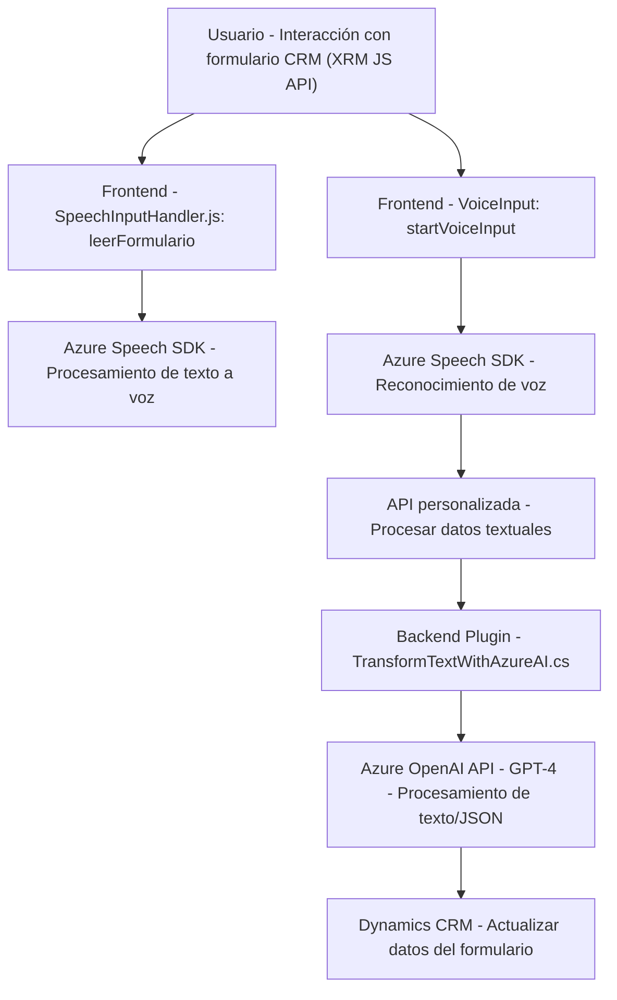

### Breve resumen técnico

La solución parece centrarse en proporcionar funcionalidades relacionadas con el reconocimiento de voz y la generación de texto sintetizado en Microsoft Dynamics CRM, utilizando componentes frontend y backend. Se integran SDKs de terceros (Azure Speech y Azure OpenAI) para manejar la transformación de texto en voz, reconocimiento de voz, y procesamiento inteligente de texto.

---

### Descripción de arquitectura

1. **Arquitectura General**:  
   La solución utiliza una arquitectura híbrida. En el frontend, se observa una arquitectura basada en módulos, donde JavaScript interactúa directamente con formularios de Dynamics CRM. En el backend, el sistema utiliza una arquitectura de plugins típica de Microsoft CRM (monolítica orientada a eventos). La comunicación entre componentes se realiza principalmente mediante APIs para conectarse a servicios externos (SDK para Speech-to-Text, Text-to-Speech, y Azure GPT-4).

2. **Frontend:**
   - La estructura se divide por funcionalidades específicas (`readForm`, `speechForm`) para modularizar tareas como la lectura de formularios y la transformación de texto/vocalización.
   - Los archivos del frontend están diseñados en torno a interacciones directas con formularios de Dynamics CRM mediante la API de JavaScript del sistema (Xrm.WebApi).
   - Uso de servicios distribuidos: el frontend carga dinámicamente el SDK de Azure Speech y consume tanto APIs internas de Dynamics como un servicio de Azure para reconocimiento y generación de texto.

3. **Backend**:  
   - Implementación de un plugin CRM clásico en C# que extiende las capacidades del sistema mediante la interfaz `IPlugin`. Este plugin interactúa con Azure OpenAI para procesar texto según normativas establecidas.
   - Integración realizada vía solicitudes HTTP con autorización mediante API keys.

4. **Patrones de diseño/arquitectura aplicados**:
   - **N capas en el backend:** Separación manejada por CRM entre lógica de negocio, servicios y capa de datos.
   - **Callback y promesas en el frontend:** Uso de asincronía para operaciones que dependen de interacciones en tiempo real con SDKs externos.
   - **Integración API:** Patrón de comunicación entre sistemas mediante REST APIs (Azure Speech SDK y Azure OpenAI API).
   - **Estilo modular:** El frontend presenta código bien modularizado en archivos específicos para sus tareas.

---

### Tecnologías usadas

1. **Frontend:**  
   - Lenguaje: JavaScript.  
   - Framework: Dynamics 365 API (Xrm).  
   - Servicios/SDK:
     - **Azure Speech SDK**: Sintetización de texto a voz y reconocimiento de voz.
     - API personalizada vía Xrm.WebApi.online.execute: Para procesamiento de datos relacionados con lenguaje natural.
  
2. **Backend:**  
   - Lenguaje: C#.  
   - Frameworks/librerías:
     - **Microsoft Dynamics CRM SDK**: Manejo de plugins del lado del servidor.
     - **Newtonsoft.Json / System.Text.Json**: Serialización y manejo de estructuras JSON.
   - Servicios API externos:
     - **Azure OpenAI GPT-4o API**: Procesamiento y transformación de texto.

3. **Dependencias externas:**
   - **Azure Speech SDK**: Para reconocimiento de voz y generación de texto a voz.
   - **Azure OpenAI GPT-4 API**: Para generar respuestas basadas en texto procesado mediante inteligencia artificial.
   - **Microsoft Dynamics 365 SDK** para integración con los datos de CRM.

---

### Diagrama Mermaid válido para GitHub

---

### Conclusión final

La solución combina un frontend interactivo en JavaScript y un backend desarrollado como un plugin en C# para Microsoft Dynamics CRM. El núcleo de la aplicación radica en la integración con servicios externos (Azure Speech SDK y Azure OpenAI API) para procesamiento de voz y texto mediante AI.  

De arquitectura modular y distribuida, con elementos de integración API bien definidos, este sistema destaca por ser altamente extensible. Sin embargo, el uso de servicios externos genera dependencia directa de Azure, lo que requiere una infraestructura bien administrada y configurada para garantizar la disponibilidad y la seguridad de los datos.