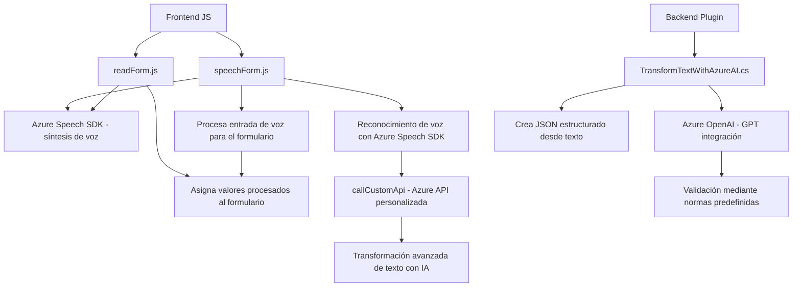

### Breve resumen técnico:
El repositorio contiene soluciones que permiten la integración de tecnologías avanzadas como el **Azure Speech SDK** y **Azure OpenAI** con las funcionalidades específicas del CRM de Dynamics. Los archivos analizados demuestran un enfoque hacia la **automatización por voz** (entrada y salida) y la **transformación estructurada de datos** utilizando servicios cloud basados en inteligencia artificial.

### Descripción de arquitectura:
La arquitectura sigue un enfoque **n-capas** con una ligera influencia en servicios orientados (SOA) debido a la dependencia en APIs externas. Cada funcionalidad está modularizada:
1. **Frontend**: Archivos JavaScript centralizados en la carpeta `FRONTEND/JS`. Estos contienen los métodos responsables de la interacción directa con formularios y servicios externos.
    - Enfoque de procesamiento de entrada/salida basado en voz.
    - Interacción con APIs para obtener y manipular datos desde el cliente.
2. **Backend**: Plugin para Dynamics CRM que ejecuta procesos avanzados de transformación con OpenAI, permitiendo la comunicación entre propósitos empresariales y servicios externos.
    - Modelado de datos.
    - Peticiones a servicios externos (e.g., callCustomApi en el frontend).

El diseño modular de las clases y métodos, las responsabilidades claramente separadas y el uso extensivo de servicios externos revelan una arquitectura orientada a servicios (SOA) aplicada en capas específicas y un patrón de **integración API externa**.

### Tecnologías usadas:
1. **Frontend**:
   - Azure Speech SDK para entrada y salida de voz.
   - JavaScript ES6 para lógica cliente.
   - Carga dinámica de scripts externos.
2. **Backend**:
   - Dynamics CRM como núcleo del ecosistema empresarial.
   - Azure OpenAI para procesamiento avanzado con modelos GPT.
   - Microsoft.Xrm.Sdk y `IPlugin` para integrar plugins dentro de Dynamics CRM.
   - `Newtonsoft.Json.Linq` y `System.Text.Json` para manipulación de datos JSON.
3. **Comunicación con APIs externas**:
   - Azure Speech SDK (para síntesis y reconocimiento de voz).
   - Azure OpenAI GPT API (para procesamiento y generación estructurada de texto).
   - `HttpClient` en el backend para realizar llamadas y manejar respuestas HTTP.

### Diagrama **Mermaid** válido para GitHub Markdown:

### Conclusión final:
El repositorio representa una solución híbrida de automatización manual basada en voz y procesamiento avanzado con capacidades de inteligencia artificial. Esto lo convierte en una opción ideal para contextos empresariales, específicamente en ecosistemas basados en Microsoft Dynamics CRM. La arquitectura balancea modularidad y servicios externos, promoviendo escalabilidad y flexibilidad en implementaciones futuras.

El enfoque n-capas junto con patrones orientados a servicios asegura que la solución esté bien adaptada para grandes aplicaciones empresariales, beneficiándose de la integración con tecnologías de Azure y manteniendo una clara separación de responsabilidades.