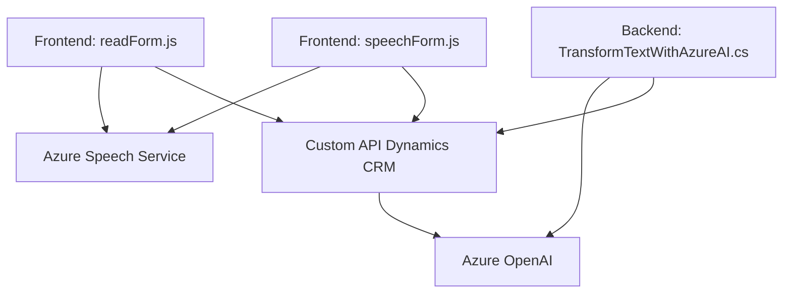

### Resumen Técnico:
El repositorio parece ser parte de una solución configurada para aplicaciones empresariales basadas en Dynamics CRM, con extensiones para permitir reconocimiento y síntesis de voz, además de procesamiento avanzado de texto mediante IA. Está compuesto por un **frontend web**, que interactúa con formularios y utiliza servicios cognitivos de Azure Speech y Azure OpenAI, y un **plugin backend** en Dynamics CRM para la transformación de texto utilizando Azure OpenAI.

---

### Descripción de la Arquitectura:
- **Tipología:** N capas con integración en la nube.
  - **Frontend:** Scripts en JavaScript que permiten la manipulación de formularios y la implementación de síntesis de voz y reconocimiento de voz en tiempo real utilizando Azure Speech SDK.
  - **Backend (Plugin Dynamics CRM):** C# plugin para procesar datos en el contexto del CRM y potenciar la funcionalidad con servicios externos mediante Azure OpenAI.
  - **Servicios externos:** Los módulos interactúan con APIs de Azure Speech y Azure OpenAI, adoptando patrones de interacción cliente-servidor.

- **Patrones observados:**
  - **Delegación de responsabilidades:** `ensureSpeechSDKLoaded` asegura la carga de una dependencia en tiempo de ejecución. El plugin igualmente delega el procesamiento avanzado de texto a Azure OpenAI Services.
  - **MVC-like:** Separación entre lógica de manipulación de datos (modelo), procesamiento de datos (controlador) y representación directa en el cliente (vista).
  - **Desacoplamiento:** Integración clara con APIs y SDKs externos mediante funciones especializadas, con bajo acoplamiento al resto del sistema.

---

### Tecnologías Usadas:
1. **Frontend:**
   - **JavaScript:** Lenguaje para implementar funciones en el navegador.
   - **Azure Speech SDK:** Bibliotecas descargadas dinámicamente para la síntesis y reconocimiento de voz.
   - **Microsoft Dynamics CRM (formContext, Xrm.WebApi):** Frameworks y métodos proporcionados por Dynamics CRM para manipular formularios y campos.

2. **Backend (Plugin):**
   - **C#:** Lenguaje base del plugin.
   - **Microsoft.Xrm.Sdk:** Framework para desarrollos de extensiones dentro de Dynamics CRM.
   - **Azure OpenAI Service (gpt-4o):** API externa para procesamiento avanzado de texto.
   - **JSON Processing Frameworks:** `Newtonsoft.Json` y `System.Text.Json` para generación y manejo de estructuras JSON.

---

### Componentes y Dependencias Externos:
1. **Azure Speech SDK:** Proporciona funcionalidades de síntesis y reconocimiento de voz.
2. **Azure OpenAI Services:** API para procesamiento avanzado de texto con el modelo GPT.
3. **Microsoft Dynamics CRM API:** Contexto para formularios y datos de cliente en tiempo real.
4. **Xrm.WebApi:** Permite comunicar y operar dentro de Dynamics CRM desde componentes frontend.
5. **System.Text.Json / Newtonsoft.Json:** Para la manipulación de datos JSON en los plugins de backend.
6. **HttpClient:** Para la comunicación con APIs externas desde el backend.

---

### Diagrama Mermaid válido para GitHub

---

### Conclusión Final:
La solución implementa una arquitectura de **n capas con fuerte integración en la nube**, usando servicios cognitivos de Azure. Se centra en interfaces modernas que permiten la interacción entre el usuario y un sistema CRM empresarial. A través de JavaScript y C#, se logra el procesamiento eficiente de datos del formulario, reconocimiento de voz, síntesis de voz y transformación de texto mediante IA. La modularidad, permisiva integración, y uso de SDKs indican que la solución está diseñada para ser flexible, escalable y adaptable en entornos corporativos.