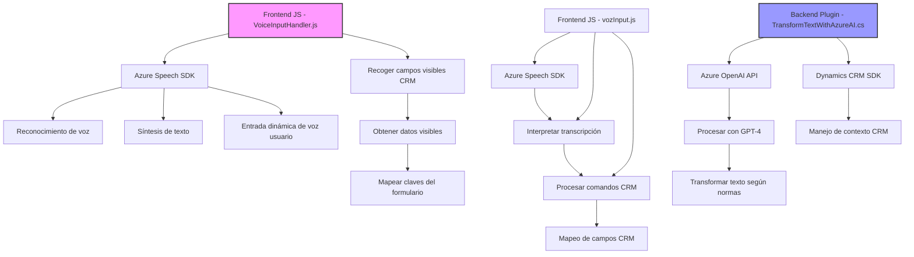

### Breve resumen técnico
El repositorio contiene elementos que interactúan con Dynamics CRM y servicios externos como **Azure Speech SDK** y **Azure OpenAI**. El enfoque se centra en capacidades de reconocimiento de voz, síntesis de texto a voz, entrada de comandos hablados, y procesamiento avanzado de texto. Los archivos combinan conceptos de integraciones API, asincronía y modularización, mientras adoptan patrones aplicables como MVC, Plugin Pattern, y paradigma orientado a eventos.

---

### Descripción de arquitectura
- **Tipo de solución**: La solución es una combinación de **frontend** (procesamiento en el navegador/integración de SDKs externos) y **plugin backend** (Transformación mediante procesamiento de IA).
- **Arquitectura**: Se aplica una arquitectura híbrida:
  - Para los archivos JS: Modelo Cliente-Servidor orientado a procesos en el **frontend**.
  - Para los plugins en C#: **Microservicio** aislado con un **Plugin Pattern** para Dynamics CRM.
- **Patrones destacados**:
  - **Eventos y modularización**: Funciones autónomas que procesan voz, texto, y datos basados en entradas dinámicas del usuario.
  - **Integración directa con SDK/API** como Azure Speech y OpenAI.

---

### Tecnologías usadas
1. **Frontend**:
   - **HTML/JavaScript** para la carga de scripts y SDK dinámicos mediante CDN.
   - **Azure Speech SDK**: Reconocimiento de voz y síntesis de texto a voz.
   - **Dynamics CRM contexto (`executionContext`) APIs**: Integración con los formularios del CRM.

2. **Backend plugins**:
   - C# y **Microsoft Dynamics SDK** (`IPlugin`) para extender funcionalidad del CRM.
   - **Azure OpenAI**: API para transformación avanzada de texto (GPT-4).
   - **Newtonsoft.Json**: Manejo de datos JSON desde las APIs.

3. **General**:
   - **Asincronía**: Promesas y manejo de eventos para procesos en tiempo real.
   - **Dependencia externa**: Los SDK y APIs cargados dinámicamente desde fuentes remotas como Azure.

---

### Dependencias o componentes externos presentes
1. **Azure Speech SDK** (frontend):
   - URL: `https://aka.ms/csspeech/jsbrowserpackageraw`.
   - Funcionalidad: Reconocimiento de voz y síntesis de texto.

2. **Azure OpenAI API** (backend plugin):
   - Usado en transformación de datos textual mediante GPT-4.
   - Clave, endpoint y despliegue configurables.

3. **Microsoft Dynamics CRM Web API**:
   - Para manipular datos y sincronización de formularios con comandos hablados y reconocidos.

4. **JSON & HTTP libraries**:
   - Librerías como `Newtonsoft.Json` y `System.Net.Http` para manejar solicitudes y datos en C#.

---

### Diagrama **Mermaid** válido para GitHub Markdown

---

### Conclusión final
El repositorio está diseñado para ofrecer **funciones avanzadas basadas en voz e inteligencia artificial** dentro de un entorno CRM como Microsoft Dynamics. Combina tecnologías frontend (JavaScript y Azure Speech SDK) y backend (C# y Dynamics CRM SDK) para ofrecer una solución híbrida e integrada. La arquitectura es modular y deseablemente extensible, destacando patrones que optimizan la separación de deberes y la escalabilidad.