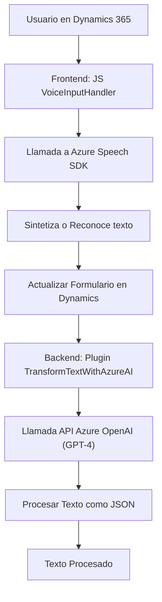

### Breve resumen técnico

El repositorio presentado incluye múltiples archivos que implementan funcionalidades centradas en procesamiento de voz y texto con tecnologías avanzadas como el **Azure Speech SDK** y la **API Azure OpenAI**, integrados principalmente con Microsoft Dynamics 365. El sistema consta de lógica de frontend en JavaScript y extensión backend mediante Plugins de Dynamics CRM para realizar transformaciones de datos.

---

### Descripción de arquitectura

**Tipo de solución:**  
La solución implementa un sistema híbrido que utiliza procesamiento de datos, reconocimiento/síntesis de voz y manipulación dinámica de formularios en Dynamics 365. Es una mezcla de **API**, lógica en **frontend**, y extensión en **backend** mediante **plugins de CRM**.

**Arquitectura:**  
1. El frontend en JavaScript emplea una arquitectura **modular** donde cada archivo encapsula funciones específicas como reconocimiento y síntesis de voz, procesamiento de tramas JSON y actualización de formularios en Dynamics.  
2. El backend (Plugins en `TransformTextWithAzureAI.cs`) sigue el **patrón de arquitectura de plugins** de Dynamics CRM, comunicándose con servicios externos como Azure OpenAI, usando un enfoque clásico de solicitud/respuesta.  
3. En conjunto, ambas capas trabajan en una arquitectura **n-capas** con enfoque hacia la integración. El frontend opera como la capa de presentación y lógica, mientras que los plugins actúan como capa de backend.

**Patrones aplicados:**  
- **Facade:** El frontend JavaScript expone puntos de entrada simplificados (`startVoiceInput` y similares), encapsulando lógica compleja como la carga de SDKs y llamadas API.  
- **Helper Patterns:** Métodos auxiliares pequeños y reutilizables (`applyValueToField`, `getPrimaryNameField`, etc.), implementados para normalizar atributos y reducir acoplamiento.  
- **Integration with External Services:** Uso del **Azure Speech SDK** en el frontend y la API de **Azure OpenAI** en el backend para reconocimiento/síntesis de voz y transformación de texto, respectivamente.

---

### Tecnologías usadas
1. **Frontend**:
   - **JavaScript (ES6)**: Uso de funciones modulares y asíncronas.
   - **Azure Speech SDK**: Reconocimiento de voz, síntesis de texto a voz, cargado en tiempo de ejecución.
   - **Microsoft Dynamics 365 SDK (client-side)**: Para manipulación de datos en formularios usando `formContext`.

2. **Backend**:
   - **C#**: Extensiones de Dynamics CRM basadas en el lenguaje.
   - **Microsoft.Xrm.Sdk**: Biblioteca oficial para interactuar con entornos de Dynamics CRM.
   - **Azure OpenAI API**: Procesamiento de texto con GPT-4.  

3. **Integración REST**:
   - Solicitudes HTTP y manejo de respuestas JSON para la interoperabilidad con servicios externos.

---

### Dependencias y componentes externos
1. **Azure Speech SDK**: 
   - Reconocimiento y síntesis de voz desde JavaScript.
2. **Azure OpenAI API**: 
   - Transformación avanzada de texto con GPT-4 en C#.
3. **Dynamics CRM SDK**:
   - Manipulación directa de objetos, campos y formularios.
4. **Microsoft Libraries**: 
   - `Newtonsoft.Json.Linq` para procesar JSON y realizar mapeo entre objetos.
5. **Various APIs**:
   - Se mencionan APIs personalizadas como `trial_TransformTextWithAzureAI`.

---

### Diagrama Mermaid válido para GitHub

---

### Conclusión final

La solución presentada es una implementación robusta para manejo de datos por voz y texto en entornos empresariales basados en Dynamics 365. La arquitectura modular permite una separación clara de responsabilidades entre frontend y backend, mientras que la integración con servicios externos como Azure Speech SDK y Azure OpenAI facilita la ampliación de funcionalidades avanzadas de IA. Sin embargo, es fundamental abordar preocupaciones de seguridad, como la exposición directa de claves de acceso a servicios externos. Esto puede resolverse mediante variabilización de entorno o configuración segura en el runtime.