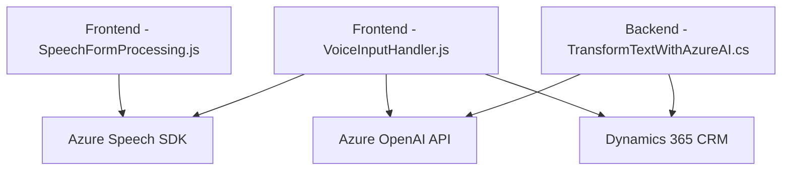

### Breve resumen técnico

El código proporcionado corresponde a una solución combinada que integra funciones de frontend y backend con servicios externos de inteligencia artificial y voz. Los archivos trabajan con:
- **Frontend**: Procesamiento de formularios y comandos de voz utilizando **Azure Speech SDK**.
- **Plugins de Dynamics CRM**: Uso de **Microsoft Dynamics CRM SDK** para transformar texto mediante APIs externas como **Azure OpenAI**.

La solución está diseñada para interactuar con formularios de Dynamics CRM, extraer valores y realizar transformación del texto o síntesis de voz, con enfoque modular y un diseño desacoplado.

---

### Descripción de arquitectura

La arquitectura general se divide en:
1. **Frontend**:
   - Funciona como un **cliente web** que interactúa con los formularios de Dynamics CRM.
   - Procesa datos provenientes de comandos de voz (Azure Speech SDK) y de formularios para enviar información a APIs externas.

2. **Backend**:
   - Implementa plugins en Dynamics CRM que actúan como intermedios entre la lógica empresarial y servicios externos.
   - En este caso, utiliza el **Azure OpenAI API** para procesamientos avanzados de texto.

En general, la solución sigue un **patrón de arquitectura n-capas**:
- **Capa de presentación (frontend)**: Para procesar formularios mediante integración de comandos de voz y servicios externos.
- **Capa de lógica empresarial (plugins)**: Encapsula procesos como transformación de texto y comunicación con servicios de terceros.
- **Servicios externos**: Uso de **Azure Speech SDK** y **Azure OpenAI API** para funcionalidades específicas.

---

### Tecnologías usadas

1. **Frontend**:
   - **Azure Speech SDK**: Para síntesis y reconocimiento de voz.
   - **JavaScript**: Lenguaje base para funciones frontend.
   - **Dynamics CRM API (Xrm.WebApi)**: Para vincular datos procesados con formularios en un sistema CRM.

2. **Backend**:
   - **Microsoft Dynamics CRM SDK**: Para creación de plugins.
   - **Azure OpenAI API**: Procesamiento avanzado de texto mediante integración con inteligencia artificial.
   - **System.Net.Http**: Librería estándar para realizar solicitudes HTTP.
   - **Newtonsoft.Json**: Manipulación del contenido JSON.

---

### Diagrama Mermaid válido para GitHub

---

### Conclusión final

La solución presentada es una **aplicación híbrida** que integra frontend y backend con servicios de terceros. Su diseño modular con una arquitectura n-capas es ideal para un sistema que interactúa con formularios de Dynamics CRM, usando inteligencia artificial y síntesis de voz como servicios externos.

Puntos destacados:
- **Escalabilidad**: Gracias al desacoplamiento entre lógica empresarial y funcionalidades externas.
- **Mantenibilidad**: Modularidad en funciones y componentes proporciona claridad.
- **Potente integración externa**: Uso de Azure Speech SDK y Azure OpenAI para sacar partido de capacidades avanzadas como NLP y síntesis de voz.