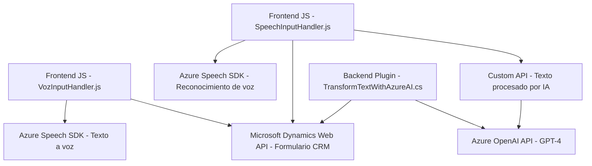

### Breve resumen técnico:
Este repositorio refleja el desarrollo de una solución completa que combina elementos de frontend y backend para interactuar con formularios y APIs mediante comandos de voz y texto. Utiliza Azure Speech SDK para entrada y síntesis de voz, además de Azure OpenAI y Dynamics CRM SDK para procesamiento avanzado de datos y ejecución de acciones en un sistema CRM.

---

### **Descripción de la arquitectura:**
La solución muestra un diseño híbrido:
- **Frontend**: Gestión de voz para comandos hablados y sintetización; implementación por medio de módulos de JavaScript.
- **Backend**: Plugin que interactúa con Dynamics CRM y Azure OpenAI para procesamiento de texto y ejecución de reglas en el CRM.
- **Arquitectura orientada a servicios (SOA)**: Cada componente cumple funciones específicas y se comunica con servicios externos como Azure Speech SDK, Dynamics CRM Web API y Azure OpenAI. Esto refleja modularidad y separación de responsabilidades.

---

### **Tecnologías usadas:**
1. **Frontend**:
   - **JavaScript**: Como lenguaje base para manejar lógica del cliente.
   - **Azure Speech SDK**: Para la entrada de voz y síntesis de texto a voz.
   - **Microsoft Dynamics Web API**: Para integración con datos y capacidades del CRM.
   - **HTML DOM**: Acceso y manipulación de elementos y atributos del formulario.

2. **Backend/Plugin**:
   - **C# (ASP.NET)**: Desarrollo del plugin de Dynamics CRM.
   - **Microsoft Dynamics CRM SDK**: Para construir funcionalidades específicas del CRM.
   - **Azure OpenAI**: Procesamiento avanzado de texto con modelos GPT, integrados vía HTTP API.
   - **Newtonsoft.Json & System.Text.Json**: Manejo de estructuras JSON.
   - **HTTP Client**: Comunicación con API de Azure.

---

### **Patrones y arquitectura identificados:**
1. **Frontend**:
   - **Modularidad**: Cada función o archivo tiene roles específicos.
   - **Cliente-Servidor**: Interacción directa con APIs para acciones específicas.
   - **SDK Wrapper**: Uso de Azure Speech SDK como capa de abstracción.
   - **Asíncronía y eventos**: Carga dinámica de dependencias y ejecución basada en eventos.

2. **Backend**:
   - **Plugin Pattern**: Implementación estándar en Microsoft Dynamics CRM mediante la interfaz `IPlugin`.
   - **Middleware**: Procesamiento intermedio entre entrada del usuario y acciones en el CRM.
   - **Microservicios**: Azure Speech y OpenAI como servicios externos específicos integrados en la solución.

3. **Arquitectura General**:
   - Combinación de arquitectura **n-capas** (frontend y backend) y orientación a servicios con dependencias externas (APIs de Azure).

---

### **Dependencias o componentes externos presentes:**
1. Azure Speech SDK:
   - Synthesis y reconocimiento de voz.
2. Microsoft Dynamics Web API:
   - Lectura y actualización de datos en el CRM.
3. Azure OpenAI:
   - Procesamiento de texto usando GPT-4.
4. JSON Libraries:
   - Manipulación de datos estructurados en el backend.
5. HTTP Client:
   - Comunicación con APIs externas.

---

### **Diagrama Mermaid:**

---

### **Conclusión final:**
La solución es una arquitectura desacoplada orientada a servicios que utiliza tecnologías modernas (Azure Speech SDK, OpenAI y Dynamics CRM API) para crear una capa de interacción avanzada basada en comandos de voz y procesamiento de texto. Su diseño modular e integrada con APIs externas permite escalabilidad y flexibilidad, mientras que el uso de plugins y servicios refuerza la separación de responsabilidades y facilita mantenimiento.