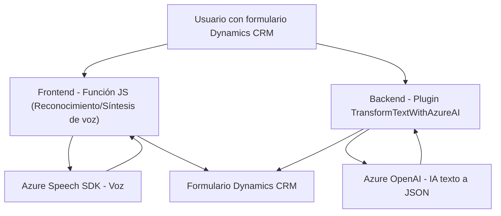

### Resumen técnico

El repositorio alberga una solución integrada que consiste principalmente en un *frontend* basado en JavaScript y un plugin para Dynamics CRM en C#. Las principales funcionalidades incluyen reconocimiento de voz, conversión a texto, síntesis de texto en voz y transformación de texto mediante Azure AI. La solución interactúa con datos de formularios en Dynamics 365 y depende en gran medida de servicios de Azure como el Speech SDK y OpenAI.

---

## 1. ¿Qué tipo de solución es?
Este repositorio desarrolla una herramienta combinada:
- **Frontend interactivo**: Implementa lógica basada en formularios y voz para mejorar la interfaz de usuario.
- **Plugin para CRM**: Extiende Dynamics CRM mediante procesamiento de texto con Azure OpenAI.  
- **Microservicio interno**: La integración con servicios externos como Azure Speech contribuye a operatividad modular.

---

## 2. Tecnologías, frameworks y patrones usados

### **Frontend (JavaScript con Azure Speech SDK y Dynamics API):**
- Azure Speech SDK: Para reconocimiento y síntesis de voz.
- Xrm.WebApi: Interacción directa con formularios de Dynamics 365.
- Lógica modular basada en funciones independientes para procesamiento.
- JSON Mapping: Transforma datos hablados en campos del formulario mediante un mapa dinámico.

### **Backend (C# Plugin para Dynamics CRM):**
- ASP.NET Framework con Microsoft.Xrm.Sdk.
- Azure OpenAI: Como servicio para transformación avanzada de textos.
- HttpClient: Para solicitudes HTTP.
- Newtonsoft.Json: Herramienta para manipulación de objetos JSON.
- Plugin Architecture de Dynamics CRM.
- SOA (Service-Oriented Architecture): Para establecer comunicación con servicios externos.

---

## 3. Tipo de arquitectura
### **Arquitectura global:**
- **Multicapa (n capas) + SOA**:
  - La solución utiliza la *frontend* para interactuar con los usuarios y el backend para procesar lógica extensiva.
  - Dependencia de servicios de Azure (Speech SDK y OpenAI) confirma el patrón orientado a servicios.

### **Componentes distintivos:**
- **Event-driven design**: En el frontend, se asegura que elementos como el SDK se carguen antes de realizar operaciones.
- **Modularidad**: Código dividido en funciones con responsabilidades bien delimitadas.
- **Plugin-based architecture**: En el backend, se utiliza como extensión para CRM, coordinando la lógica relacionada a datos y transformaciones.

---

## 4. Dependencias o componentes externos
- **Azure Speech SDK**: Para reconocimiento y síntesis de voz.
- **Dynamics CRM API/Xrm.WebApi**: Comunicación directa con formularios de Dynamics 365.
- **Azure OpenAI**: Procesamiento avanzado con IA para transformación de texto.
- **Microsoft.Xrm.Sdk**: Librería oficial para desarrollo en Dynamics CRM.
- **Newtonsoft.Json**: Manipulación de JSON en entornos .NET.
- **System.Net.Http**: Para solicitudes al servicio OpenAI.

### **Posibles riesgos asociados:**
- Dependencia de servicios externos (Azure Speech SDK y OpenAI) podría representar puntos únicos de fallo ante errores de conectividad o restricciones del servicio.
- Gestión de claves sensibles (`api-key` de Azure) directamente en código puede exponer información confidencial. Una mejor solución sería usar Azure Key Vault o variables de entorno seguras.

---

## 5. Diagrama Mermaid

---

## Conclusión final
La solución presenta una arquitectura orientada a la integración entre servicios en la nube y Dynamics CRM. El frontend interactivo permite a los usuarios manejar formularios con voz, mientras que el backend asegura procesamiento avanzado de datos mediante Azure OpenAI. Aunque la modularidad y el uso de APIs son puntos fuertes, existe una dependencia significativa en servicios externos, lo que hace crucial garantizar alta disponibilidad y seguridad en los accesos a estos servicios.