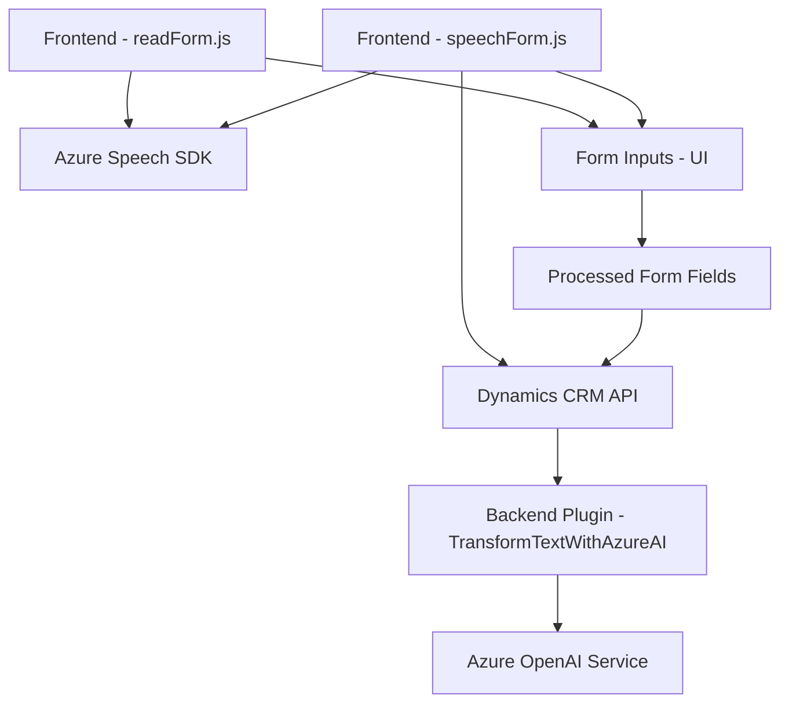

### Breve resumen técnico

El repositorio parece contener tres componentes principales relacionados con la interacción de formularios mediante voz, procesamiento de natural language input y manejo de datos estructurados. Los archivos en el repositorio están distribuidos de la siguiente manera:

1. **`readForm.js`**: Permite convertir información visible de formularios en voz mediante Azure Speech SDK.
2. **`speechForm.js`**: Habilita el reconocimiento de voz usando el Azure Speech SDK y conecta la transcripción con Dynamics CRM para interacción dinámica de formularios.
3. **`TransformTextWithAzureAI.cs`**: Es un plugin de Microsoft Dynamics CRM que conecta directamente con Azure OpenAI Service para transformar texto en objetos JSON estructurados.

La solución es una integración para plataformas CRM con Azure y facilita la accesibilidad y procesamiento de datos mediante reconocimiento de voz y servicios de AI.

---

### Descripción de arquitectura

La solución tiene **propiedades híbridas** de diferentes tipos de arquitectura:
1. **Frontend**:
   - Modular: Cada archivo encapsula funcionalidades específicas para ejecutarse como módulos independientes.
   - Arquitectura por capas: Los archivos JavaScript están separados por lógica de lectura y reconocimiento.
   - Orientado a servicios: Dependencias externas como SDK y APIs externas (Azure Speech y Dynamics CRM).

2. **Backend**:
   - Plugin en **Dynamics CRM** que trabaja como un componente extendido utilizando la arquitectura propia del CRM (basada en eventos).
   - SOA (Service-Oriented Architecture): La integración directa con el servicio de Azure OpenAI implica diseño basado en servicios para delegar funciones específicas fuera del sistema principal.

En conjunto, la solución parece ser una **arquitectura modular multicapas** con integración de servicios (SOA), aprovechando Dynamics CRM como la capa de dominio.

---

### Tecnologías y patrones utilizados

#### **Frontend**
- **Lenguajes/Frameworks:**
  - **JavaScript/ES6** para implementación de lógica en el navegador.
- **SDKs/APIs:**
  - **Azure Speech SDK** para interacción de reconocimiento de voz y síntesis.
  - Dependencias de Dynamics CRM (e.g., `Xrm.WebApi` para llamadas a APIs internas).
- **Patrones:**
  - Modularización: Uso de funciones especializadas para mantener la separación de lógica.
  - Asynchronous programming: Uso de `async/await` para manejar operaciones API y SDK de manera eficiente.

#### **Backend**
- **Lenguajes/Frameworks:**
  - **C#** para la extensión de Dynamics CRM mediante plugins.
  - Dependencias externas como `Newtonsoft.Json` y `System.Net.Http` para manipular y enviar datos.
- **Servicios Externos:**
  - Azure OpenAI Service para procesamiento de texto.
- **Patrones:**
  - **Plugin Architecture:** En Dynamics CRM para extender comportamientos via `IPlugin`.
  - **SOA:** Comunicación con servicios externos usando HTTP/JSON para transformación de texto estructurado.

---

### Diagrama Mermaid válido para GitHub

El diagrama siguiente representa la arquitectura global con un flujo de interacción entre componentes:

---

### Conclusión final

La solución presentada es una arquitectura modular multicapas que integra servicios externos de Azure (Speech SDK y OpenAI) en una plataforma de Dynamics CRM. El uso de JavaScript para frontend e integración con backend en C# mediante plugins permite una conexión fluida entre el reconocimiento de voz, el procesamiento dinámico de formularios y la transformación AI de datos.

Las dependencias externas (Azure Speech SDK, Dynamics CRM API, Azure OpenAI) fortalecen la interfaz del sistema, haciéndolo apto para mejorar interacciones como accesibilidad y procesamiento de información estructurada dentro de entornos corporativos.

La solución destaca por sus principios de modularidad, desacoplamiento, y escalabilidad, haciendo que sea adaptable a futuros requerimientos sin impactar en su arquitectura base.

