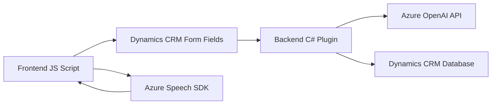

### Breve resumen técnico
El repositorio contiene componentes orientados a integrar funcionalidades de voz, textos y procesamiento avanzado mediante Azure Speech SDK, Dynamics 365 y Azure OpenAI. Los archivos analizados sugieren la implementación de un sistema híbrido que combina frontend para manejo de formularios y voz, lógica de CRM en forma de plugins y procesamiento avanzado de IA utilizando APIs externas.

---

### Descripción de arquitectura
La solución sigue una arquitectura **n-capas** con integración a sistemas externos:
1. **Presentación** (Frontend): Interactúa con usuarios mediante formularios, reconoce voz (Speech SDK) y actualiza datos.
2. **Lógica de negocio** (Plugins de Dynamics 365): Realiza transformaciones, validaciones y conexión con Azure OpenAI para tareas especializadas.
3. **Datos** (Dynamics CRM): Gestión de datos empresariales y almacenamiento de contexto.
4. **Servicios externos**: Azure Speech y OpenAI proporcionan funcionalidades avanzadas como reconocimiento de voz y transformación de texto.

La estructura modular garantiza que cada unidad funcional esté bien definida, con responsabilidades separadas según propósito.

---

### Tecnologías usadas
1. **Frontend**:
   - **JavaScript**: Procesamiento de formularios, detección y síntesis de voz.
   - **Azure Speech SDK**: Reconocimiento de voz y síntesis de texto a audio.

2. **Backend**:
   - **Dynamics CRM Plugins (.NET Framework)**: Extensiones escritas en C# integradas al entorno Dynamics.
   - **Azure OpenAI**: API REST para transformación avanzada de texto usando IA.

3. **Frameworks/Dependencias**:
   - **Microsoft Dynamics SDK (`Xrm.WebApi`)**: Gestión de datos en CRM desde JavaScript y las APIs.
   - **JSON.NET (`Newtonsoft.Json`)**: Procesamiento avanzado de JSON en .NET.

---

### Diagrama **Mermaid** válido para GitHub

---

### Conclusión final
Esta solución 💡 está diseñada para gestionar eficientemente el flujo de interacción entre usuarios humanos, un sistema de CRM empresarial y capacidades avanzadas de IA. La integración de voz (Azure Speech), procesamiento de texto (OpenAI) y manejo de datos en Dynamics refleja una arquitectura inteligente y orientada a la robustez:
- **Ventaja principal:** Modularidad y capacidad de escalar tanto en servicios externos como en lógica interna de negocio.
- **Conclusión:** Se trata de una solución híbrida de **n-capas** que emplea patrones modernos de integración y funcionamiento eficiente en entornos empresariales.