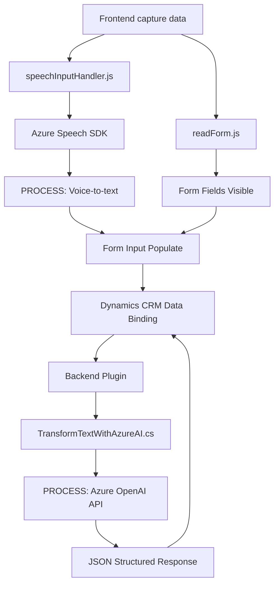

### Breve resumen técnico
El repositorio contiene tres diferentes implementaciones para una solución en un entorno **Dynamics CRM** integrando procesamiento de voz, interacción con formularios dinámicos, y procesamiento textual con Azure AI y Azure Speech SDK. Principalmente, se trata de una solución basada en la integración de **APIs externas**, orientada a enriquecer la funcionalidad de un entorno de CRM mediante transformación de datos y captura de voz.

---

### Descripción de arquitectura
La arquitectura implementada se basa en un esquema de múltiples capas (n capas), con separación de responsabilidades:

1. **Capa de Presentación**:
   - Implementada mediante scripts frontend (**readForm.js**, **speechInputHandler.js**) para capturar datos del formulario y manejar interacción por voz.
   - Uso de **Azure Speech SDK** para sintetizar y reconocer voz en tiempo real.

2. **Capa de Aplicación/Negocio**:
   - Contenido en el plugin **TransformTextWithAzureAI.cs**.
   - Este realiza transformación de texto mediante solicitudes a Azure OpenAI AI.

3. **Capa de Integración**:
   - Integra APIs externas como **Azure Speech SDK**, **Azure OpenAI**, y Dynamics CRM Web API para manejar interacción con formularios y entidades.

La arquitectura general está altamente desacoplada, interoperando mediante APIs y servicios externos, lo que podría ser vista como un híbrido entre **n capas** y servicios externos con microservicios.

---

### Tecnologías usadas
1. **Microsoft Dynamics CRM**:
   - Utilizado como la base del entorno en el que se opera.
   - Integración mediante plugins y herramientas como `IServiceProvider` y `IOrganizationService`.

2. **Azure Speech SDK**:
   - Para reconocimiento de voz y síntesis.

3. **Azure OpenAI Service**:
   - Utilizado para transformar texto mediante IA.

4. **JavaScript**:
   - Scripts que manejan interacción del lado del cliente (capa frontend).

5. **C# (.NET)**:
   - Usado en el backend para integración directa como plugins para Dynamics CRM.

6. **APIs y HTTP**:
   - Constituyen los canales de comunicación principal hacia Azure y otros servicios externos.

7. **JSON**:
   - Estructura utilizada para datos en las integraciones con APIs externas.

---

### Dependencias externas
- **Azure Speech SDK**: Reconocimiento y síntesis de voz.
- **Azure OpenAI Service**: Procesamiento avanzado de texto mediante inteligencia artificial.
- **Microsoft Dynamics CRM Web API**: Manipulación y persistencia de datos dentro de la plataforma CRM.
- **Librerías estándar de C# y JavaScript**: Para manejo de JSON, integración HTTP, y manipulación de elementos dinámicos del formulario.

---

### Diagrama Mermaid válido para GitHub

---

### Conclusión final
El análisis refleja que este repositorio implementa una solución integrada que utiliza reconocimiento de voz, procesamiento textual con IA, y manipulación de formularios dentro de Microsoft Dynamics CRM. La combinación de **frontend dinámico con JavaScript**, **plugins para CRM**, y **APIs externas (Azure Speech + OpenAI)**, junto a patrones de modularización y separación de responsabilidades, demuestra una arquitectura orientada a capas que aprovecha características híbridas de microservicios y entornos externos. Es una solución robusta ideal para escenarios de CRM que requieren interacción mediante voz y lógica enriquecida proporcionada por IA.