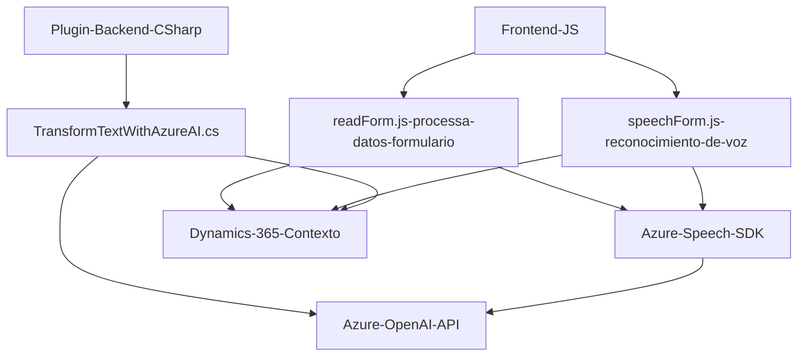

### Breve resumen técnico:
El repositorio está diseñado para ser parte de un sistema que combina formularios dinámicos (probablemente en un CRM como Dynamics 365) con servicios avanzados de inteligencia artificial, específicamente Azure Speech SDK para voz y Azure OpenAI para transformar texto. Implementa características de reconocimiento de voz, síntesis de voz y procesamiento de texto para mejorar la usabilidad y productividad en la manipulación de formularios.

---

### Descripción de arquitectura:
La solución tiene componentes claramente delimitados:
- **Frontend (JavaScript)**: Gestiona lógica relacionada con el reconocimiento y síntesis de voz. Se enfoca en interactuar con formularios, extraer datos visibles y aplicar transformaciones.
- **Plugin Backend (C#)**: Desarrollado como un complemento para Microsoft Dynamics 365, encargado de realizar procesamiento avanzado de texto mediante Azure OpenAI API.

La arquitectura general parece orientada a un modelo de **n capas**, con:
1. **Capa cliente (Frontend)**: Implementa la lógica de entrada y salida de voz, interactuando con el usuario.
2. **Capa de integración**: Gestiona llamadas a APIs de Azure y Dynamics 365.
3. **Capa de negocios (Plugins)**: Aplica reglas y transforma datos para cumplir con los requisitos específicos del sistema.

El sistema no es completamente monolítico ni completamente basado en microservicios. Es un híbrido funcional que divide los roles por capas y responsabilidades, aprovechando modularidad.

---

### Tecnologías usadas:
1. **Frontend (JavaScript)**:
   - Azure Speech SDK: Reconocimiento y síntesis de voz.
   - DOM Manipulation: Para extraer y trabajar con datos de formularios.
   - Dynamics 365 Form Context: Es probable que esté trabajando con formularios del CRM Dynamics.
2. **Backend Plugin (C#)**:
   - Microsoft.Xrm.Sdk: Para interactuar con Dynamics 365.
   - Azure OpenAI API: Integración con GPT-4 para transformar datos textuales provenientes del sistema.
   - Newtonsoft.Json y System.Net.Http: Manejo de datos JSON y petición HTTP segura.
   
Patrones aplicados:
- Modularización: División del código en funciones específicas para mantener la lógica desacoplada.
- Dynamic Dependency Loading: Para cargar SDKs externos en tiempo de ejecución, optimizando recursos.
- API Consumer: Interacción con servicios externos como Azure Speech y Azure OpenAI.

---

### Dependencias o componentes externos:
1. **Azure Speech SDK**: Procesa reconocimiento y síntesis de voz.
2. **Dynamics 365 SDK (`Xrm.WebApi`)**: Manejo de datos del CRM y APIs personalizadas.
3. **Azure OpenAI API**: Modelo GPT-4 para transformar texto según reglas definidas por el usuario.
4. **Visual Studio Tools para Plugins**: Utilizado en la creación del plugin para Dynamics 365.

---

### Diagrama Mermaid:

---

### Conclusión final:
La solución presentada muestra una integración entre el frontend y backend para extender las capacidades de un CRM como Dynamics 365, añadiendo soporte para voz y procesamiento avanzado de texto basado en inteligencia artificial. El diseño implementa patrones claros de modularización y capas, aprovechando servicios externos robustos como Azure Speech SDK y Azure OpenAI API.

Sin embargo, existen áreas de oportunidad, como garantizar que las claves sensibles utilizadas en interacciones con APIs externas se manejen a través de un sistema seguro como Azure Key Vault. En general, esta arquitectura híbrida puede escalar bien con ajustes mínimos, favoreciendo una experiencia de usuario avanzada.