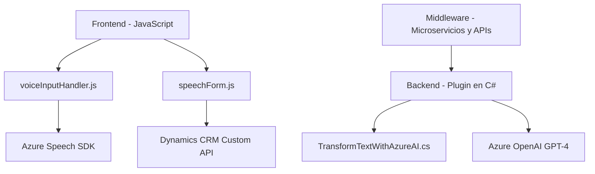

### Breve resumen técnico

Este repositorio contiene tres archivos que interactúan con componentes de **Microsoft Dynamics CRM** y los servicios de **Azure Speech SDK** y **Azure OpenAI**. Su propósito principal es agregar capacidades de voz, inteligencia artificial y procesamiento de texto en el contexto de formularios dinámicos, mejorando la accesibilidad del usuario y las capacidades avanzadas de entrada y transformación de datos con IA.

---

### Descripción de arquitectura

La solución implementa una arquitectura basada en **n capas**. Los componentes se organizan como un frontend (JavaScript para interacción dinámica del usuario), middleware (JavaScript para integración de voz y lógica de cliente) y el backend (plugin en C# conectado a Dynamics CRM). Además, utiliza **microservicios** para la comunicación con **Azure Speech SDK** y **Azure OpenAI**, representando una arquitectura orientada a servicios integrados.

Las principales características incluyen:
- **Frontend dinámico**: JavaScript para interacción en tiempo real con formularios y servicios accesibles.
- **Middleware para dinamismo**: Procesamiento y manipulación de datos en el cliente mediante funciones de JS.
- **Backend especializado**: Plugin de C# acoplado a Dynamics CRM que se comunica con Azure OpenAI para funcionalidades avanzadas mediante modelos GPT-4.

---

### Tecnologías usadas

**Frontend (JavaScript)**
- Tecnologías: JavaScript ES6+, Azure Speech SDK.
- Frameworks o servicios: Dependencia ligera a Dynamics 365 (contexto de forms), Azure Speech SDK.

**Backend (C# Plugin)**
- Lenguaje: C#.
- Tecnologías: Azure OpenAI (API con GPT-4), Microsoft Dynamics CRM SDK.
- Librerías básicas: `Newtonsoft.Json`, `System.Net.Http`, `System.Linq.Expressions`.

**Patrones de diseño utilizados**
- **Modularidad**: Funciones separadas por contexto específico de negocio.
- **Facade**: Puntos de entrada principales que simplifican el uso de múltiples funciones en JavaScript.
- **Service-Oriented Architecture (SOA)**: Integración con APIs externas como Azure Speech y OpenAI.
- **Event-Driven**: Manejo de eventos asíncronos y promesas en JavaScript, complementado con ejecución basada en contexto de plugins en CRM.
- **Pipeline (Secuencia lógica)**: Varias funciones secuenciales que generan datos transformados (e.g., entrada de voz → texto → manipulación en formularios).

---

### Dependencias o componentes externos

**Dependencias externas identificadas**:
1. **Azure Speech SDK**:
   - Indispensable para la entrada de voz y síntesis.
   - URL específica utilizada: `https://aka.ms/csspeech/jsbrowserpackageraw`.

2. **Microsoft Dynamics CRM API**:
   - Manipulación de datos en los formularios, con `Xrm.WebApi.online`.

3. **Azure OpenAI Service**:
   - Utilizado para procesamiento avanzado de texto con reglas específicas (GPT-4).

4. **Librerías estándar**:
   - C#: manejo de JSON (Newtonsoft), HttpClient para solicitudes REST, Dynamics CRM SDK.

5. **Contexto CRM específico**:
   - Integración directa del plugin y funciones JS con esquemas internos de Dynamics CRM como `executionContext`, `formContext`.

---

### Diagrama Mermaid válido en GitHub

---

### Conclusión final

Esta solución representa una implementación robusta que combina dinámicas en el frontend para mejorar la interacción del usuario, procesamiento de datos basado en APIs externas (como Azure Speech y OpenAI) y un backend especializado que manipula dinámicamente datos en Microsoft Dynamics CRM. La arquitectura es clara, orientada a capas (n capas) y utiliza microservicios para ampliar las capacidades principales de solución. Es ideal para agregar accesibilidad y funcionalidad con IA en entornos empresariales.