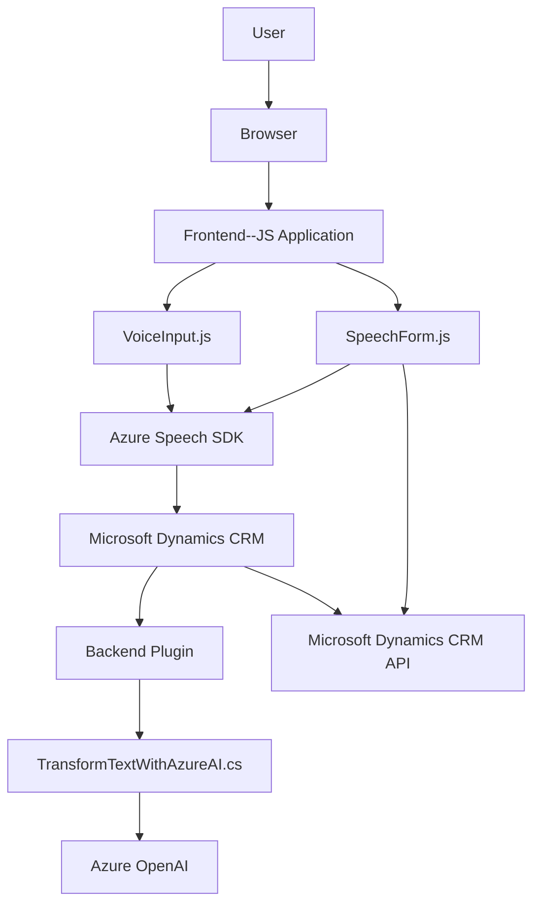

### Breve Resumen Técnico:
El repositorio analiza componentes que parecen ser parte de un sistema orientado a la gestión de entradas de voz y texto en formularios dinámicos, integrado con Microsoft Dynamics CRM y Azure OpenAI. Aborda el tratamiento y mapeo de datos en formularios, síntesis y reconocimiento de voz, y la generación de respuestas estructuradas vía IA.

---

### Descripción de Arquitectura:
La solución adopta una arquitectura **modular** combinada con principios de **n capas**. Los componentes identificados se dividen en tres capas principales:

1. **Frontend**:
   - Gestiona la interacción del usuario.
   - Procesa y muestra datos en base al contexto.
   - Utiliza el **Azure Speech SDK** para síntesis y reconocimiento de voz.
   - Aplica el patrón "Field Mapping" para asignar valores transcritos a campos específicos del formulario.

2. **Backend (Plugins)**:
   - Maneja lógica avanzada para transformación de texto (Azure OpenAI).
   - Ejecuta funciones dentro del ecosistema de Microsoft Dynamics CRM.
   - Enfocado al procesamiento de texto a datos estructurados en formato JSON.
   - Usa APIs externas y servicios como **Azure OpenAI**.

3. **Servicios Externos**:
   - **Azure Speech SDK** para la gestión de voz.
   - **Azure OpenAI** para el procesamiento avanzado de texto.
   - **Microsoft Dynamics Web APIs** para acceder y manipular datos del formulario.

---

### Tecnologías Usadas:
1. **Frontend**:
   - **JavaScript**: Scripts para gestión de lógica en el navegador y lenguaje procedural.
   - **Azure Speech SDK**: Para síntesis y reconocimiento de voz.
   - **Microsoft Dynamics CRM Web APIs**.

2. **Backend**:
   - **C# y .NET Framework**: Implementación de plugins en Dynamics CRM.
   - **Newtonsoft.Json**: Para manipular JSON en .NET backend.
   - **System.Text.Json**: Uso alternativo para serialización/deserialización JSON.
   - **Azure OpenAI**: Servicio de generación de texto estructurado basado en IA.

---

### Diagrama Mermaid compatible con GitHub Markdown:

---

### Conclusión Final:
La estructura de este repositorio sugiere una solución **híbrida n capas**, combinando un frontend rico en funcionalidades que interactúan con un CRM dinámico y dependencias externas en Azure. Los patrones de diseño destacan el uso de modularidad, callbacks y mapeo de campos, mientras que la arquitectura en backend refuerza una separación clara de responsabilidades. La dependencia en servicios externos como Azure Speech SDK y Azure OpenAI asegura funcionalidades avanzadas con mínima sobrecarga en el sistema interno.