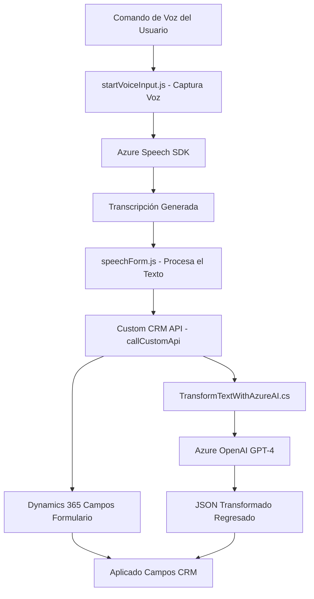

### Breve resumen técnico

El repositorio representa una solución integrada con Microsoft Dynamics CRM, que amplifica sus capacidades mediante el uso de servicios de Azure como Speech SDK y OpenAI (GPT-4). La solución combina procesamiento de texto, síntesis y reconocimiento de voz, así como análisis de texto estructurado en JSON. Esto sugiere que el objetivo es facilitar la interacción de los usuarios con los formularios del CRM a través de comandos de voz y procesamiento inteligente de texto.

---

### Descripción de arquitectura

La arquitectura es **modular y basada en eventos**, diseñada principalmente para ejecutar lógica asíncrona en puntos específicos dentro de Dynamics CRM. A grandes rasgos, la solución podría clasificarse como **Plugins y librerías extendidas** para Dynamics, con integración externa a APIs como Azure Speech SDK y Azure OpenAI.

Por tipo de arquitectura:
- **Monolito extendido**: Los archivos están diseñados como extensiones modulares dentro del CRM, pero todas las operaciones dependen de la infraestructura del sistema central.
- **Integración de servicios externos**: Extiende las capacidades del CRM mediante dependencias externas (operaciones AI y servicios de voz).

---

### Tecnologías usadas

1. **JavaScript (Frontend)**:
   - Usado en la implementación de scripts en formularios CRM para realizar el reconocimiento de voz, procesamiento y transformación dinámica de datos.
   - Framework API de Dynamics 365. (`executionContext`, `Xrm.WebApi`).

2. **C# (Backend)**:
   - Implementación basada en el patrón de Plugins de Dynamics CRM.
   - Integración con servicios REST y OpenAI GPT-4 mediante solicitudes HTTP.
   - Uso de dependencias como `Newtonsoft.Json` y `HttpClient`.

3. **Servicios de Azure**:
   - **Azure Speech SDK**: Para reconocimiento de voz y síntesis.
   - **Azure OpenAI Service**: Gestión de modelos GPT para transformar texto en datos estructurados.

4. **Patrones de diseño**:
   - **Modularidad**: Las funciones están aisladas por roles específicos (reconocimiento de voz, extracción de datos, asignación de valores).
   - **Eventos**: Inicio de procesos mediante interacción del usuario (voz o texto).
   - **Delegación de tareas**: Funciones como `ensureSpeechSDKLoaded` aseguran la ejecución de lógicas secundarias de forma controlada.
   - **Uso de API en cascada**: Las APIs internas y externas se integran para llegar al resultado final.

---

### Dependencias o componentes externos

1. **Azure Speech SDK**:
   - Reconocimiento de voz (asíncrono orquestado por JavaScript).
   
2. **Azure OpenAI API**:
   - Transformación avanzada de texto en JSON estructurado con lógica predefinida.

3. **Microsoft Dynamics 365 (framework)**:
   - Contextos de ejecución del CRM (`executionContext`, `formContext`).
   - API interna para consultas (`Xrm.WebApi.online`).

4. **Bibliotecas de C#**:
   - **Newtonsoft.Json.Linq**: Parseo dinámico de respuestas JSON.
   - **HttpClient**: Consultas REST hacia Azure OpenAI.

---

### Diagrama Mermaid válido para GitHub

---

### Conclusión final

La solución es una extensión funcional para Microsoft Dynamics CRM que usa tecnologías modernas como reconocimiento de voz (Azure Speech SDK) y procesamiento de lenguaje natural (Azure OpenAI GPT-4). Representa un **modelo híbrido entre monolito extendido y arquitectura de integración de servicios**, donde la lógica principal se ejecuta dentro del CRM, pero se complementa con servicios externos. 

Las dependencias externas (Azure Speech y OpenAI) brindan una capacidad avanzada para automatizar tareas, mejorar la interacción del usuario con formularios y procesar comandos en tiempo real.