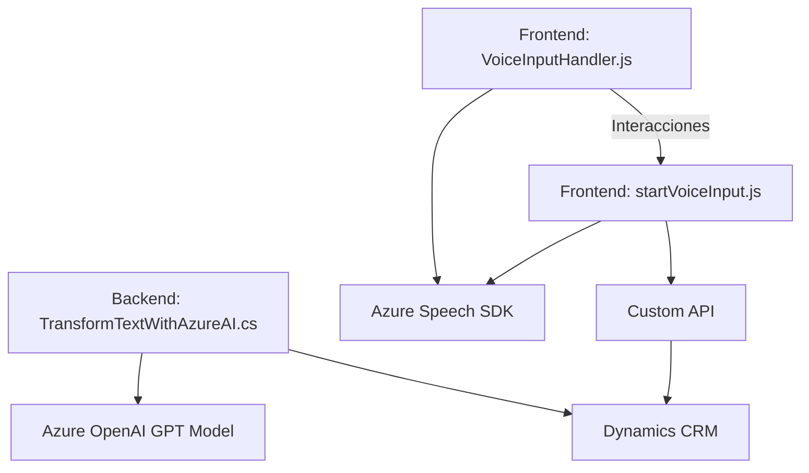

### Breve Resumen Técnico:
El repositorio analizado contiene archivos que implementan funcionalidades específicas en dos principales componentes: un **frontend** para procesamiento de formularios y entrada/salida de voz, y un **plugin de Dynamics CRM** que interactúa con **Azure OpenAI GPT models**. La solución parece estar diseñada para mejorar la interacción con formularios mediante comandos de voz y síntesis, así como para realizar transformación avanzada de datos utilizando inteligencia artificial.

---

### Descripción de Arquitectura:
La solución sigue un enfoque modular basado en una arquitectura híbrida, optimizada para integración con sistemas externos. Las principales características son:

1. **Frontend**:
   - Implementado en JavaScript, enfocado en la interacción mediante voz y la visualización/actualización de formularios.
   - Utiliza el patrón modular con división de responsabilidades (funciones pequeñas dedicadas a tareas específicas como obtención de datos del formulario, transcripción de voz, síntesis, etc.).
   - Incluye llamadas a servicios externos como **Azure Speech SDK** y, potencialmente, una **Custom API** alojada en Dynamics CRM para la integración.

2. **Backend Plugin (Dynamics CRM)**:
   - Basado en la arquitectura de **Plugins de Dynamics CRM**, este componente actúa como un "microservicio" dentro del entorno CRM y extiende las funcionalidades del sistema.
   - Consume modelos de IA y servicios REST como **Azure OpenAI GPT models** para transformar texto en JSON estructurado.

3. **Tipo de arquitectura**:
   - **Modular**: Cada archivo cumple con tareas específicas y funcionan de manera independiente.
   - **API-Centric Microservice**: Los componentes interactúan principalmente con servicios externos mediante APIs (Speech SDK, OpenAI) que actúan como proveedores de funcionalidades.
   - **Contextual Layers** para vinculación de frontend-backend y adaptación de datos a contextos de formularios dinámicos.
   - No se observa evidencia de una arquitectura hexagonal o basada en eventos complejos; el diseño se basa en integraciones directas con APIs.

---

### Tecnologías Usadas:
#### Frontend:
- **JavaScript**
- **Azure Speech SDK** - Speech-to-text y text-to-speech funcionalidades.
- **DOM Manipulation** para cargar recursos dinámicamente (script del SDK).

#### Backend Plugin:
- **.NET Framework** - Plugin para Dynamics CRM.
- **Microsoft.Xrm.Sdk** - SDK de Dynamics CRM.
- **Azure OpenAI GPT models** - API de OpenAI.
- **HttpClient** - Integración con páginas externas vía HTTP, utilizando RESTful.

#### Patrones y prácticas:
- Promesas y programación asíncrona para el manejo de flujos no bloqueantes.
- Modularidad: Código dividido en funcione específicas.
- Delegate Pattern: Uso de `callback` condicional.
- API Consumption: Comunicación entre módulos y servicios.
- Usos de factory - y servicio como adaptador - para transformar datos con un propósito específico.

---

### Diagrama Mermaid (complementando toda la solución):
Aquí está el gráfico que describe la relación entre los componentes y dependencias:

Esta representación muestra:
- **Interacción directa** entre los archivos principales del **frontend** (VoiceInputHandler.js para síntesis de voz y extraction, y startVoiceInput.js para reconocimiento de voz y relación con datos en los formularios).
- Dependencias claras con servicios REST externos como **Azure Speech SDK** y la API **OpenAI GPT**.
- Vinculación de los plugins Dynamics CRM (backend) con datos procesados por los modelos de GPT y su funcionalidad extendida de transformación JSON.

---

### Conclusión Final:
La solución representa un sistema híbrido que mezcla tecnología frontend (JavaScript) con una capa backend basada en plugins y comunicación API con ecosistemas como Dynamics CRM y Azure (Speech+AI). La arquitectura modular facilita mantener la separación de preocupaciones entre componentes individuales y escalar de forma independiente. No obstante, se podría estandarizar más opciones de seguridad (como mejores prácticas en el uso de claves de API), y, dependiendo del nivel de interacción del frontend con el backend, evaluar qué funciones repetir o unificar. La elección de Azure como proveedor externo parece bien justificada dado el uso intensivo de speech-to-text y AI models (GPT).