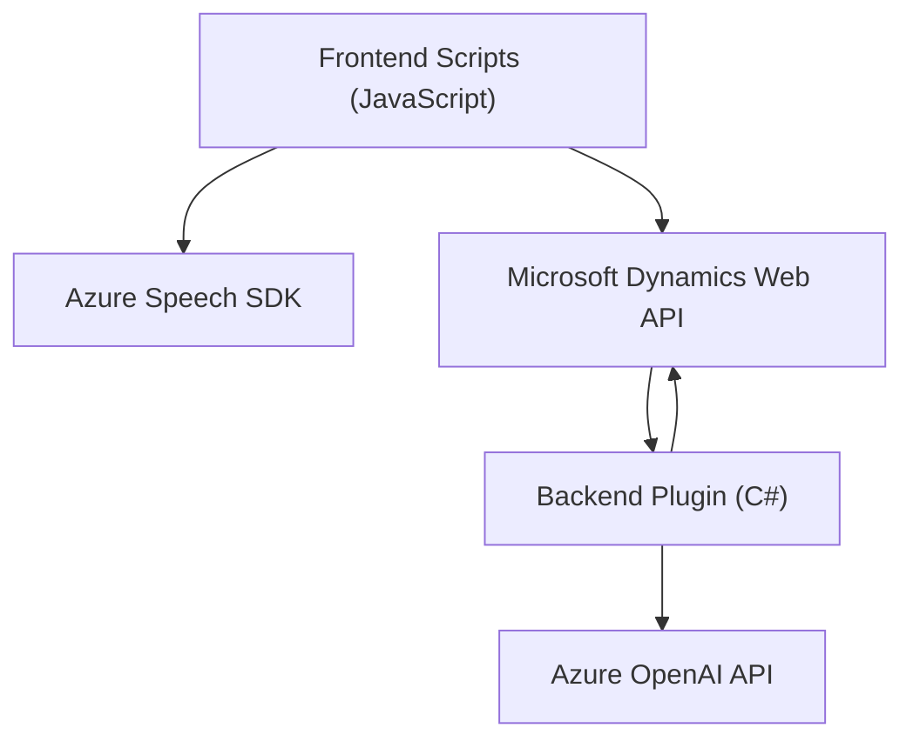

### Breve resumen técnico
El repositorio analiza una solución destinada a integrar reconocimiento de voz, síntesis de texto a voz y procesamiento basado en IA en formularios CRM (Customer Relationship Management). Combina funcionalidades en el frontend (JavaScript) para interacción dinámica y un plugin backend (.NET) que opera con servicios de Azure OpenAI.

---

### Descripción de la arquitectura
La solución sigue una **arquitectura cliente-servidor** con enfoque en comunicación entre capas mediante APIs y SDKs. La arquitectura principal es **n-capas**, separando la lógica de presentación (frontend), negocio (procesamiento de texto en CRM plugin) y servicios externos (Azure Speech SDK y OpenAI). El contexto CRM actúa como el núcleo para el manejo de datos y eventos.

Puntos clave de la arquitectura:
- **Frontend**: Scripts JavaScript procesan entradas dinámicas (voz, formularios) mediante la Azure Speech SDK y envían o reciben datos desde el backend y APIs.
- **Backend plugin**: Extiende Microsoft Dynamics CRM para procesar datos con Azure OpenAI.
- **Comunicación por API**: Se realizan llamadas HTTP hacia servicios como Azure Speech y OpenAI, el backend consume y estructura dichos resultados para el sistema CRM.

---

### Tecnologías usadas
#### Lenguajes y frameworks:
1. **Frontend**: 
   - JavaScript (modularizado).
   - Azure Speech SDK: Reconocimiento de voz y síntesis de texto a voz.
   - Microsoft Dynamics Web API (`Xrm.WebApi`): Para comunicación con registros CRM.
2. **Backend**: 
   - C# (.NET Framework), específico para plugins en Dynamics CRM.
   - Azure OpenAI API (GPT): Para procesamiento avanzado de texto.
   - Newtonsoft.Json y System.Text.Json: Serialización y deserialización de datos JSON.

---

### Dependencias o componentes externos
1. **Azure Speech SDK**:
   - Para síntesis de voz y reconocimiento desde el frontend.
   - Utiliza credenciales de azureKey y azureRegion.
2. **Azure OpenAI API**:
   - Procesa entradas textuales (este servicio requiere configuraciones precisas de API Key y modelo).
3. **Microsoft Dynamics CRM Web API**:
   - Maneja actualizaciones y consultas de datos en formulario CRM.
4. **Plugins e interfaces de Dynamics CRM**:
   - `IPlugin` y `IOrganizationService`.
5. **Libraries**:
   - `Newtonsoft.Json.Linq`.
   - `System.Text.Json`.
   - `System.Net.Http`.

---

### Diagrama Mermaid del flujo arquitectónico

---

### Conclusión final
La solución implementa una **arquitectura n-capas** en la que el frontend interactúa directamente con servicios avanzados como Azure Speech SDK para capacidades de voz y Dynamics Web API para actualizar formularios CRM. El plugin backend amplía la funcionalidad del sistema CRM para delegar tareas sofisticadas de procesamiento textual a servicios como Azure OpenAI. Destaca por su modularidad y la separación clara entre interfaz de usuario, lógica de negocio y servicios externos.

La integración con servicios Azure y CRM lo convierte en una solución robusta, escalable y adaptable a flujos empresariales que requieren procesamiento avanzado de datos y técnicas de inteligencia artificial.