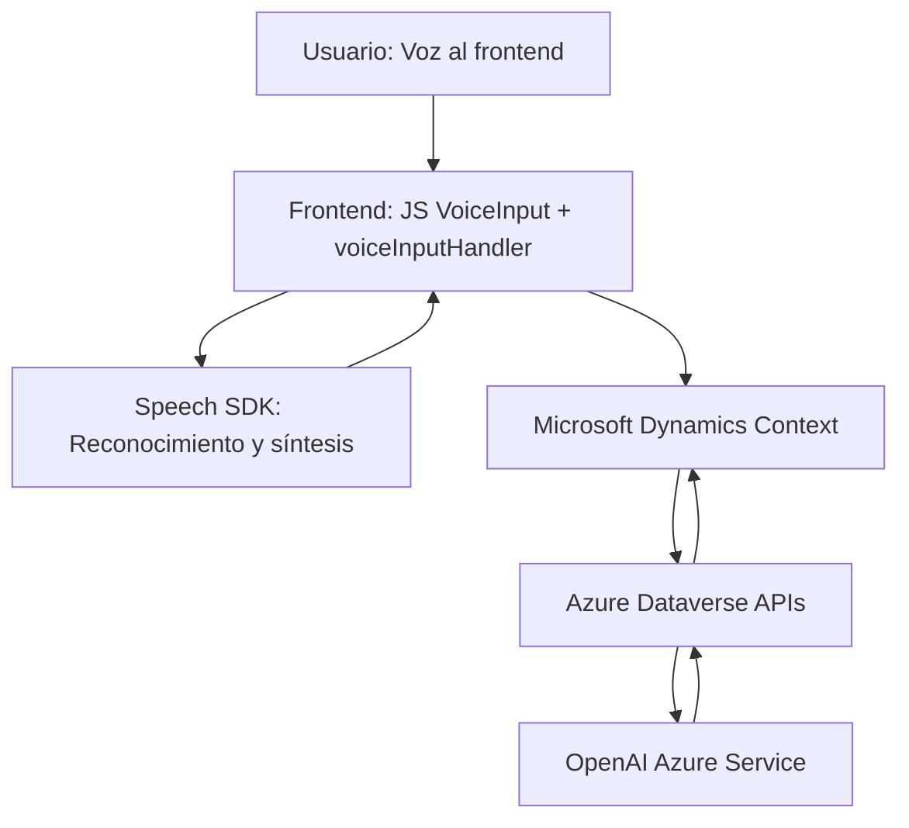

### Breve resumen técnico
El repositorio presenta una solución que integra diversos componentes enfocados en la **captura, síntesis y procesamiento de datos** mediante voz interactuando con servicios externos de **Microsoft Azure** y **Dynamics CRM**. Además, usa un plugin para realizar transformaciones adicionales mediante **Azure OpenAI**. La solución comprende dos principales componentes:

1. **Frontend de JavaScript**: Responsables del manejo del procesamiento de datos en formularios y reconocimiento de voz.
2. **Plugin Backend en C#**: Responsable de transformar datos textuales mediante un servicio de inteligencia artificial.

---

### Descripción de arquitectura
La solución sigue un enfoque **event-driven** en el frontend y se basa en **Service-Oriented Architecture (SOA)** al delegar tareas especializadas a servicios externos como Speech SDK y Azure OpenAI. 

La arquitectura general indica la interacción de tres capas principales:
1. **Frontend**: Encargada de capturar voz, realizar síntesis y brindar una experiencia de usuario en la interfaz.
2. **Backend Plugin API**: Ejecuta transformaciones avanzadas en datos con Azure OpenAI.
3. **Servicios externos**:
    - Speech SDK: Reconocimiento y síntesis de voz.
    - Azure OpenAI (GPT) para análisis semántico y modelos de transformación.

Aunque se integra muy bien con Microsoft Dynamics CRM, no ofrece una arquitectura típica de CRM, sino una solución **orientada a servicios modulares**.

---

### Tecnologías usadas
1. **Frontend:**
   - **JavaScript**: Base del frontend para manipular DOM, formularios y ejecutar lógica.
   - **Azure Speech SDK**: Reconocimiento y síntesis de voz.

2. **Backend (Plugin)**:
   - **C#**: Para el desarrollo del plugin.
   - **Microsoft.Xrm.Sdk**: Framework central de plugins en Dynamics CRM.
   - **Azure OpenAI Service**: Modelo GPT para procesamiento y transformación avanzada mediante solicitudes HTTP.

3. **General**:
   - **Microsoft Dynamics CRM Context**: Para manejo de formularios, entidades y usuarios en el modelo CRM.
   - **RESTful APIs**: Para integración con Speech SDK y Azure OpenAI.

---

### Diagrama Mermaid válido para GitHub

---

### Conclusión final
Esta solución parece estar diseñada para **interacción avanzada basada en voz** en el contexto de Microsoft Dynamics CRM. Utiliza tecnología puntera como **Azure Speech SDK** y **OpenAI** para permitir una experiencia vocacional con soporte para inteligencia artificial. 

La arquitectura modular, basada en servicios, facilita la distribución de responsabilidades, separando claramente el manejo del frontend y backend mientras delega tareas específicas a servicios externos. Además, emplea el **patrón de cliente-servidor** y tecnologías modernas como SDK y APIs que hacen que sea fácil de escalar e integrar en soluciones empresariales más amplias.