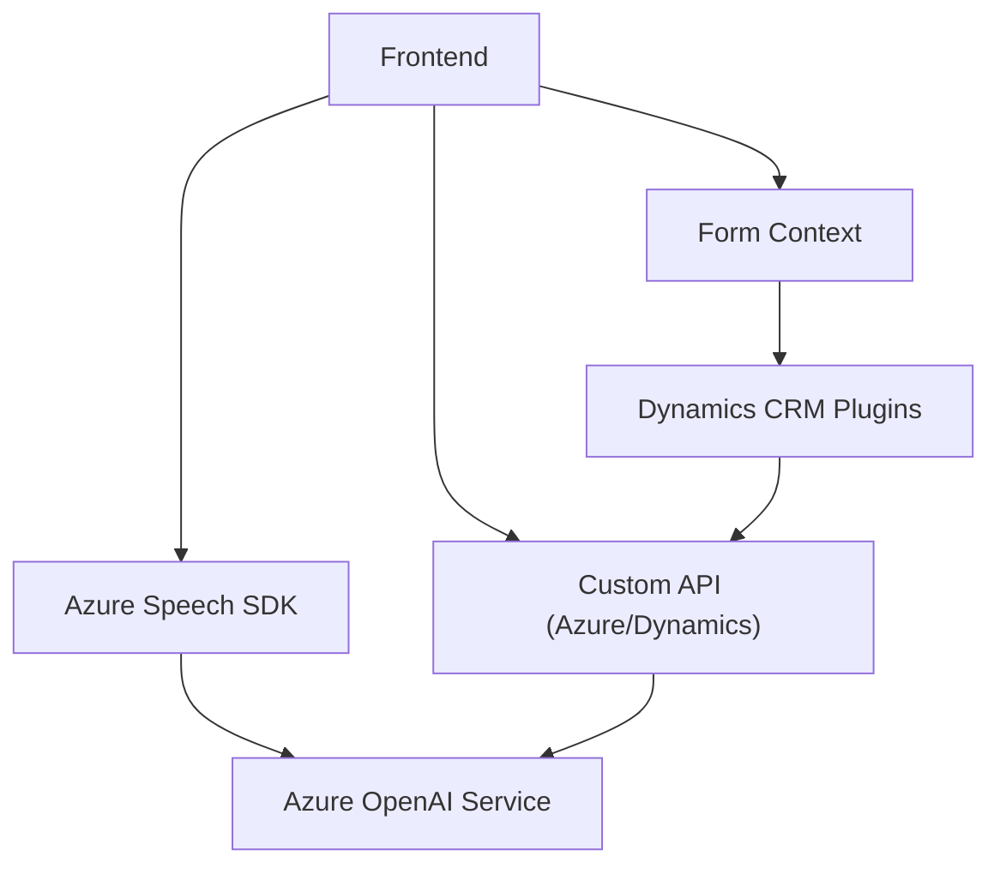

## Breve resumen técnico

Este proyecto se centra en la integración del servicio **Azure Speech SDK** y el **Azure OpenAI Service** con Microsoft Dynamics CRM. Utiliza tecnologías de reconocimiento de voz (speech-to-text), síntesis de voz (text-to-speech) y procesamiento avanzado de texto mediante IA. Tiene funcionalidades variadas como entrada de voz, síntesis de palabras, manipulación de datos en formularios y transformación de texto contextualizado con normas personalizadas.

---

## Descripción de arquitectura

La arquitectura principal del proyecto utiliza un modelo **cliente-servidor** combinado con prácticas derivadas de **Service-Oriented Architecture (SOA)**. El frontend se basa en JavaScript, interactuando con Azure SDKs y APIs externas, mientras que el backend implementa extensiones de Microsoft Dynamics CRM a través de plugins en C#. 

En más detalle:
1. El frontend usa una arquitectura basada en eventos y modularidad, permitiendo procesos asincrónicos como reconocimiento y síntesis de voz.
2. El backend amplía la funcionalidad de Dynamics CRM mediante una **arquitectura plugin**, basada en la creación de clases que implementan la interfaz `IPlugin`.
   
Patrones destacados:
- **Facades**: En el frontend, varias funciones actúan como puntos de entrada unificados para procesos como reconocimiento de voz o síntesis de datos.
- **Plugin Pattern**: El archivo backend implementa este patrón para Dynamics CRM siguiendo la estructura que define Microsoft.
- **Service-Oriented Interaction**: Usa servicios externos (Azure Speech y OpenAI) para sintetizar voz de texto y transformar datos.

---

## Tecnologías usadas

1. **Lenguajes principales**:
   - **JavaScript/ES6**: Para las interacciones cliente y manipulación DOM.
   - **C#**: Para extensiones y plugins en Dynamics CRM.

2. **Frameworks y servicios**:
   - **Azure Speech SDK**: Reconocimiento de voz y síntesis de texto a voz.
   - **Azure OpenAI Service**: Generación de texto estructurado mediante IA.
   - **Microsoft Dynamics SDK**: Base para desarrollar plugins y manejar datos.

3. **Dependencias**:
   - **Newtonsoft.Json**: Manipulación avanzada de JSON.
   - **HTML API**: Manipulación DOM y carga de scripts SDK en frontend.
   - **Xrm.WebApi**: Realización de llamadas a APIs REST dentro de Dynamics.

---

## Diagrama Mermaid válido para GitHub

Se representa la estructura modular y el flujo de integración entre componentes backend y frontend.

---

## Conclusión final

Este proyecto combina tecnologías modernas de reconocimiento y síntesis de voz con procesamiento avanzado mediante IA, vinculadas al sistema Dynamics CRM para mejorar la interacción con sus formularios en tiempo real. La arquitectura está basada en una combinación de modularidad, orientación a eventos en el frontend, y plugins en el backend. La dependencia de servicios externos (Azure) refuerza la capacidad del sistema para operar en un contexto **Service-Oriented Architecture**, siendo ideal para soluciones empresariales personalizadas orientadas a la automatización y accesibilidad.