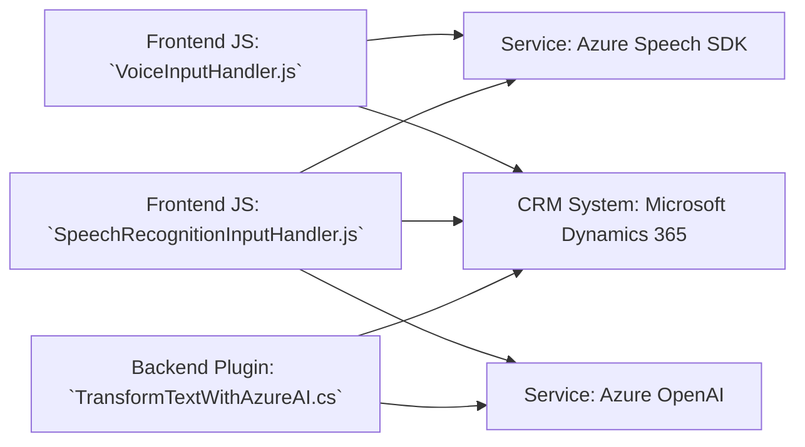

### Breve resumen técnico

La solución presentada parece ser una implementación combinada que integra funcionalidades de un **frontend en JavaScript** y un **backend para Dynamics CRM**, con el objetivo de procesar datos de formularios y habilitar la interacción por voz y transformación textual mediante servicios de Azure (Azure Speech SDK, Azure OpenAI). Los archivos forman parte de una solución híbrida que optimiza accesibilidad y eficiencia, proporcionando interfaces para lectura de formularios, transcripción de comandos de voz, y procesamiento avanzado de texto.

---

### Descripción de arquitectura

#### Tipo de solución
La solución abarca **frontend (JavaScript)** y **backend (C#)** y está orientada al uso en entornos CRM (Dynamics 365). Se clasifica como una arquitectura que permite la interacción entre un usuario y un CRM mediante funcionalidades relacionadas con la voz, comandos personalizados y herramientas de IA.

#### Arquitectura
La solución global utiliza una arquitectura **n capas** compuesta por:
1. **Frontend**: Lógica en JavaScript para interacción con el navegador (voz, síntesis, reconocimiento). Provee integración dinámica con datos de formularios.
2. **Backend (plugin)**: Implementa lógica empresarial en el contexto de Dynamics CRM mediante la ejecución de plugins, con integración de **Azure OpenAI** como servicio de tercera capa.

Adicionalmente:
- En el frontend se observa modularidad, separación de responsabilidades y un enfoque orientado a eventos.
- El backend se basa en el cumplimiento de patrones de plugins diseñados para Dynamics CRM.

Esta mezcla permite que tanto el manejador de voz como el transformador de texto estén integrados en una solución accesible y adaptable.

---

### Tecnologías usadas

1. **Frontend (JavaScript)**:
   - **Azure Speech SDK**: Reconocimiento y síntesis de voz.
   - APIs del navegador (DOM, `window`, etc.).
   - Interacción directa con formularios Dynamics 365 (`formContext`).

2. **Backend (C#)**:
   - **Microsoft Dynamics CRM SDK**: Implementación de plugins (`IPlugin`), manejo de entidades de CRM.
   - **Azure OpenAI**: Transformación textual avanzada usando IA.
   - .NET Core:
     - `System.Net.Http`: Llamadas al servicio REST.
     - `System.Text.Json`: Manipulación de datos JSON.

#### Patrones usados:
1. **Modularidad**: Separación de lógica en funciones específicas para facilitar reutilización.
2. **Event-driven Architecture** (en frontend y backend): Procesos activados por eventos de entrada (voz en JavaScript, ejecución de plugins en CRM).
3. **Plugin Architecture** (backend): Lógica encapsulada bajo la interfaz `IPlugin`, diseñada para ser ejecutada en el contexto del sistema CRM.
4. **API Gateway**: Integración directa con servicios externos (Azure Speech API, Azure OpenAI).

---

### Dependencias o componentes externos

1. **Azure Speech SDK**: 
   - Para reconocimiento de voz, síntesis y reproducción de texto como audio.
   - Cargado dinámicamente en los scripts de frontend.

2. **Azure OpenAI**: 
   - Integrado en el plugin para transformar texto en formatos JSON estructurados.
   - Endpoint en REST API.

3. **Xrm.WebApi**:
   - Usado en las funciones de frontend para interactuar con el backend Dynamics CRM (obtener registros y manejar datos del formulario).

4. **Dinámica de formularios**:
   - `formContext`: Proporciona detalles sobre los datos y atributos visibles del formulario en el contexto web.

5. **APIs del navegador**:
   - Facilitadas por JavaScript, como `document`, `window`, para operaciones dinámicas en la interfaz gráfica.

---

### Diagrama Mermaid

---

### Conclusión final

La solución presentada implementa una arquitectura **modular de n capas**, adecuada para la integración de funcionalidades avanzadas de voz y procesamiento de texto mediante IA en entornos CRM como Dynamics 365. La estructura permite extender las capacidades tradicionales de un CRM al habilitar interacción por comandos de voz y transformación textual dinámica, mejorando la accesibilidad y productividad. Es una combinación robusta de tecnologías de frontend, backend y servicios externos como Azure Speech SDK y Azure OpenAI.

La implementación es técnica y alineada con estándares modernos de desarrollo, adaptándose a un entorno empresarial y productivo donde el manejo de datos dinámicos y accesibilidad son clave.