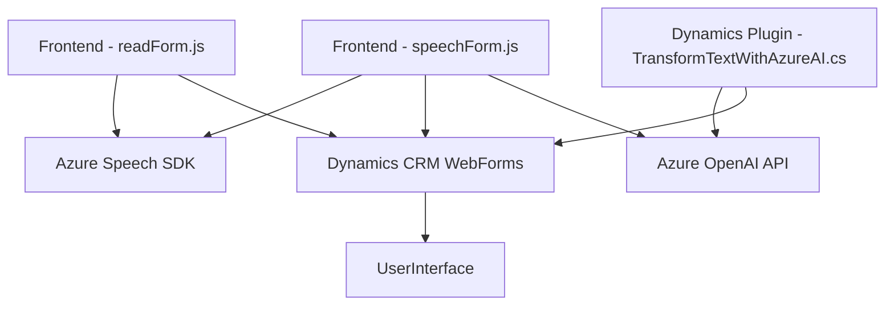

# Análisis técnico del repositorio

### **Breve resumen técnico**
El repositorio contiene archivos pertenecientes a un sistema desarrollado sobre **Microsoft Dynamics CRM** que utiliza **Azure Speech SDK** y **Azure OpenAI** para interactuar con formularios mediante reconocimiento de voz y generación de texto transformado. Los archivos **JavaScript y C#** se enfocan en manipular datos en formularios y conectar con APIs externas para implementar funcionalidades avanzadas.

---

### **Descripción de arquitectura**
La arquitectura utiliza una combinación de las siguientes características:
1. **Estilo de Microservicios Internos:** La lógica está segmentada en archivos individuales y localizados para realizar tareas específicas que interactúan de manera modular.
2. **Arquitectura n-capas:** Organización por capas en la que los componentes de presentación (frontend), lógica de negocio (C# plugins) y servicios externos (APIs de Azure OpenAI y Speech SDK) están separados y conectados mediante llamadas HTTP y SDKs.
3. **Patrón de comunicación síncrona y asincrónica:** Uso de promesas en JavaScript y llamadas cliente-servidor en el plugin C#.

---

### **Tecnologías usadas**
1. **Frontend**:
   - JavaScript: Para la funcionalidad de manejo del formulario y configuración del SDK.
   - Azure Speech SDK: Para síntesis y reconocimiento de voz.

2. **Backend**:
   - C# (.NET Framework): Desarrollo de plugins en Microsoft Dynamics CRM.
   - Microsoft Dynamics CRM Web API: Para interactuar con los datos del formulario.
   - Azure OpenAI: Para el procesamiento avanzado de texto.
   - JSON manipulation libraries: Uso de Newtonsoft.Json y System.Text.Json para serialización/deserialización.

3. **Platform**:
   - **Microsoft Dynamics CRM**: Base del sistema que ofrece formularios e integración directa con ERP.
   - **Azure Services**:
     - Speech SDK para funciones relacionadas con síntesis y reconocimiento de voz.
     - OpenAI para transformación avanzada de texto.

4. **Patrones**:
   - **Modular design:** Código organizado en funciones reutilizables y bien definidas.
   - **Event-driven asynchronous tasks:** Coordinación de funciones usando callbacks y promesas en JavaScript.
   - **Plugin Pattern:** Implementación de plugins mediante la interfaz `IPlugin` en Dynamics CRM.
   - **API Pattern:** Ambas implementaciones utilizan APIs externas para recolectar y transformar datos.

---

### **Dependencias o componentes externos presentes**
1. **Externos**:
   - **Azure Speech SDK:** Para síntesis de texto a voz y reconocimiento de entrada por voz.
   - **Azure OpenAI API:** Para generación y transformación avanzada de texto.
   - **Dynamics CRM API (`Xrm.WebApi`)**: Para integración con los formularios de Microsoft Dynamics.
   - **Newtonsoft.Json.Linq** y **System.Text.Json:** Procesamiento de datos en JSON para comunicación entre sistemas.

2. **Internos**:
   - Uso del contexto de formularios (`formContext` y `executionContext`) proporcionado por Dynamics CRM.

---

### **Diagrama Mermaid válido para GitHub**

---

### **Conclusión final**
El repositorio presenta un sistema construido para mejorar la accesibilidad y la interacción con formularios en Microsoft Dynamics CRM mediante reconocimiento de voz y procesamiento de datos con IA. Está diseñado mediante un enfoque modular, usando tecnologías modernas como **Azure SDKs** y **OpenAI** en una arquitectura **n-capas** con posibilidad de extensión hacia una solución basada en **microservicios**. 

La integración con APIs externas y SDKs es el núcleo de la funcionalidad, mientras que el uso de Dynamics CRM facilita una implementación empresarial robusta y adecuada para escenarios corporativos.