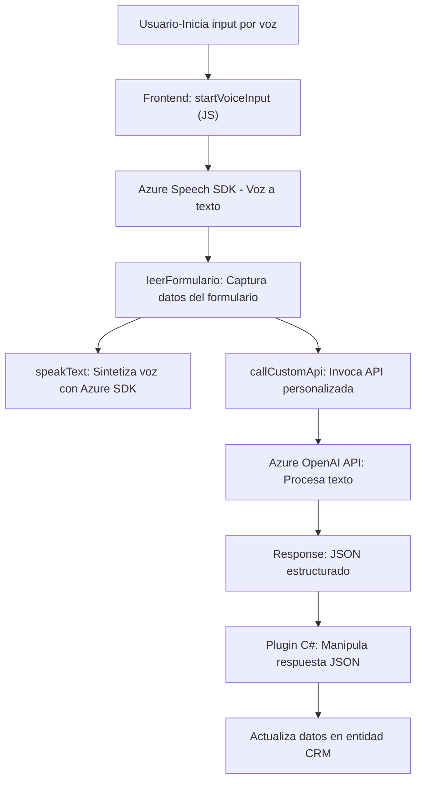

### Breve resumen técnico
El repositorio representa una solución que integra un sistema CRM con funcionalidades avanzadas de interacción por voz y procesamiento semántico de texto mediante servicios cloud (Azure Speech SDK y Azure OpenAI). Incluye componentes frontend (JS) para la captura y manipulación de datos de formularios, junto con un plugin backend en C# para procesamiento avanzado y generación de datos en formato JSON.

---

### Descripción de arquitectura

La solución combina una arquitectura híbrida **multicapa**:
1. **Frontend dinámico (JavaScript):** Funciona como la capa de presentación interactiva, permitiendo reconocimiento de voz y manipulación dinámica de formularios a través de APIs y SDKs.
2. **Integración de SDKs cloud:** Comunicación con Azure Speech SDK y Azure OpenAI desde el frontend y backend, facilitando tecnologías de voz y procesamiento de texto semántico.
3. **Backend extensible (C# Plugin):** Implementa un plugin en Dynamics CRM para extender su funcionalidad utilizando características de inteligencia artificial y servicio orientado a reglas de Azure OpenAI.

---

### Tecnologías utilizadas

- **Frontend:**
  - JavaScript.
  - Azure Speech SDK: Reconocimiento de voz.
  - Dynamics CRM Form Context API: Manipulación de formularios y datos.
  
- **Backend:**
  - C#: Desarrollo del plugin de Dynamics CRM.
  - Microsoft.Xrm.Sdk: SDK de Dynamics CRM para manejar el contexto del plugin.
  - Azure OpenAI API: Procesamiento semántico de texto.
  - Newtonsoft.Json: Manejo avanzado de JSON.

- **Arquitectura de integración:**
  - **Service-Oriented Architecture (SOA):** Integración con APIs externas de Azure.
  - **Multicapa:** Componentes frontend y backend están separados para garantizar responsabilidades divididas.

---

### Diagrama **Mermaid** 100 % compatible con GitHub Markdown

---

### Conclusión final

La solución provee capacidades enriquecidas para formularios de CRM mediante interacción por voz y procesamiento semántico de texto. Se implementa una arquitectura multicapa que combina componentes frontend interactivos y backend extensible, complementados por servicios cloud (Azure Speech y OpenAI). La solución destaca por integrar tecnologías modernas y patrones estructurales orientados a servicios, garantizando alta escalabilidad y adaptabilidad tanto en interfaces como en lógica de negocio.