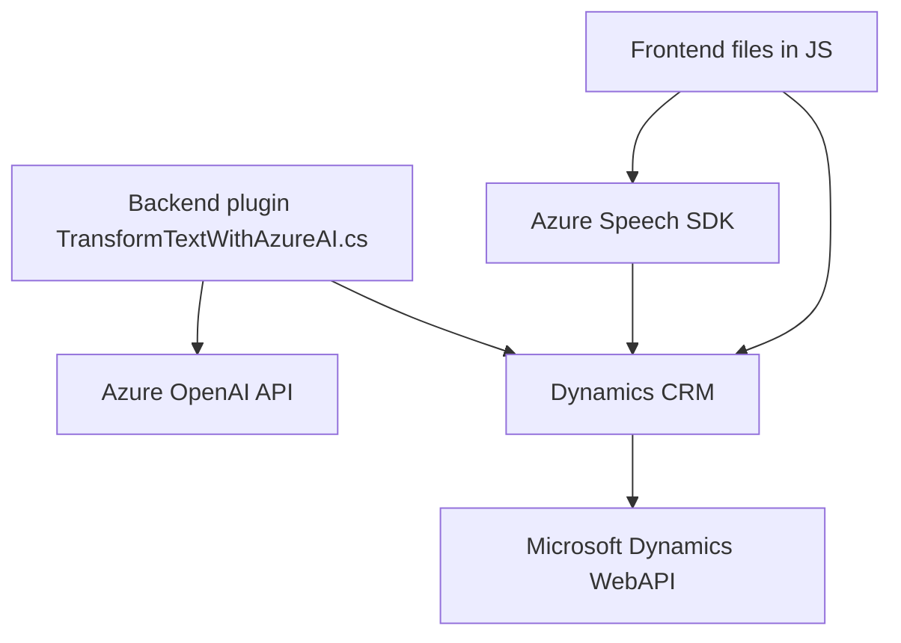

### Resumen técnico:
Este repositorio combina un **plugin para Microsoft Dynamics CRM** basado en .NET y el SDK de CRM con dos módulos frontend en JavaScript. Los módulos aprovechan integraciones avanzadas con los servicios de **Azure Speech SDK** y **Azure OpenAI API**, para interactuar con formularios dentro de Dynamics CRM, procesar datos a través de comandos hablados y realizar transformaciones de texto con inteligencia artificial.

---

### Descripción de arquitectura:
1. **Tipo de solución**:
   - El repositorio parece ser parte de una solución completa de integración de **Microsoft Dynamics CRM** que incluye:
     - **Frontend** basado en JavaScript implementado en archivos como `readForm.js` y `speechForm.js`.
     - **Plugins backend** escritos en .NET, como `TransformTextWithAzureAI.cs`, que amplían las capacidades nativas de Dynamics a través de servicios inteligentes.

2. **Arquitectura**:
   - **Multicapa**:
     - Separación clara entre capas: una capa frontend centrada en la interacción con el usuario y una capa de backend que maneja la lógica empresarial y la comunicación con servicios externos.
   - **Microservices dentro de Dynamics CRM**:
     - Los plugins en formato .NET y las integraciones con servicios externos sugieren un enfoque en una arquitectura de **API Gateway complementada con microservicios** para operaciones específicas relacionadas con la inteligencia artificial y la síntesis/reconocimiento de voz.

---

### Tecnologías usadas:
1. **Frontend:**
   - JavaScript / ES6+.
   - **Azure Speech SDK**.
   - Comunicación con Dynamics CRM (context API).

2. **Backend:**
   - DotNet (C#).
   - Dynamics CRM SDK.
   - HTTP client para llamar al **Azure OpenAI API**.

3. **Servicios externos:**
   - **Azure Speech SDK:** Reconocimiento de voz (en `speechForm.js`) y síntesis de voz (en `readForm.js`).
   - **Azure OpenAI API:** Transformación de texto mediante IA en `TransformTextWithAzureAI.cs`.

---

### Dependencias o componentes externos potenciales:
1. **Azure Speech SDK**:
   - Utilizado para servicios de reconocimiento y síntesis de voz.
   - Incluye `SpeechConfig`, `SpeechSynthesizer`, y `AudioConfig`.

2. **Microsoft Dynamics CRM SDK**:
   - Permite el acceso y manipulación de formularios y atributos del entorno CRM.

3. **Azure OpenAI API y servicios cognitivos**:
   - Para realizar transformaciones complejas de entrada/salida de texto con IA.

4. **Dependencias adicional de .NET**:
   - `HttpClient`, `Newtonsoft.Json.Linq`, `System.Text.Json`, y otros.

---

### Diagrama **Mermaid** para GitHub:

---

### Conclusión final:
Este repositorio está estructurado para brindar una integración avanzada en el ecosistema de Microsoft Dynamics CRM, gracias al uso de servicios inteligentes proporcionados por Azure (OpenAI y Speech SDK). Los archivos frontend en JavaScript permiten interactuar con datos en tiempo real mediante reconocimiento y síntesis de voz, mientras que los plugins backend optimizan las capacidades del CRM permitiendo transformaciones de texto con inteligencia artificial. La solución tiene una arquitectura modular orientada a servicios y se apoya en múltiples capas y micro-servicios para facilitar la interacción entre componentes y el uso de IA.