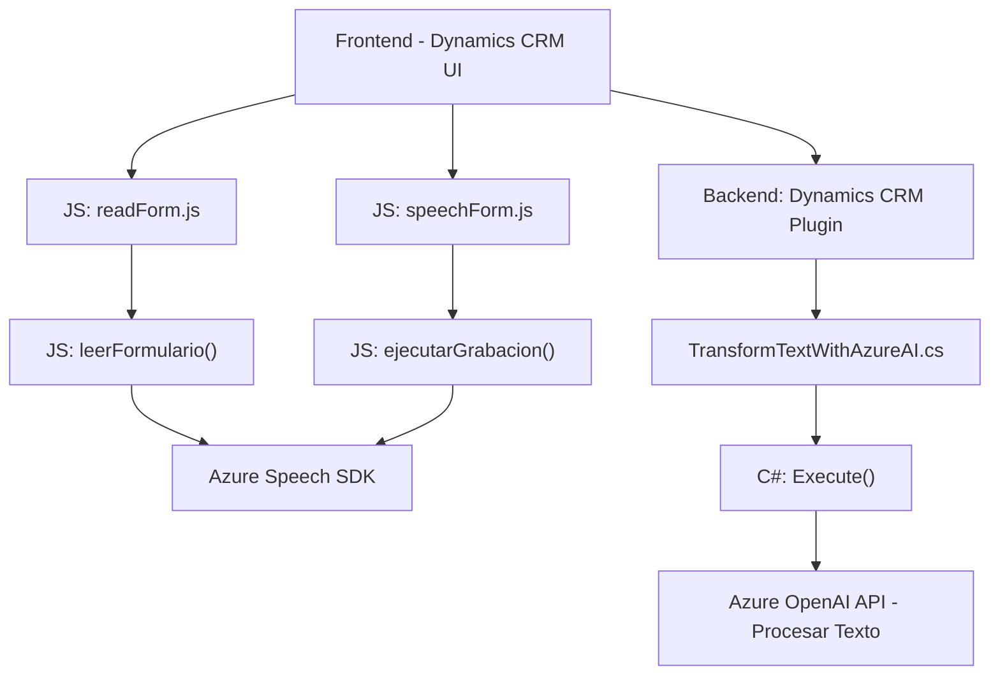

### **Breve resumen técnico**

El repositorio describe un software de carácter empresarial que ofrece funcionalidades integradas con Microsoft Dynamics CRM. Incluye:

1. **Frontend (JavaScript):** Dos archivos principales (`readForm.js` y `speechForm.js`) implementan servicios de reconocimiento y síntesis de voz mediante Azure Speech SDK.
2. **Backend (C#):** Un plugin `TransformTextWithAzureAI.cs` que utiliza Azure OpenAI para transformar texto basado en reglas específicas.

La solución parece estar diseñada para mejorar la experiencia del usuario mediante interacción por voz y transformación semántica de texto dentro del contexto de formularios en Dynamics 365.

---

### **Descripción de arquitectura**

#### Análisis de componentes:
1. **Frontend:**
   - Utiliza dinámicamente **Azure Speech SDK** para interacción por voz y manipulación de formularios CRM.
   - JavaScript actúa como controlador para la interfaz de formularios (MVC), usando eventos dirigidos por el usuario como mecanismo principal.
   - Organizado en módulos funcionales altamente cohesivos.

2. **Backend:**
   - El archivo `TransformTextWithAzureAI.cs` implementa un **plugin de Dynamics CRM** con un patrón clásico de extensión encapsulada.
   - Interactúa con Azure OpenAI mediante HTTP POST para transformar contenido textual, y usa un modelo basado en servicios externos.

#### Arquitectura general:
La solución presenta características de una **arquitectura de capas híbrida**:
   - **Frontend:** Actúa como un controlador/event manager en la capa de presentación y lógica de negocio.
   - **Backend:** Encapsula la lógica que depende de terceros mediante plugins con servicios externos.
   - **Servicios externos:** Azure Speech SDK y Azure OpenAI amplían las capacidades del sistema con tecnologías SaaS (Software as a Service).

---

### **Tecnologías usadas**

#### Tecnologías core:
1. **Frontend:**  
   - Microsoft Dynamics CRM APIs (`formContext` y `Xrm.WebApi`) para interactuar con datos en formularios CRM.  
   - Azure Speech SDK para reconocimiento y síntesis de voz.  

2. **Backend:**  
   - Lenguaje: C#  
   - Framework: Microsoft Dynamics CRM SDK (`IPlugin`)  
   - Azure OpenAI: Utilizado para transformar texto.  
   - Dependencias como `Newtonsoft.Json`, `System.Net.Http` y otras estándar para manipulación de datos y solicitudes HTTP.  

#### Patrones de diseño:
1. **Frontend:**  
   - **Event-driven design:** Funciones disparadas por eventos.  
   - **Service Layer:** Implementa separación entre lógica de negocio y capas de servicios externos como APIs.  

2. **Backend:**  
   - **Plugin Pattern:** Implementación modular que extiende la funcionalidad de Dynamics CRM.  
   - **Encapsulación:** Maneja solicitudes HTTP dentro de métodos concretos.  

---

### **Diagrama Mermaid**

---

### **Conclusión final**

Este repositorio representa una solución **híbrida en capas** centrada en la interacción entre usuarios y formularios de Dynamics CRM. Usa tecnologías modernas como **Azure Speech SDK** y **Azure OpenAI** para funciones de síntesis y procesamiento de texto. La arquitectura aprovecha conceptos de **MVC** en el frontend y extensibilidad basada en plugins en el backend del CRM. Estas decisiones facilitan la escalabilidad al incorporar módulos externos dinámicos y APIs basadas en SaaS.