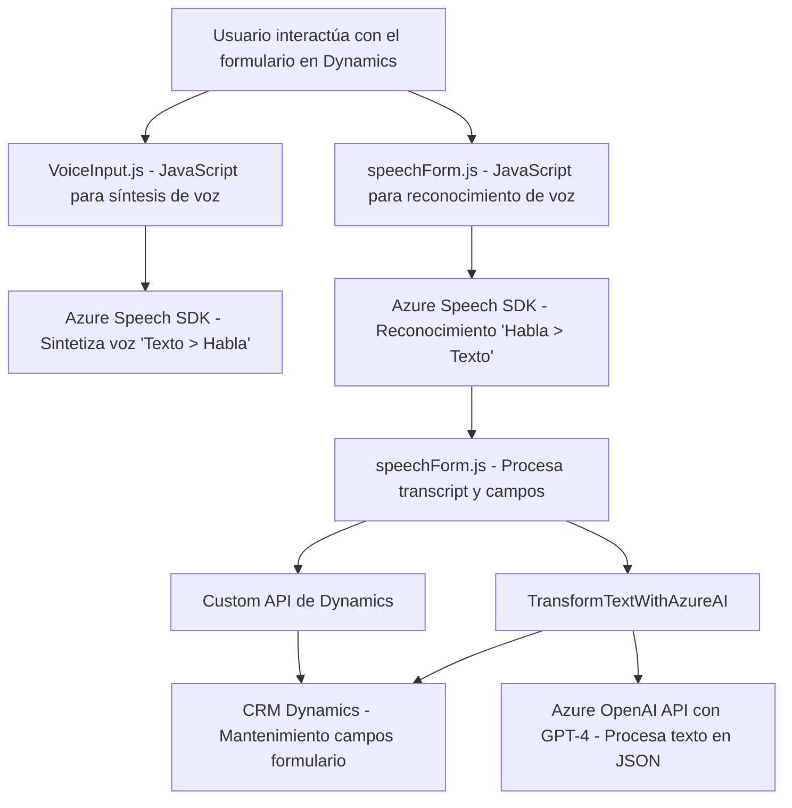

### **Breve resumen técnico**
El repositorio consta de tres archivos principales: 
1. `VoiceInput.js` y `speechForm.js`, que implementan funcionalidad frontend basada en JavaScript para el reconocimiento y síntesis de voz utilizando Azure Speech SDK y su interacción con formularios en entornos Dynamics 365.
2. `TransformTextWithAzureAI.cs`, un plugin desarrollado en C# para Microsoft Dynamics CRM que interactúa con el modelo GPT-4 en Azure OpenAI para transformar texto en formato JSON estructurado según ciertas reglas.

El conjunto de archivos sugiere una solución de integración entre una plataforma de reconocimiento de voz, un frontend manejado vía JavaScript y una lógica de backend personalizada (plugin) en Dynamics CRM.

---

### **Descripción de arquitectura**
La arquitectura es una **modular y orientada a servicios con características de diseño n-capas**, adaptada específicamente para integrarse con Microsoft Dynamics CRM como el núcleo, utilizando un **framework de plugins** en el backend, complementado por capacidades de reconocimiento de voz y procesamiento del lenguaje natural para integración y usabilidad.

- **Frontend:** La interacción del usuario ocurre vía scripts en los formularios de Dynamics que actúan como puntos de entrada, habilitando tanto la síntesis como el reconocimiento de voz.
- **Backend:** Un plugin en Dynamics CRM procesa las transcripciones mediante Azure OpenAI y retorna datos en JSON para su uso en el frontend.
- **Integraciones:** Comunicación bidireccional entre Azure Speech SDK, Azure OpenAI y Dynamics CRM para garantizar experiencia fluida en la recogida y uso de los datos por voz.

---

### **Tecnologías usadas**
- **Frontend:**
  - **JavaScript:** Para manejar eventos en los formularios y manipular datos. 
  - **Azure Speech SDK:** Reconocimiento y síntesis de voz en tiempo real. 

- **Backend:**
  - **C#:** Desarrollo plugin (framework Microsoft Dynamics CRM).
  - **Azure OpenAI (GPT-4):** Para generar respuestas estructuradas basadas en texto.
  - **REST API:** Llamadas HTTP POST para interactuar con Azure.

- **Patrones utilizados:**
  - **Facade Pattern:** Los puntos de entrada (`startVoiceInput`) simplifican la lógica para el reconocimiento y síntesis de voz.
  - **Plugin Pattern:** El archivo C# sigue las características de los plugins de Microsoft Dynamics CRM para incorporar eventos personalizados.
  - **Asynchronous Programming:** Uso de Promesas (`async/await`) en el flujo de comunicación con APIs.
  - **Singleton Pattern:** Gestión centralizada de dependencias como `HttpClient` y `Azure Speech SDK`.

---

### **Diagrama Mermaid**

---

### **Conclusión final**
La solución implementada en este repositorio se centra en integrar tecnologías modernas como Azure Speech SDK y Azure OpenAI con el entorno tradicional de Microsoft Dynamics CRM. 

La arquitectura es eficiente para integrar reconocimiento y síntesis de voz, así como manipulación avanzada de datos mediante ML/AI a través del backend. Usando un diseño modular basado en componentes frontend (JavaScript), servicios globales (Azure APIs) y un núcleo centralizado (Dynamics Plugin), el sistema logra una experiencia completa y robusta para usuarios que manipulan formularios en Dynamics.

Se recomienda optimizar el manejo de errores, considerar el diseño hexagonal para desacoplar dependencias rígidas del SDK y realizar pruebas de estrés para evaluar el comportamiento ante una alta carga de solicitudes hacia Azure APIs.