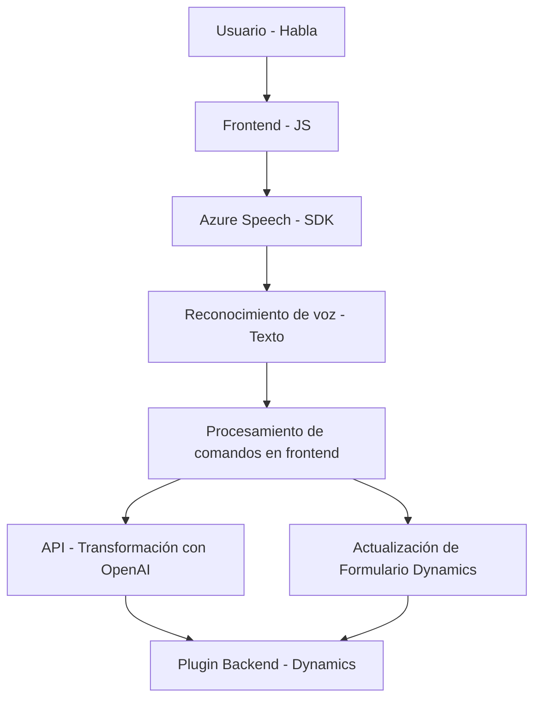

### Breve resumen técnico

El repositorio presenta una solución que combina funcionalidad de reconocimiento de voz con capacidades avanzadas de interacción con formularios y servicios externos. Se utiliza como base la plataforma Dynamics 365, con integraciones hacia el SDK de Azure Speech y la API de Azure OpenAI para transformar texto y manejar formulario dinámico. Contiene tres módulos principales:

1. **Funcionalidad del frontend** (en JavaScript): Módulos que reconocen voz y procesan datos para interactuar con formularios.
2. **Integración de APIs externas**: Llamadas a Azure Speech SDK para síntesis de voz y transcripción, así como una API personalizada en Dynamics CRM para transformación avanzada de texto.
3. **Archivo de plugins en backend** (C#): Usa el patrón de plugin en Dynamics CRM para delegar transformaciones de texto a la API de Azure OpenAI.

---

### Descripción de arquitectura

La solución sigue una **arquitectura híbrida** que mezcla frontend modular y backend basado en eventos. Está basada principalmente en una estructura de **n capas**:

1. **Frontend**: Utiliza una organización modular en JavaScript con funciones que encapsulan diferentes tareas como el manejo de reconocimiento de voz, acceso a formularios y transformación de texto.
2. **Backend**: El plugin en C# extiende eventos y responde a solicitudes dinámicas de Dynamics CRM, integrándose con un servicio Azure OpenAI para el procesamiento avanzado.
3. **Servicios externos**: Azure Speech actúa como un servicio de síntesis de voz a texto y de reconocimiento; Azure OpenAI se utiliza como un servicio API para procesar texto más complejo.

---

### Tecnologías usadas

1. **Frontend (JavaScript)**:
   - SDK de **Azure Speech**: Sintetiza texto a voz y realiza transcripción de voz.
   - **Form Context API**: Accede y modifica atributos en formularios de Dynamics CRM.
   - **JavaScript ES6+**: Modularización de funciones y uso de promesas para operaciones asincrónicas.

2. **Backend (C#)**:
   - **Microsoft Dynamics SDK**: Soporte para creación de plugins como extensiones a eventos de la plataforma.
   - **System.Net.Http**: Para realizar solicitudes REST hacia APIs externas.
   - **System.Text.Json** y **Newtonsoft.Json**: Manejo de datos JSON en C#.

---

### Dependencias o componentes externos

1. **Microsoft Dynamics CRM SDK**: Base de integración para el sistema de formularios y eventos.
2. **Azure Speech SDK**:
   - Función de síntesis de voz y transcripción de reconocimiento de voz.
   - SDK cargado dinámicamente desde el navegador.
3. **Azure OpenAI (API personalizada)**:
   - Transformación de texto según normas específicas.
   - Respuestas en formato JSON estructurado.
4. **Form Context API (Dynamics CRM)**:
   - API interna para acceder y manipular formularios y sus atributos.
5. **JavaScript API en frontend**:
   - Biblioteca de promesas y llamadas de red para interactuar con servicios externos.

---

### Diagrama Mermaid

---

### Conclusión final

El diseño general de la solución es robusto, teniendo en cuenta la modularización de los elementos del frontend, integración de servicios externos y el manejo de lógica empresarial en el backend como parte de Dynamics CRM. La arquitectura basada en **n capas** con dependencias externas como el Azure Speech SDK y la API de Azure OpenAI garantiza una solución escalable y extensible.

Sin embargo, es importante considerar:
1. **Optimización de dependencias en frontend**: Reducir la carga dinámica para mejorar el rendimiento general del proceso de voz.
2. **Gestión de errores**: Aunque las funciones están moduladas, es esencial mejorar el manejo de excepciones tanto en el backend como en interacciones de servicios externos.
3. **Documentación ampliada**: Sería útil incluir ejemplos de configuración del plugin y del frontend para facilitar el despliegue. 

La solución combina tecnologías modernas y patrones bien definidos, haciendo un buen uso de capacidades cloud-first y paradigmas orientados a eventos.