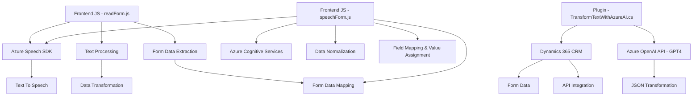

### Resumen técnico

El repositorio contiene una solución que integra procesos de reconocimiento de voz, síntesis de voz, manipulación de datos, y transformación de texto con funcionalidades de CRM (Dynamics 365). Se basa en servicios de Azure (Azure Speech SDK, Azure OpenAI) y utiliza APIs personalizadas para conectar datos hablados y procesarlos en formularios y sistemas CRM.

---

### Descripción de la arquitectura

La solución tiene componentes que interactúan de manera modular:
1. **Frontend (JavaScript)**: Scripts que manejan el reconocimiento de voz, síntesis de texto a voz, e integración con formularios.
2. **Backend (Plugin de Dynamics CRM)**: Actúa como middleware entre el servicio Azure OpenAI y la lógica de negocio del CRM.
3. **Cloud integration**: Dependencia de varios servicios de Azure para proporcionar servicios de voz y procesamiento basado en IA.

Patrón arquitectónico dominante:
- **Orientado a servicios**: Integración dinámica con APIs externas como Azure Speech SDK y Azure OpenAI.
- **Plugins**: Uso de plugins específicos en el entorno de Dynamics CRM para personalizar el comportamiento del sistema.

---

### Tecnologías usadas

1. **Frontend**:
   - JavaScript: para manejar eventos, manipular formularios y realizar integraciones con Azure Speech SDK.
   - Azure Speech SDK: procesamiento de voz en tiempo real.
   - Dynamics 365 Web API: procesamiento y mapeo de datos en los formularios del CRM.

2. **Backend**:
   - C#: manejo de lógica del plugin y transformación de datos.
   - Azure OpenAI API: funciones de GPT para transformar texto.
   - Microsoft Dynamics CRM SDK: para implementar y conectar plugins dentro del ecosistema CRM.
   - Newtonsoft.Json: manipulación JSON para API REST.
   - System.Net.Http: integración con servicios externos vía HTTP.

3. **Patrones**:
   - **Servicio orientado**: conexión modular con servicios externos.
   - **Plugin Pattern**: personalización del CRM mediante eventos y capa de extensión.
   - **Asynchronous Patterns**: uso de callbacks y promesas en el frontend para coordinar acciones con servicios externos.

---

### Diagrama Mermaid válido para GitHub

---

### Conclusión final

La solución representa un **ecosistema de herramientas para procesamiento avanzado de datos a partir de entradas de voz**, integrando la síntesis de texto a voz y el reconocimiento de voz para formularios en aplicaciones empresariales que funcionan en conjunto con un sistema CRM. La arquitectura destaca por su modularidad y su orientación a la integración de servicios externos. Sin embargo, es importante notar el potencial desafío que representa la implementación síncrona de llamadas a servicios de API en el plugin, lo cual podría ser una oportunidad para optimizar la solución en entornos de producción.