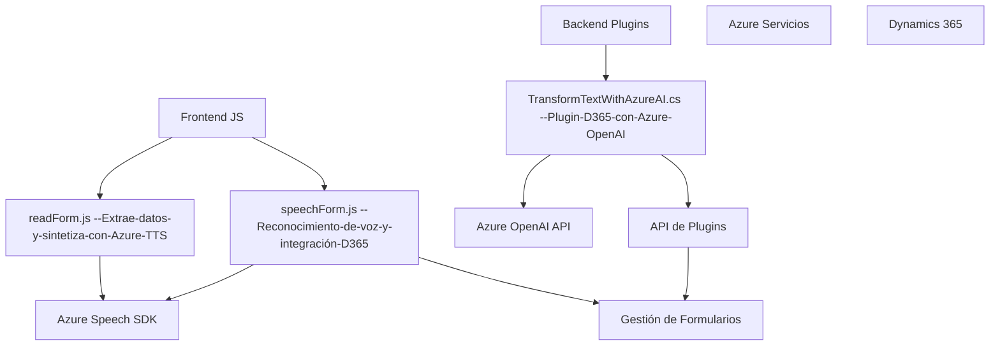

### Breve resumen técnico
El repositorio es una solución híbrida que integra múltiples tecnologías para proporcionar funcionalidad avanzada en sistemas CRM. Incluye módulos orientados a frontend, API externas y plugins, destacándose principalmente por la integración entre Dynamics 365, Azure Speech SDK y Azure OpenAI. La solución está diseñada para mejorar la interacción entre usuarios y formularios mediante voz (TTS y reconocimiento de voz) y procesamiento inteligente de texto utilizando inteligencia artificial.

---

### Descripción de arquitectura
La arquitectura principal parece ser modular con una separación clara de responsabilidades:
- **Frontend**: Implementado con JavaScript para facilitar la interacción del usuario, procesar formularios y vincularlos con los servicios de Azure (Speech SDK y OpenAI).
- **Plugin y Backend**: Desarrollado en C# bajo el estándar de Plugin para Dynamics CRM que actúa como integración del núcleo CRM con servicios de nube externa.
- **Servicios externos**: Fuertes dependencias de Azure, incluyen Azure Speech SDK para voz y Azure OpenAI API para el procesamiento de texto mediante IA.

La arquitectura general usa el **patrón de arquitectura n-capas**, donde cada módulo (frontend, backend, servicios externos) cumple una responsabilidad específica:
1. **Interfaz de usuario (frontend)** para la interacción mediante voz y la visualización.
2. **Lógica empresarial (backend)** implementada como plugins y servicios específicos.
3. **Capa de servicios** que externaliza funcionalidades avanzadas, como TTS, reconocimiento de voz y procesamiento de texto mediante APIs de Azure.

---

### Tecnologías usadas
1. **Frontend**:
   - JavaScript estándar.
   - Azure Speech SDK (integración TTS y reconocimiento de voz).
   - Microsoft Dynamics 365 APIs.

2. **Backend**:
   - `Microsoft.Xrm.Sdk` para integraciones con CRM.
   - `System.Net.Http` para consumir APIs externas.
   - `Newtonsoft.Json.Linq` y `System.Text.Json` para manipulación de JSON.
   - Azure OpenAI API para procesamiento inteligente de textos.

3. **Servicios externos**:
   - Azure Speech SDK (TTS y reconocimiento de voz).
   - Azure OpenAI API (procesamiento de texto con IA).

4. **Otros conceptos y patrones**:
   - Modularidad: Cada función o clase tiene un propósito único.
   - Gestión dinámica: Carga dinámica de SDK y dependencias basadas en disponibilidad.
   - Mapeo lógico: Traducción de etiquetas visibles en formularios a claves contables del sistema.
   - Servicios desacoplados: Dependencia de APIs externas mediante interfaces bien definidas.

---

### Diagrama Mermaid válido para GitHub

---

### Conclusión final
Este repositorio es una solución avanzada que proporciona una experiencia integrada entre voz, inteligencia artificial y formularios en un entorno CRM. Utiliza tecnologías modernas como Azure Speech SDK y Azure OpenAI API, destacándose por su modularidad y el aprovechamiento de servicios externos en un entorno n-capas. Es especialmente adecuado para implementar funcionalidades enriquecidas en Microsoft Dynamics 365, optimizando la interacción del usuario y los procesos digitales empresariales.