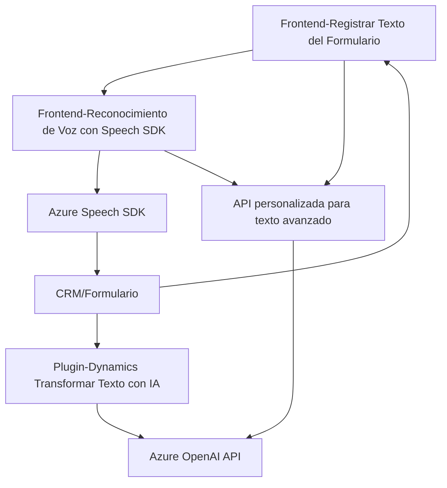

### Informe Técnico sobre la Solución

#### Breve Resumen Técnico
Este repositorio implementa una solución que agiliza la interacción entre usuarios y sistemas en entornos Dynamics CRM, utilizando funcionalidades de reconocimiento de voz, síntesis de audio y transformación de texto con inteligencia artificial (Azure Speech SDK y Azure OpenAI). Está compuesto por archivos que integran lógica orientada a formularios dinámicos y plugins personalizados.

### Descripción de Arquitectura
1. **Tipo de Solución:**  
   La solución fomenta una arquitectura híbrida que combina:
   - **Frontend Dinámico:** Para el procesamiento de formularios mediante reconocimiento y síntesis de voz.  
   - **Microplugin:** Extensiones para sistemas CRM que interactúan directamente con APIs de servicios externalizados.  

2. **Arquitectura General:**  
   - **Multicapa creando un híbrido entre N capas y Microservicios:**  
      El frontend se organiza mediante capas para la gestión de datos de entrada/salida mientras que la integración con Dynamics CRM y Azure OpenAI se aproxima a componentes de estilo microservicio (ej. plugin para Dynamics CRM y la API personalizada).  

   - **Integración con Servicios Externos:** Gran parte de la funcionalidad depende de conectarse a APIs remotas y al entorno CRM externo. Esto refuerza un diseño acorde con un modelo de **software orientado a servicios (SOA)**.  

### Tecnologías, Frameworks y Patrones Usados
**Tecnologías y Frameworks:**  
- **Azure Speech SDK:** Reconocimiento de voz y síntesis de texto en audio (JavaScript).  
- **Azure OpenAI API:** Procesamiento avanzado de inteligencia artificial.  
- **Dynamics CRM:** Manipulación de formularios a través de APIs específicas (Xrm.WebApi y Microsoft.Xrm.Sdk).  
- **JS y TypeScript para Frontend:** Organización clara y modular en funciones para manipulación DOM y llamadas externas.  
- **C# para Plugins:** Desarrollo basado en los servicios de extensibilidad de Dynamics CRM (implementación de `IPlugin`).

**Patrones Identificados:**  
- Modularidad: Separación de responsabilidades en funciones específicas.  
- Evento-Callback: En frontend (JavaScript) y plugin (C#) con Azure Speech SDK y contextos CRM.  
- Cargador Dinámico: En funciones JavaScript para manejar dependencias como Speech SDK.  
- Cliente API: Comunicación con servicios de terceros y APIs internas mediante HTTP.  
- Plugin-based Architecture: Extensiones del sistema CRM como componentes independientes.

### Dependencias o Componentes Externos Identificados
- **Azure Speech SDK:** Reconocimiento de voz y síntesis de audio en frontend.  
- **Azure OpenAI API:** Transformación de texto a JSON con plantillas predefinidas.  
- **Dynamics CRM Framework:** Utilización de servicios y APIs internas como `Xrm.WebApi`.  
- **Navegador Web:** Para manipulación de DOM y ejecución de scripts dinámicos.  
- **Newtonsoft.Json:** Procesamiento de JSON en plugins C#.  

---

### Diagrama Mermaid

---

### Conclusión Final
El repositorio presenta una solución muy bien estructurada que combina procesamiento de voz, síntesis de audio y transformación de texto, integrándose directamente con sistemas de gestión como Dynamics CRM. Utiliza tecnologías modernas orientadas a servicios (Azure Speech y OpenAI), descargando su complejidad en servicios externos. La arquitectura es una combinación híbrida diseñada para robustez, escalabilidad y modularidad. Es ideal para entornos empresariales donde la interacción natural con los sistemas es esencial.