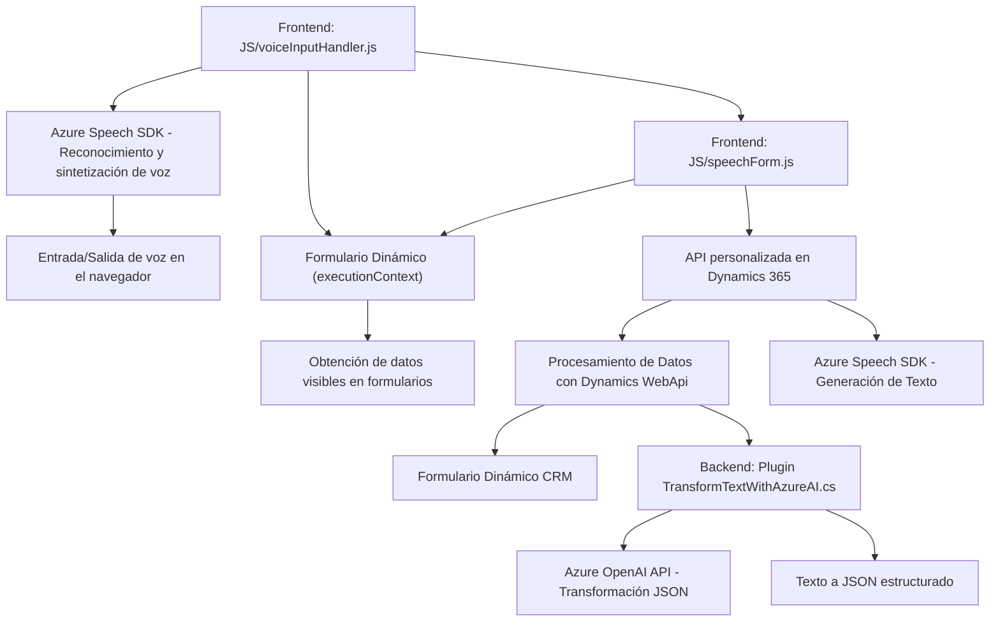

### Breve Resumen Técnico

Este repositorio forma parte de una solución de software para integrar reconocimiento y síntesis de voz con formularios en **Microsoft Dynamics CRM**, utilizando tecnologías de **Azure Speech SDK** y **Azure OpenAI**. Contiene tanto componentes de frontend para interacciones en tiempo real con usuarios, como plugins para procesamiento backend en la plataforma Dynamics CRM. La funcionalidad está orientada hacia la mejora de la experiencia del usuario mediante entrada/salida de audio y la transformación automatizada de texto en estructuras JSON.

---

### Descripción de Arquitectura

- **Tipo de solución:** La solución se implementa como una integración personalizada de funcionalidades de entrada/salida de datos (voz y texto) en Microsoft Dynamics CRM.
- **Arquitectura:** 
  - **N Capas:** Divide responsabilidades entre:
    - Frontend: Reconocimiento de voz, manipulación de formularios y síntesis de audio.
    - Backend (Plugins): Procesamiento y transformación de datos mediante inteligencia artificial (Azure OpenAI).
    - Servicios externos: Uso de servicios en la nube como Azure Speech SDK y Azure OpenAI.
  - **Integración orientada a servicios:** Conexión con APIs externas para procesamiento (Azure Speech SDK y OpenAI).

---

### Tecnologías Usadas

1. **Frontend:**
   - JavaScript para la manipulación de DOM y dinámicas en el navegador.
   - Azure Speech SDK para transcripción y síntesis de voz.

2. **Backend:**
   - C# para desarrollo de plugins en Dynamics CRM.
   - Azure OpenAI para transformación y análisis de texto.

3. **Externas:**
   - **APIs:**
     - Azure Speech SDK para funcionalidades de voz.
     - Azure OpenAI para interpretación y transformación de lenguaje natural.

4. **Patrones y estilos:**
   - **Modular Design:** Código dividido en funciones con responsabilidades específicas.
   - **Dependency Injection en el frontend:** Uso de `executionContext` y `formContext` como parámetros para desacoplar lógica y datos.
   - **Plugin-based Architecture:** Implementación estándar en Microsoft Dynamics CRM para servicios personalizados.
   - **Service integration:** Comunicación con servicios externos (Azure).

---

### Diagrama Mermaid

---

### Conclusión Final

Este repositorio implementa una solución híbrida que combina tecnologías de frontend, backend, y servicios externos en una arquitectura de múltiples capas. La solución aprovecha los servicios de Azure Speech SDK para integrar capacidades de reconocimiento y síntesis de voz en una interfaz de usuario web, que interactúa directamente con formularios de Dynamics CRM. Por otro lado, el procesamiento avanzado del texto mediante **Azure OpenAI** está implementado como un plugin en Dynamics CRM, utilizando modelos de IA para transformar datos textuales en estructuras útiles de JSON.

La solución es un ejemplo práctico y modular de cómo integrar varias tecnologías modernas y servicios en la nube para enriquecer plataformas CRM con funcionalidades avanzadas de voz y procesamiento de texto.