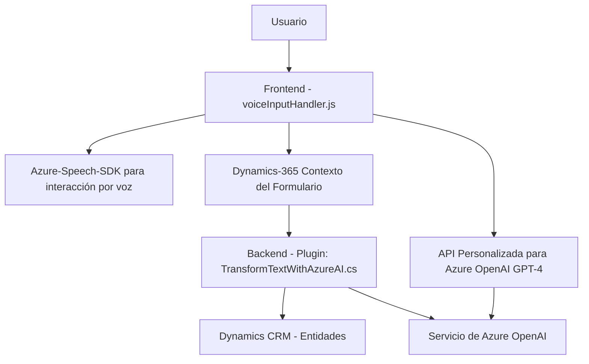

### 1. Breve Resumen Técnico
El repositorio analiza archivos de un sistema que emplea **Azure Speech SDK** para interacción por voz con formularios en Dynamics 365 CRM. Adicionalmente, incluye un plugin que utiliza **Azure OpenAI GPT-4** para el procesamiento y estructuración avanzada de texto. La solución aborda la interacción natural entre usuarios y sistemas mediante reconocimiento de voz y lenguaje natural, además de integrarse con APIs externas y capacidades offline del CRM.

---

### 2. Descripción de Arquitectura
La solución tiene una **arquitectura de n capas**, donde cada capa cumple una función claramente separada:

1. **Capa de presentación (Frontend)**: Archivos JavaScript (`readForm.js` y `speechForm.js`) que procesan datos del formulario y permiten la interacción por voz. Se encargan de cargar dinámicamente SDKs y gestionar eventos como entrada de datos y comandos.
2. **Capa de negocio**:
   - Plugins de Dynamics 365 (`TransformTextWithAzureAI.cs`) que ejecutan la lógica empresarial específica, como transformar texto manipulado mediante **Azure OpenAI** en JSON estructurado.
   - Interacción con APIs externas, como Azure OpenAI y Speech SDK.
3. **Capa de datos**: Consulta y manipulación de entidades en Dynamics CRM (uso de campos y atributos).

Además, el módulo de procesamiento con OpenAI introduce un componente de **microservicio** de AI gestionado por Azure, mostrando un ejemplo híbrido: monolito en Dynamics CRM con componentes externos complementarios.

---

### 3. Tecnologías Usadas
1. **Frontend/JavaScript**:
   - Azure Speech SDK para reconocimiento de voz.
   - API Custom de Dynamics 365 CRM (contexto del formulario y `Xrm.WebApi`).
   - Manejo de eventos asincrónicos y modularidad en funciones.
   
2. **Backend**:
   - Dynamics 365 SDK (`IPlugin`, `IExecutionContext`, etc.).
   - .NET Framework (C#).
   - Azure OpenAI GPT-4 para procesamiento avanzado del lenguaje.

3. **Patrones de Diseño**:
   - Modularidad: Cada funcionalidad está encapsulada en funciones/métodos independientes.
   - Cliente-Servidor: Interacción con APIs externas (Speech SDK, Azure OpenAI).
   - Desacoplamiento: La lógica de AI y voz está separada de la gestión del CRM.
   - Error Handling explícito.
   - Arquitectura por capas y event-driven en frontend.

---

### 4. Dependencias y Componentes Externos
1. **Azure Speech SDK**:
   - Reconocimiento de voz y síntesis de texto a voz.
   - Carga dinámica desde URL: `https://aka.ms/csspeech/jsbrowserpackageraw`.
2. **Azure OpenAI GPT-4**:
   - Procesamiento y transformación de texto.
   - Llamadas REST vía `System.Net.Http`.
3. **Microsoft Dynamics SDK**:
   - Manipulación de entidades, contexto y operaciones del CRM.
4. **Newtonsoft.Json**:
   - Procesamiento de JSON en los plugins.
5. **Contexto de Dynamics CRM**:
   - `formContext` y capacidades nativas del API para manipulación de datos.

---

### 5. Diagrama Mermaid

---

### Conclusión Final
La solución es una integración avanzada que une reconocimiento de voz (Azure Speech SDK), procesamiento de lenguaje mediante AI (Azure OpenAI GPT-4) y manipulación de datos en un Dynamics 365 CRM. Representa una arquitectura **híbrida**, donde el monolito de Dynamics CRM se complementa con microservicios externos, alcanzando modularidad y flexibilidad. Puede ser extendida fácilmente para escenarios empresariales que requieren procesamiento inteligente o interacción natural con sistemas.