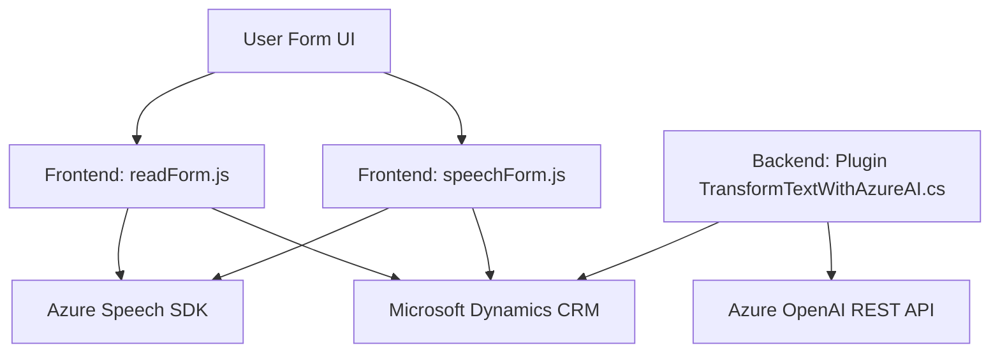

### Análisis Técnico del Repositorio

#### Breve Resumen Técnico:
Este repositorio contiene archivos para la implementación de funcionalidades que integran reconocimiento de voz, síntesis de texto a voz, y procesamiento de datos mediante servicios de Azure, específicamente Azure Speech SDK y Azure OpenAI. Está diseñado para interactuar con formularios en entornos Microsoft Dynamics CRM/Dynamics 365, procesar comandos hablados y enviar/recibir datos de APIs personalizadas.

---

#### Descripción de Arquitectura:
La solución implementa una arquitectura modular basada en integración con servicios externos (Azure) y dependencias propias del sistema Microsoft Dynamics 365. Predominan patrones de asincronía y eventos en los archivos frontend. En el backend, se utiliza un patrón de Plugins para Dynamics CRM junto con REST para consumir servicios de IA de OpenAI.

Es una arquitectura híbrida que mezcla:
- **Modularidad y eventos en el frontend**, donde archivos como `readForm.js` procesan datos del formulario y sintetizan voz dinámicamente.
- **Arquitectura hexagonal en el backend**, ya que el plugin es una capa aislada que interactúa con datos del sistema internamente y servicios externos como Azure OpenAI.

---

#### Tecnologías Usadas:
1. **Frontend (JavaScript)**:
   - **Azure Speech SDK**: Para reconocimiento de voz y síntesis de texto a voz.
   - JavaScript Promises y callbacks para manejar eventos de interacción en tiempo real.
   - Microsoft Dynamics CRM APIs.
   
2. **Backend (.NET/C#)**:
   - **Azure OpenAI REST API**: Para transformación y procesamiento de texto.
   - Microsoft Dynamics CRM plugin API: Manejo de formularios y datos en el entorno CRM.
   - JSON Parsing (Newtonsoft.Json).
   - HTTP Client para llamadas REST.

3. **Plataforma de despliegue**:
   - Microsoft Dynamics 365.
   - SDKs y servicios de Azure.

---

### Dependencias o Componentes Externos:
1. **Servicios de Azure**:
   - Azure Speech SDK (sintetización de voz y reconocimiento de comandos hablados).
   - Azure OpenAI REST API (procesamiento avanzado de texto con GPT).
   
2. **Microsoft Dynamics CRM**:
   - Plugins para manejo de workflows y extensiones específicas del sistema.
   - APIs como `Xrm.WebApi` y servicio `OrganizationService`.

3. **Librerías y Frameworks**:
   - Newtonsoft.Json para deserialización JSON.
   - HttpClient para integrar API REST.

4. **Entorno Formulario/UI**:
   - Microsoft Dynamics para interacción con formularios y datos.

---

### Diagrama Mermaid Compatible con GitHub Markdown:

---

### Conclusión Final:
Este repositorio implementa una solución completa basada en servicios de Azure para habilitar inteligencia artificial y voz en entornos empresariales de Microsoft Dynamics CRM. Con una arquitectura modular y componentes externos como Azure Speech SDK y OpenAI REST API, proporciona funcionalidades avanzadas para manejo de datos procedentes de voz y texto en formularios. La integración con Dynamics 365 y sus APIs asegura que estas funcionalidades están alineadas con los procesos empresariales de la plataforma CRM.