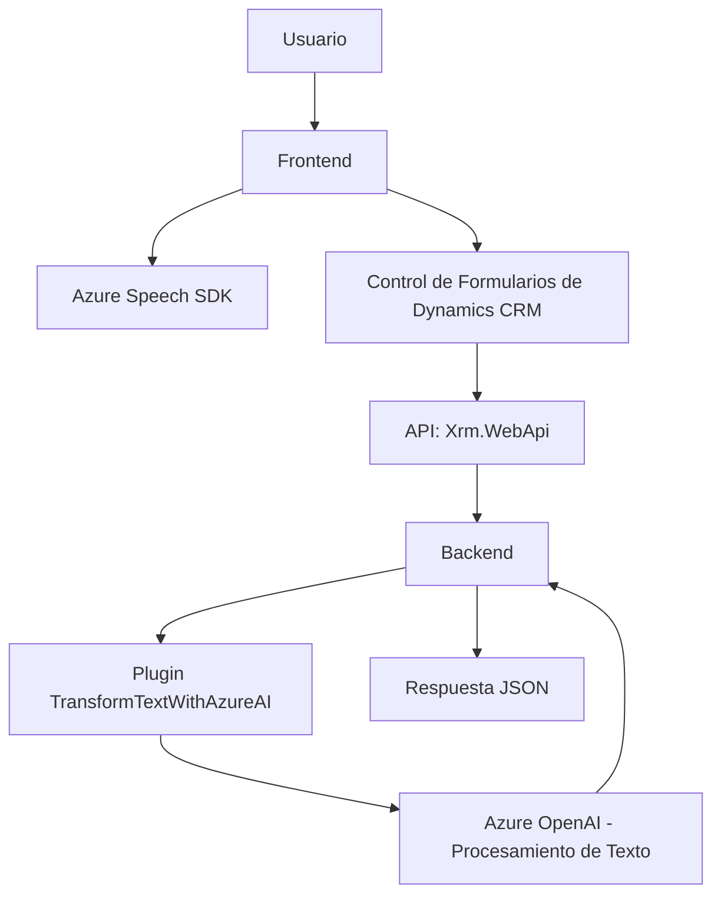

### Breve resumen técnico
El repositorio contiene una solución con tres componentes principales:
1. **Frontend/JS/readForm.js**: Maneja la extracción de datos visibles en un formulario de Dynamics CRM y utiliza Azure Speech SDK para sintetizarlos en voz.
2. **Frontend/JS/speechForm.js**: Implementa reconocimiento de voz interactivo para actualizar formularios basados en comandos hablados y llamadas a APIs personalizadas.
3. **Plugins/TransformTextWithAzureAI.cs**: Define un plugin para Dynamics CRM que transforma texto utilizando Azure OpenAI y devuelve respuestas en formato JSON.

### Descripción de arquitectura
La solución sigue una aproximación basada en **arquitectura de capas** con integración de tecnologías de terceros. El frontend interactúa directamente con Dynamics CRM y utiliza servicios de Azure para síntesis y reconocimiento de voz. Un plugin complementa la solución al integrar funcionalidades avanzadas de procesamiento de texto.

- **Frontend (Capa de Presentación):** Implementación en JavaScript para reconocimiento y síntesis de voz.
- **Backend (Capa de Lógica):** Plugins de Dynamics CRM que procesan comandos de forma asincrónica mediante Azure OpenAI.
- **Servicios externos:** Uso del SDK de Azure Speech y Azure OpenAI, integrados mediante APIs REST o bibliotecas externas, para realizar funcionalidades avanzadas.
- **Dependencias internas:** Los módulos internos tanto en JavaScript como en C# están altamente modularizados, lo cual facilita mantenimientos y escalabilidad.

### Tecnologías usadas
1. **Frontend:** JavaScript (posiblemente ejecutándose en un navegador de Dynamics CRM).
   - Frameworks: `Xrm.WebApi` (API propia de Dynamics).
   - SDK: `Azure Speech SDK`, cargado dinámicamente para reconocimiento y síntesis de voz.
2. **Backend:** C# utilizando el SDK de Dynamics CRM (`Microsoft.Xrm.Sdk`) para plugins.
   - REST API: Comunicación con Azure OpenAI desde C#.
   - JSON Handling: `Newtonsoft.Json` o `System.Text.Json` para transformar datos.
   - HTTP Client: `System.Net.Http` para integrar servicios de Azure.
3. **Servicios externos:** Azure Speech SDK (sintetizador y reconocimiento de voz) y Azure OpenAI para procesamiento de texto avanzado.

### Diagrama Mermaid

### Conclusión final
La solución está diseñada para mejorar la interacción entre usuarios y Dynamics CRM mediante comandos hablados y síntesis de voz utilizando servicios avanzados de Azure. La arquitectura basada en capas permite la separación de responsabilidades y facilita la integración de servicios de terceros como Azure Speech SDK y OpenAI. Además, la modularidad de los componentes frontend y backend asegura la escalabilidad y mantenibilidad del sistema.