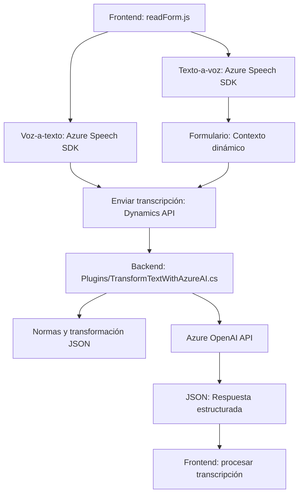

### Breve resumen técnico

El repositorio analiza, implementa y documenta una solución que integra servicios cloud de Microsoft Azure (principalmente Azure Speech SDK y Azure OpenAI) para interactuar con formularios de Microsoft Dynamics CRM. La solución incluye un conjunto de archivos que proporcionan funcionalidades para convertir texto en voz, procesar voz en texto y mapear datos usando inteligencia artificial.

---

### Descripción de arquitectura

La arquitectura del sistema presentado en el repositorio tiene los siguientes componentes:
1. **Frontend (JavaScript):**
   - Realiza la interacción con el usuario, utilizando funciones para entrada de voz y síntesis a texto en el navegador.
   - Carga dinámica de SDK y usa APIs externas (ej., Speech SDK y APIs de Dynamics CRM).

2. **Backend (Microservicio - Plugin):**
   - Define la lógica del negocio en forma de un plugin compatible con Dynamics CRM.
   - Interactúa con Azure OpenAI para aplicar procesos de transformación y análisis de texto dentro de un entorno específico (CRM).

Esta solución emplea arquitectura basada en **plug-ins** para Dynamics CRM y **servicios cloud** (Azure services) bajo una configuración de arquitectura orientada a servicios (**SOA**).

---

### Tecnologías usadas

1. **Tecnologías y frameworks:**
   - **Azure Speech SDK:** Para la entrada de voz y síntesis de voz.
   - **Azure OpenAI API:** Procesamiento avanzado de inteligencia artificial.
   - **Microsoft Dynamics CRM:** Para gestión de formularios y datos a través de su ecosistema.
   - **Newtonsoft.Json y System.Text.Json:** Manejo de JSON en el backend.
   - **HTTP Client (C# - .NET)**: Integraciones con APIs externas.

2. **Patrones de diseño:**
   - **Callback:** Implementado para verificar la carga del Speech SDK y gestionarlo.
   - **Factory Method:** Uso dinámico de funciones para mapeo y asignación de valores en estructuras JSON de entrada y salida (ej., `applyValueToField`).
   - **Modularidad:** Funciones independientes para tareas específicas.

---

### Diagrama Mermaid compatible con GitHub Markdown

---

### Conclusión final

Este repositorio define una solución híbrida que une componentes frontend y backend con servicios cloud de Microsoft Azure para mejorar la interacción y usabilidad en sistemas basados en formularios (ej., CRM). Su arquitectura se alinea con un modelo de **Servicios distribuidos (SOA)** con una configuración basada en módulos y plugins.

Aunque no es un sistema completamente independiente de microservicios, muestra integración sólida entre frontend y backend, lo que la hace una base robusta para aplicaciones orientadas a servicios en la nube. Además, el uso de tecnologías como Azure Speech SDK y OpenAI permite añadir capacidades avanzadas de IA y reconocimiento de voz al sistema.