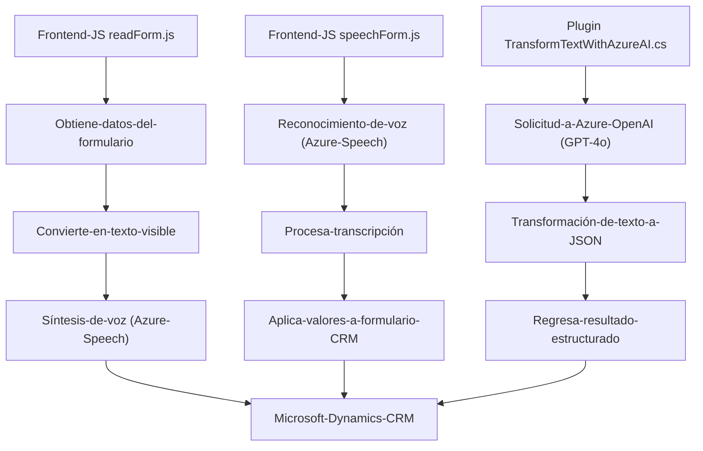

## Breve resumen técnico
El repositorio presentado contiene tres archivos con funcionalidades únicas que trabajan en conjunto para implementar un sistema de síntesis (readForm.js), reconocimiento de voz (speechForm.js) y transformación de texto mediante un plugin conectado a un servicio basado en AI (TransformTextWithAzureAI.cs). El componente global de la solución es claramente una extensión para Microsoft Dynamics CRM con integración con el servicio Azure (Speech SDK y OpenAI).

---

## Descripción de la arquitectura
La arquitectura está diseñada como una extensión modular para Microsoft Dynamics CRM que implementa funcionalidades de procesamiento de texto y voz. Sigue un estilo **combinado**:
1. **Elemento de capa externa:** Constituido por dos archivos JavaScript (Frontend/JS/readForm.js y Frontend/JS/speechForm.js) que integran la API de Azure Speech SDK con la API de Microsoft Dynamics CRM.
2. **Core interno:** Implementado como un plugin en C# (`TransformTextWithAzureAI.cs`) que hace uso de la API de Azure OpenAI para realizar transformaciones dinámicas de texto a JSON según reglas predefinidas.
3. La arquitectura general tiende hacia un enfoque **modular**, donde cada componente cumple una función específica y está desacoplado en términos de responsabilidades.

---

## Tecnologías usadas
1. **Frontend:**
   - **JavaScript**: Utilizado para implementar lógica de voz (síntesis y reconocimiento).
   - **Azure Speech SDK**: Utilizado para la síntesis de voz y reconocimiento de texto hablado.
   - **Microsoft Dynamics CRM API**: Integración directa con formularios, entidades y registros del CRM.
2. **Backend:**
   - **C#**: Lenguaje utilizado para implementar el plugin.
   - **Azure OpenAI (GPT)**: Integrado con el plugin para procesamiento y transformación de texto.
   - **ASP.NET Framework**: Aprovechado como parte del diseño de los plugins CRM.
3. **Otros frameworks y bibliotecas:**
   - `System.Net.Http`, `System.Text.Json`, `Newtonsoft.Json.Linq`: Utilizadas para manejar comunicación con APIs externas y procesamiento de datos JSON.

---

## Diagrama **Mermaid**

---

## Conclusión final
La solución presentada utiliza un enfoque modular para integrar funcionalidades avanzadas de voz y texto con Microsoft Dynamics CRM. Los archivos de frontend (`readForm.js` y `speechForm.js`) actúan como interfaces que interactúan tanto con el usuario como con el CRM, mientras que el plugin backend (`TransformTextWithAzureAI.cs`) realiza tareas específicas de procesamiento avanzado de texto utilizando un servicio externo de AI. El uso de servicios de Azure (Speech SDK y OpenAI) y las prácticas de desacoplamiento de funciones refuerzan la flexibilidad y extensibilidad de la solución.

Por último, aunque la arquitectura no es completamente basada en microservicios, el uso de APIs externas y la separación de responsabilidades entre el frontend y el plugin contribuyen al diseño orientado a servicios. El diagrama generado visualiza claramente las relaciones y dependencias entre todos los componentes, con énfasis en la interacción entre módulos y servicios externos.