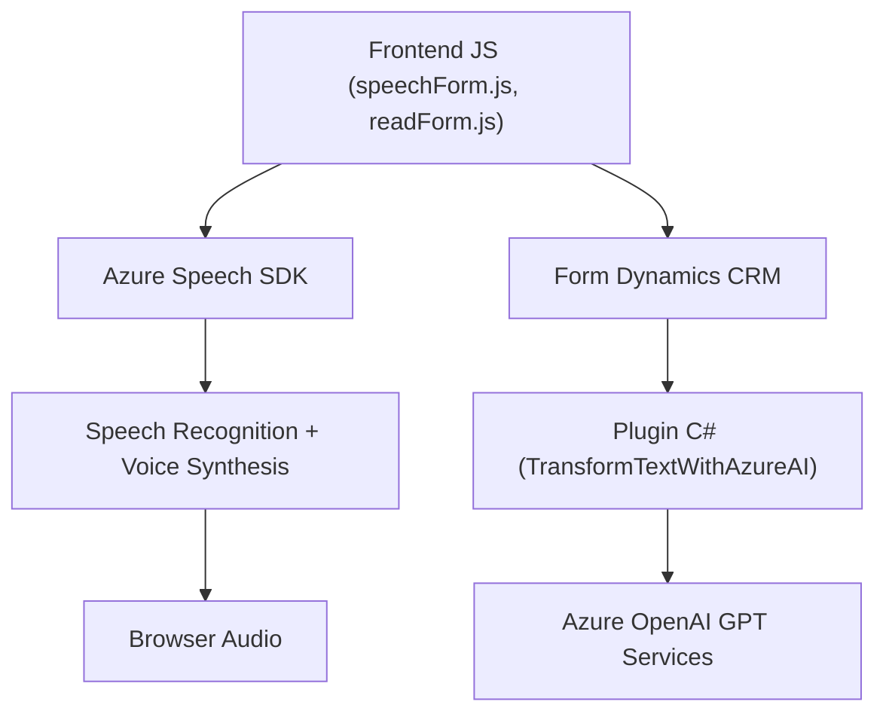

### Análisis Técnico General

#### **Breve Resumen Técnico**
El repositorio parece incluir una solución integrada para Microsoft Dynamics CRM utilizando reconocimiento de voz y síntesis de texto a voz con Azure Speech SDK, combinado con procesamiento avanzado de texto mediante Azure OpenAI. Esto incluye tres niveles principales: frontend (JavaScript SDK), integración con servicios externos (Speech y OpenAI), y un plugin para manipulación personalizada en Dynamics CRM.

---

### 1. **Tipo de Solución**
La solución consiste en un **sistema híbrido**. Algunos aspectos destacan:
- **API y Plugin**: Un plugin (`TransformTextWithAzureAI.cs`) que extiende Microsoft Dynamics CRM mediante el procesamiento de texto avanzado usando Azure OpenAI.
- **Frontend**: Módulos como `speechForm.js` y `readForm.js` implementan la interacción del usuario con Microsoft Dynamics CRM, permitiendo reconocimiento de voz y síntesis de voz.
- **Microservicio conceptual**: Aunque no está separado en contenedores, la interacción con APIs externas como Speech SDK y OpenAI introduce un concepto de microservicio.

---

### 2. **Tecnologías, Frameworks y Patrones Usados**
#### **Tecnologías**
- **Azure Speech SDK**: Para síntesis y reconocimiento de voz.
- **Azure OpenAI**: Para transformación de texto basado en IA.
- **Microsoft Dynamics CRM SDK**: Extiende funcionalidades como datos del formulario (`Xrm.WebApi`) y plugins (`IPlugin`).
- **Lenguajes y librerías**:
  - **JavaScript**: Frontend (manejo del SDK de Azure, interacción con el DOM y APIs).
  - **C# .NET**: Backend para el plugin.
  - **HTTP**: Para comunicación con servicios Azure.

#### **Patrones Arquitectónicos**
1. **Modularización**:
   - Cada módulo está diseñado con responsabilidad específica, como procesamiento de texto (`TransformTextWithAzureAI.cs`) y trabajo en frontend (`speechForm.js`).
2. **Carga dinámica**:
   - Los SDKs para Azure Speech son cargados dinámicamente (`ensureSpeechSDKLoaded`), optimizando los tiempos de carga.
3. **Cliente-Servidor**:
   - El modelo de datos combina el cliente (browser), Dynamics CRM API, y servicios externos como OpenAI para orquestación.
4. **Factory Pattern**:
   - La creación de objetos como `SpeechSynthesizer` en JavaScript utiliza una forma de factoría para inicializar componentes vocales.
5. **Event-Driven Design**:
   - La interacción de reconocimiento de voz y síntesis vocal sigue un diseño basado en eventos (callbacks).
6. **Plugin Architecture**:
   - Extensiones para Dynamics CRM implementan el estándar `IPlugin`.

---

### 3. **Arquitectura**
La solución usa una combinación de **arquitectura de n capas** y elementos de **arquitectura hexagonal** debido a su integración directa con servicios externos y la lógica desacoplada:
- **N Capas**:  
  - **Frontend**: Maneja la interacción con Azure Speech, el reconocimiento/síntesis de voz desde el lado cliente con JavaScript.
  - **Intermedio/Backend**: El plugin en C# (`TransformTextWithAzureAI`) interactúa con Dynamics CRM y servicios de OpenAI.
  - **Externos**: Integración con APIs de Azure Speech y OpenAI.
- **Hexagonal**: Al conectar Dynamics CRM con servicios externos mediante APIs bien definidas.

---

### 4. **Dependencias o Componentes Externos**
- **Azure Speech SDK**: Para síntesis y reconocimiento de voz.
- **Azure OpenAI**: Para procesamiento de texto basado en IA.
- **Microsoft Dynamics CRM Web APIs (Xrm.WebApi)**: Para manipulación dinámica de formularios y datos.
- **Custom API de CRM**: Funciones personalizadas registradas como `trial_TransformTextWithAzureAI`.
- **HTTP Client Libraries**: En el plugin para interactuar con Azure OpenAI servicios.

---

### Diagrama Mermaid Válido para GitHub

---

### Conclusión Final
La solución presentada es robusta y flexible para integrar capacidades de procesamiento por voz y texto con Dynamics CRM. Las tecnologías utilizadas, como Azure Speech SDK y OpenAI, permiten crear una interfaz rica e interactiva accesible para usuarios finales. Además, el plugin implementa procesos avanzados para transformar y asignar texto estructurado a un sistema CRM, alineándose con principios modernos de arquitectura como modularidad y desacoplamiento. Sin embargo, el almacenamiento de claves de API y parámetros sensibles debe ser revisado para evitar riesgos de seguridad.