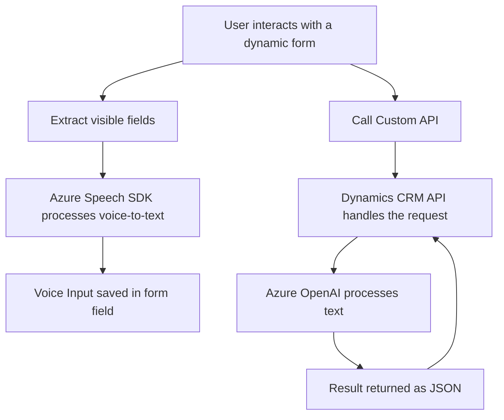

### Breve Resumen Técnico
Este repositorio amalgama funcionalidades para interactuar con formularios dinámicos, integrando reconocimiento de voz y generación de texto usando **Azure Speech SDK** en el frontend, y procesamiento avanzado con **Azure OpenAI** en el backend. Está diseñado para sistemas CRM, especialmente **Microsoft Dynamics CRM**.

---

### Descripción de Arquitectura
1. **Tipo de solución:** Una aplicación híbrida que utiliza un frontend (JavaScript y SDKs) para la interacción del usuario y un backend (C# plugin) como extensión para el procesamiento de datos dentro de Microsoft Dynamics CRM con integración de servicios de Azure.
2. **Arquitectura:** Se utiliza una arquitectura orientada a **componentes distribuidos y desacoplados**. En el frontend, el manejo de formularios y la interacción con **Azure Speech SDK** son modulares, y en el backend, el móvil de ejecución es un patrón de plugin relacionado con microgestiones estandarizadas para el CRM.
3. **Patrones:** El frontend opera bajo **event-driven programming** y modularización para la interacción con datos mediante SDK. El backend aplica **plugin pattern** y **adapter pattern** con integración a servicios de Azure OpenAI.
4. **Integraciones externas:**  
   - **Azure Speech SDK**: Para síntesis y reconocimiento de voz en tiempo real en el frontend.
   - **Azure OpenAI**: Para procesamiento avanzado de texto bajo reglas definidas en los plugins del backend.
   - **Microsoft Dynamics CRM plugins**: Proporciona una conexión entre el CRM y el servicio Azure OpenAI.

---

### Tecnologías Usadas
- **Frontend**:  
  - JavaScript para la lógica de interacción.  
  - **Azure Speech SDK** para reconocimiento y síntesis de voz.  
  - Xrm API (Dynamics CRM JavaScript library) para manipulación y acceso a datos de formularios.  

- **Backend**:  
  - C# (Microsoft.Xrm.Sdk) para el desarrollo de plugins.  
  - **Azure OpenAI** para el procesamiento de texto.  
  - Libraries: `Newtonsoft.Json`, `System.Net.Http` for API communication.  

The stack suggests a mix of **Azure cloud services** extending the CRM capabilities with an integrated **event-driven and plugin-based architecture**.

---

### Diagrama **Mermaid**

---

### Conclusión Final
Este repositorio despliega una solución modular de alta integración con tecnologías de Azure y Dynamics CRM, facilitando la interacción basada en voz y procesamiento avanzado. Desde el punto de vista técnico, se distingue por su separación de responsabilidades (frontend para interacción y backend para lógica de negocio), uso de patrones como plugins y SOA (Service Oriented Architecture), y su implementación orientada a eventos. Sin embargo, debería considerar un manejo de credenciales más dinámico para mejorar la seguridad general.