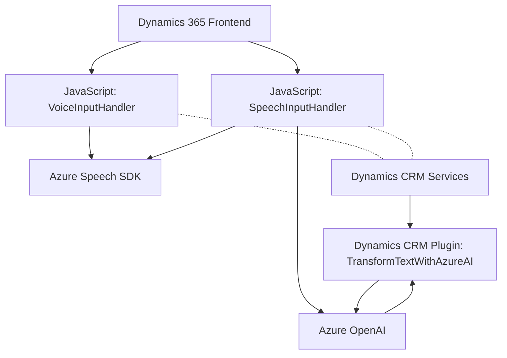

### Breve resumen técnico

El repositorio analizado contiene tres bloques principales relacionados con la integración de Dynamics 365, Azure Speech SDK, y Azure OpenAI. Cada archivo cumple con diferentes roles:
1. **Frontend (JS)**: Interactúa directamente con formularios de Dynamics 365 utilizando Azure Speech SDK para síntesis de voz (VoiceInputHandler.js) y reconocimiento de voz (SpeechInputHandler.js).
2. **Backend Plugin (C#)**: Un plugin de Dynamics CRM (_TransformTextWithAzureAI.cs_) invoca a Azure OpenAI para procesar texto con reglas específicas y proporciona una respuesta estructurada en formato JSON al CRM.
3. **Dependencias Externas**: Integración con servicios como Azure Speech SDK y Azure OpenAI mediante API RESTful.

---

### Descripción de arquitectura

La solución utiliza un enfoque **modular**, delegando la lógica de procesamiento de voz y texto a herramientas externas (Azure SDKs y APIs). El frontend opera como un cliente "ligero" que encapsula lógica de negocio específica para la interfaz de Dynamics 365. El backend utiliza un **plugin-based architecture**, típica de Dynamics CRM.

En términos de arquitectura general:
- **Arquitectura de capas**:
  - **Presentación (Frontend)**: Operaciones relacionadas con los formularios de Dynamics 365.
  - **Lógica de Negocio (Backend Plugin)**: Transformaciones avanzadas mediante Azure OpenAI.
  - **Integración de servicios (Externo)**: Usando Azure Speech SDK y Azure OpenAI.
- Además, emplea patrones como **Thin Client**, **Modularización**, y **API Gateway** para delegar tareas complejas a servicios externos.

---

### Tecnologías usadas

**Frontend**:
- JavaScript.
- Azure Speech SDK: Procesamiento de síntesis y reconocimiento de voz.
- Dynamics 365 Web API: Para manipulación de datos y contexto del formulario.

**Backend Plugin**:
- C#.
- Microsoft Dynamics SDK (`Microsoft.Xrm.Sdk`): Extensiones para entidades y ejecución.
- Azure OpenAI REST API: Procesamiento de texto con IA.
- Newtonsoft.Json: Serialización/deserialización JSON.
- System.Net.Http: Llamadas HTTP al servicio Azure OpenAI.

---

### Dependencias o componentes externos

1. **Azure Speech SDK**:
   - Para sintetizar voz o interpretar entradas habladas en el frontend.

2. **Azure OpenAI**:
   - Para transformación de texto avanzado. Es invocado por el plugin en el backend.

3. **Dynamics 365 Web API**:
   - Llaves y contexto directo para manipular formularios y datos organizacionales.

4. **Complementos dinámicos**: Uso de _Newtonsoft.Json_ para trabajar con respuestas en JSON.

---

### Diagrama Mermaid válido para GitHub

---

### Conclusión final

La solución presentada combina tecnología de frontend, plugins de Dynamics CRM, y servicios líderes como Azure Speech SDK y Azure OpenAI para procesar voz y texto. La arquitectura está diseñada para ser modular y seguir un flujo de capas (Presentación - Lógica de Negocio - Integración de Servicios), destacando un enfoque moderno basado en microservicios y APIs externas. Es ideal para un entorno corporativo donde una plataforma CRM como Dynamics 365 necesita integrar capacidades avanzadas de IA y voz para mejorar las interacciones con usuarios finales.