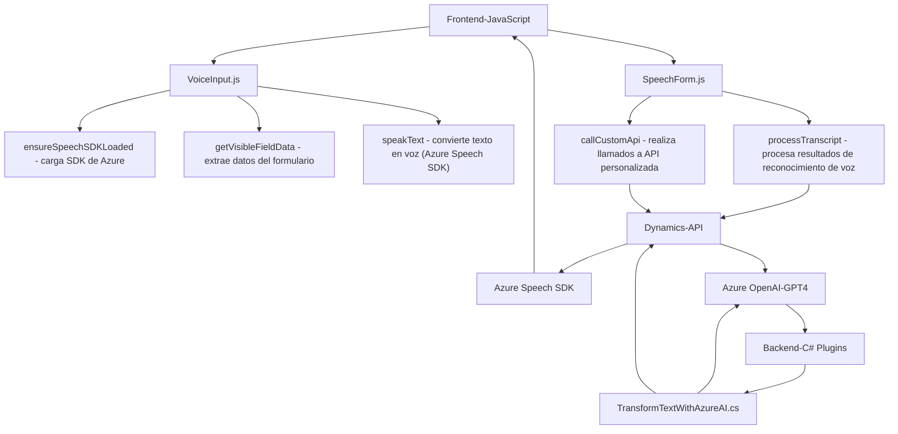

### Breve resumen técnico

El repositorio es una solución que integra **Azure Speech SDK**, **Azure OpenAI**, y **Microsoft Dynamics 365 CRM** para crear una interacción avanzada con formularios mediante comandos de voz. Incluye funcionalidad para síntesis de voz, reconocimiento de entrada por voz, y procesamiento de texto con IA. Está estructurado en componentes de frontend en JavaScript y plugins en C#, junto con integración en APIs de Dynamics 365.

---

### Descripción de la arquitectura

La solución tiene una **arquitectura híbrida** basada en:
1. **Micro-Funcionalidades**: Con la arquitectura del frontend altamente modular dividido en varias funciones enfocadas en la transformación de datos y la interacción entre el cliente y servicios externos.
2. **Plugin de Dynamics 365**: Este sigue el patrón **Responsabilidad única** enfocado en procesar entradas mediante Azure OpenAI y devolver salidas estructuradas, sirviendo como un componente de backend en el entorno de Dynamics CRM.
3. **N-Capas**: La arquitectura completa puede clasificarse como de 3 capas:
   - **Presentación (Frontend)**: Usa JavaScript para capturar y transcribir texto, junto con interacción directa mediante Voice Inputs.
   - **Lógica del dominio (Plugins)**: A través de C# se implementan transformaciones mediante Azure OpenAI.
   - **Persistencia/API (Dynamics 365)**: La solución interactúa con Microsoft Dataverse y APIs específicas del entorno CRM.

---

### Tecnologías empleadas y patrones

#### Tecnologías y frameworks:
- **Frontend**:
  - **JavaScript**: Para captura y procesamiento de inputs en los formularios.
  - **Azure Speech SDK**: Para síntesis y reconocimiento de voz.
  - **Dynamics 365 Web API**: Usada para interactuar con CRM.
  
- **Backend**:
  - **Azure OpenAI Service**: Basado en modelos GPT (como GPT-4) para la generación y transformación de texto.
  - **Dynamics 365 Plugins (C#)**: Utiliza Microsoft Xrm SDK para comunicaciones con el CRM.
  - **.NET Framework**: Para construir componentes extensibles en un entorno Dynamics CRM.

#### Patrones:
1. **Modularidad funcional**:
   - Cada funcionalidad en los módulos de JavaScript tiene una responsabilidad específica (e.g., el reconocimiento de voz, extracción de valores visibles, síntesis y audio).
2. **Factory method (plugin)**:
   - Configuración dinámica del prompt en Azure OpenAI para adaptarse a las necesidades del usuario y generar respuestas específicas.
3. **API Gateway**:
   - Implementación de un proxy (plugins, APIs internas del CRM) para interactuar con Azure APIs (Speech y OpenAI).
4. **Capa de integración**:
   - Módulos que conectan las entradas de voz (frontend) con la lógica backend o la base de datos de CRM.

---

### Dependencias y componentes externos

1. **Azure Speech SDK (JavaScript)**:
   - Funcionalidades: síntesis de voz, reconocimiento de voz y reproducción de audio.
   
2. **Azure OpenAI Service (C#)**:
   - Integra el modelo GPT para personalizar transformaciones textuales según reglas.
   - Requiere claves privadas y configuración de región para el acceso.
   
3. **Dynamics 365 Plugins**:
   - Extensiones nativas (`TransformTextWithAzureAI.cs`) personalizadas para interacción y lógica con el entorno CRM.

4. **Dynamics 365 APIs**:
   - APIs base para consultas CRUD en Microsoft Dataverse.
   - Soporte para campos relacionados (como búsquedas o atributos).

5. **Bibliotecas internas y core del lenguaje**:
   - **Newtonsoft.Json** para manipulación de JSON estructurados.
   - `System.Net.Http` para enviar peticiones a APIs externas.

---

### Diagrama Mermaid válido para GitHub

---

### Conclusión final

Este repositorio representa una solución integral para integrar reconocimiento de voz, accesibilidad y procesamiento con IA en una plataforma como Dynamics 365. Su arquitectura modular y las tecnologías como Azure Speech y OpenAI permiten un flujo dinámico y eficiente para trabajar con formularios en entornos CRM. Sin embargo, se recomienda fortalecer aspectos de seguridad en el manejo de credenciales y mejorar la tolerancia frente a fallos en la comunicación con servicios externos.