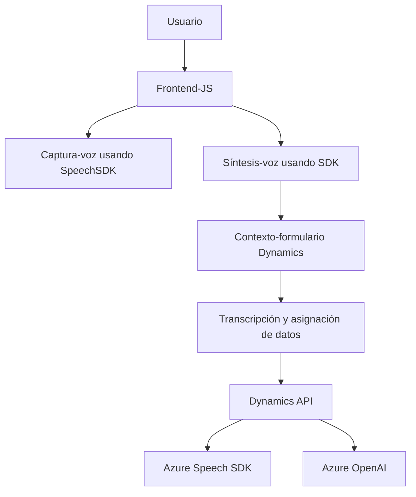

### Breve resumen técnico:
El repositorio contiene tres archivos principales que implementan una integración dinámica entre formularios web, captura y síntesis de voz, y procesamiento avanzado de texto con servicios de Microsoft Dynamics 365, Azure Speech SDK y Azure OpenAI. Los módulos interactúan con formularios en tiempo real, procesan datos transcritos mediante voz, transforman texto con inteligencia artificial, y aplican valores en campos del formulario en un contexto CRM.

---

### Descripción de arquitectura:
La solución se organiza en capas especializadas:
1. **Frontend (JavaScript)**: Controla el formulario y la interacción de usuario con captura de voz y síntesis.
2. **Backend/plugin para Dynamics 365 (.NET)**: Ejecuta lógica avanzada aprovechando servicios de Azure OpenAI directamente dentro del ecosistema Dynamics.
3. **Servicios externos**:
   - Azure Speech SDK para la síntesis y reconocimiento de voz.
   - Azure OpenAI para la transformación de texto mediante inteligencia artificial.
   - APIs de Dynamics 365 para operar sobre el modelo de datos.
   
La arquitectura utiliza elementos de **integración orientada a eventos**, **microservicios SaaS**, y **servicios de datos distribuidos**, adaptándose a entornos altamente integrados como Dynamics 365 y Azure.

---

### Tecnologías usadas:
1. **Frontend**:
   - JavaScript (modular, orientado a eventos).
   - Azure Speech SDK.
   - Dynamics 365 framework (para manipulación de formularios).
2. **Backend/plugin**:
   - .NET Framework (librerías de Dynamics SDK y funciones propias).
   - Microsoft Azure OpenAI.
   - APIs internas de Dynamics para registros, entidades y datos relacionados.
3. **Patrones**:
   - Modularidad y separación de responsabilidades.
   - **Facade** para encapsular operaciones de APIs.
   - Eventos para controlar flujos asincrónicos (internos en frontend/backend con los SDK).
   - Dependency Injection a través de Dynamics 365 plugin API.
4. **Infraestructura**:
   - Dynamics 365 SaaS.
   - Azure PaaS para reconocimiento de voz (Speech SDK) y procesamiento de texto avanzado.

---

### Diagrama Mermaid (para GitHub Markdown):

---

### Conclusión final:
La solución está diseñada como una arquitectura **orientada a servicio SaaS**, integrada en el ecosistema Dynamics 365 con soporte para captura y síntesis de voz, así como procesamiento IA con Azure OpenAI. El frontend controla la interacción del usuario, mientras que el backend ejecuta lógica avanzada mediante plugins. Las dependencias incluyen SDKs externos (Azure Speech y OpenAI) y APIs internas para manejar flujos de datos distribuidos.

Aunque modular y funcional, hay áreas de mejora como la configuración de credenciales de API en servicios seguros (e.g., Key Vault). En general, la arquitectura garantiza una integración sólida, adaptable y escalable para entornos Dynamic CRM con soporte para procesamiento de voz y texto inteligente.