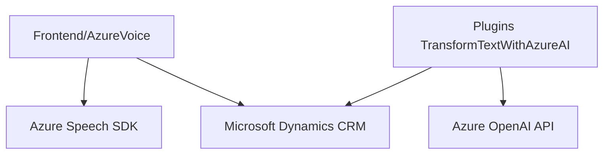

**Breve Resumen Técnico:**

El repositorio presenta soluciones que integran funcionalidades de reconocimiento y síntesis de voz mediante el Azure Speech SDK, así como procesamiento avanzado de texto con Azure OpenAI dentro de un contexto de Microsoft Dynamics CRM. Los archivos están orientados al frontend JavaScript y al backend en .NET/C# con configuraciones específicas para la interacción entre APIs personalizadas y elementos del CRM.

---

### **Descripción de Arquitectura:**
La arquitectura general sigue un enfoque de integración en n capas:
1. **Capa de presentación**: Implementada en JavaScript para el frontend (interacción del usuario y grabación/transcripción/síntesis de voz).
2. **Capa de servicios**: Interacciones con Azure Speech SDK en el frontend y los plugins en el backend.
3. **Capa de negocio** (en plugins): Procesamiento con Azure OpenAI API para transformar texto bajo reglas específicas.
4. **Capa de datos**: Integración con Microsoft Dynamics CRM, que actúa como repositorio central de datos.

Los patrones implican una separación clara de responsabilidades entre frontend (procesamiento inicial) y backend (procesamiento profundo en el contexto del CRM), promoviendo modularidad.

---

### **Tecnologías Usadas:**
1. **Frontend**:
   - **JavaScript**: Lógica modular y eventos para síntesis y reconocimiento de voz.
   - **Azure Speech SDK**: Para procesamiento de voz (grabación y síntesis).
   - **Promise/Callbacks Asíncronos**: Para manejo de recursos dinámicos.
   - **DOM API**: Manipulación de script dinámico.

2. **Backend**:
   - **C# (.NET Framework)**: Implementación del plugin para el CRM.
   - **Microsoft.Xrm.Sdk**: API estándar para trabajar en Dynamics CRM.
   - **Azure OpenAI API**: Modelos GPT para procesamiento avanzado de texto.
   - **Newtonsoft.Json** y **System.Text.Json**: Serialización y deserialización de JSON.
   - **System.Net.Http**: Para llamadas HTTP.

---

### **Diagrama Mermaid:**

---

### **Conclusión Final:**

La solución descrita utiliza una arquitectura **n capas** adecuada para integrar tecnologías modernas con un sistema corporativo como Dynamics CRM. El uso de servicios externos (Azure Speech SDK y Azure OpenAI API) asegura capacidades avanzadas para reconocimiento y síntesis de voz, junto con el procesamiento robusto de texto basado en IA. 

Este enfoque modular facilita la escalabilidad y el mantenimiento, permitiendo extender la funcionalidad tanto en el frontend como en el backend. Las tecnologías empleadas están alineadas con estándares modernos y aceleran el desarrollo de aplicaciones integradas y personalizadas.