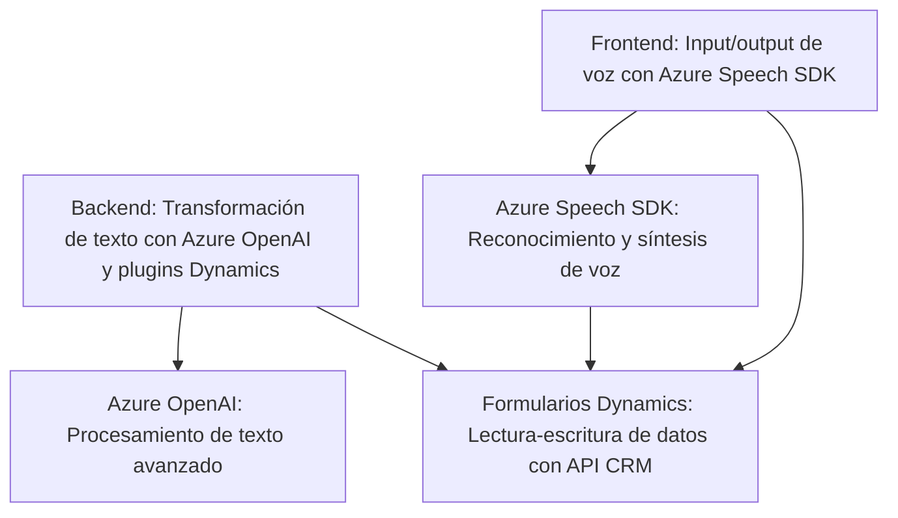

### Breve resumen técnico
El repositorio contiene código que interactúa estrechamente con formularios de Dynamics CRM para funcionalidades de entrada y salida por voz, procesamiento avanzado de texto con IA (Azure OpenAI), y manipulación de datos en contextos dinámicos. Este sistema integra varias tecnologías externas como Azure Speech SDK, Dynamics CRM API, y Azure OpenAI para llevar a cabo tareas específicas en un entorno empresarial.

### Descripción de arquitectura
La solución presenta una arquitectura basada en componentes especializados que funcionan de manera interdependiente pero autónoma, es decir, cada módulo está diseñado para tareas específicas: entrada de voz (speech input), síntesis de voz (speech synthesis), y transformación de texto con reglas o IA. Es una arquitectura de **n capas** que integra SDKs externos y APIs mediante patrones comunes como modularización, separación de responsabilidades, y delegación asíncrona, donde los datos fluye desde el frontend hasta los plugins.

---

### Tecnologías usadas
1. **Frontend:**
   - JavaScript para manejar entrada/salida por voz y manipular formularios.
   - Azure Speech SDK para reconocimiento y síntesis de voz.
   - Microsoft Dynamics CRM para interacción contextual con formularios.

2. **Backend/plugins:**
   - C# en Dynamics CRM para extender funcionalidades con plugins.
   - Azure OpenAI (GPT-4 específico) para procesamiento de texto con IA.
   - REST APIs: Realización de solicitudes HTTP hacia servicios externos.

---

### Dependencias o componentes externos presentados
1. **Azure Speech SDK:** Usado para reconocimiento y síntesis de voz.
2. **Azure OpenAI:** Modelo GPT-4 usado para transformar texto y generar JSON estructurados.
3. **Microsoft Dynamics CRM:** APIs y contexto de formulario para manipulación de datos en aplicaciones empresariales.
4. **Librerías de procesamiento JSON:** `Newtonsoft.Json`, `System.Text.Json`.

---

### Diagrama Mermaid 100 % compatible con GitHub Markdown

### Conclusión final
La solución implementa una arquitectura **n capas** centrada en la interacción dinámica entre frontend, backend, APIs externas y formularios en Dynamics CRM. Ofrece un flujo eficiente para manejar entrada/salida por voz, procesamiento de texto con IA, y manipulación automatizada de datos en un marco empresarial. Las buenas prácticas como la separación de responsabilidades a nivel de función y modularización aseguran un diseño extensible, aunque su dependencia de servicios externos como Azure debe manejarse cuidadosamente desde el punto de vista de la robustez y disponibilidad.