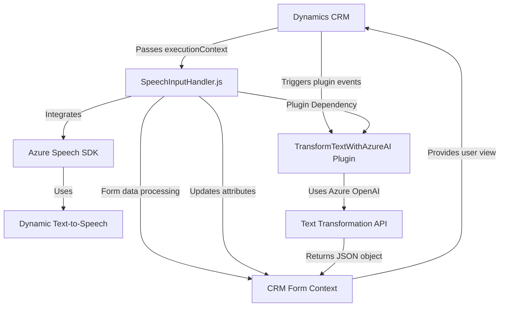

### Breve resumen técnico

El repositorio contiene componentes de una solución tecnológica que integra sistemas externos —Azure Speech SDK y Azure OpenAI— en un formulario de Dynamics 365 CRM. Los scripts proporcionan funcionalidades de interacción por voz (reconocimiento y síntesis de voz) y transformación de datos (mediante IA de OpenAI). El código está distribuido en archivos que trabajan juntos para enriquecer la experiencia de usuario mediante interfaces modernas, procesamiento de lenguaje natural y generación de estructuras dinámicas.

---

### Descripción de arquitectura

1. **Tipo de solución**  
   La solución es un híbrido orientado al desarrollo de una **API dinámica**, con un respaldo de inteligencia artificial, y un **frontend personalizado** basado en formularios de Dynamics 365 CRM. Puede clasificarse como una solución extendida para una plataforma CRM, habilitando interacción por voz y transformación de datos mediante plugins y scripts frontend.

2. **Tecnologías, frameworks y patrones usados**  
   - **Tecnologías:**  
     - Azure Speech SDK para reconocimiento y síntesis de voz.  
     - Azure OpenAI para transformación de texto mediante GPT-4.  
     - Dynamics 365 CRM para la gestión de datos y eventos.  
   - **Frameworks y librerías:**  
     - JavaScript (frontend y SDK de Azure).  
     - Microsoft.Xrm.Sdk (interacción con Dynamics CRM en backend).  
     - Newtonsoft.Json y System.Text.Json (manejo de JSON en el plugin de C#).  
   - **Patrones:**  
     - **Asynchronous Programming:** Extensivo uso de async/await y promesas.  
     - **Facade Pattern:** Abstracción mediante funciones que encapsulan SDKs y APIs externas.  
     - **MVC-like:** Partición de datos de la vista (formulario Dynamics) y lógica de control (en plugins y scripts).  
     - **Callback pattern:** Manejo asíncrono de dependencias como el SDK de Azure Speech.

3. **Arquitectura**  
   Este repositorio sigue un **n capas**:  
   - **Presentación:** Scripts en JavaScript para interacción con formularios (Frontend).  
   - **Lógica de negocio:** Plugins en C# que procesan eventos y datos en el CRM.  
   - **Acceso a datos:** Integración con APIs externas y servicios de Azure (Speech SDK, OpenAI, Dynamics Web API).  
   La solución se basa en la extensión modular del ecosistema Dynamics 365 usando arquitectura de **plugin en eventos**.

4. **Dependencias o componentes externos**  
   - **Azure Speech SDK:** Para convertir texto en voz y realizar reconocimiento de voz.  
   - **Azure OpenAI API:** GPT-4 en Azure para transformar texto.  
   - **Frameworks de Dynamics CRM:** Microsoft.Xrm.Sdk para desarrollo de plugins backend.  
   - **Script SDK:** URL: `https://aka.ms/csspeech/jsbrowserpackageraw`, para integraciones en frontend.  
   - **JSON libraries:** Newtonsoft.Json para deserialización y manejo de respuesta.

---

### Diagrama Mermaid válido para GitHub

---

### Conclusión final

La solución es una ampliación modular para Dynamics 365 CRM, introduciendo capacidades avanzadas de interacción basada en voz y transformación de texto mediante inteligencia artificial. Se compone de **scripts frontend en JavaScript** que proporcionan funcionalidad inmediata en formularios, y **plugins backend en C#** que extienden la lógica del CRM. La arquitectura está estructurada en capas (**n capas**) y aprovecha servicios externos de Azure (Speech SDK y OpenAI) para implementar funciones como reconocimiento de voz, síntesis de texto a voz, y transformación dinámica de datos. Es adecuada para entornos empresariales que buscan automatización integrándose con IA avanzada en experiencias CRM centradas en el usuario.