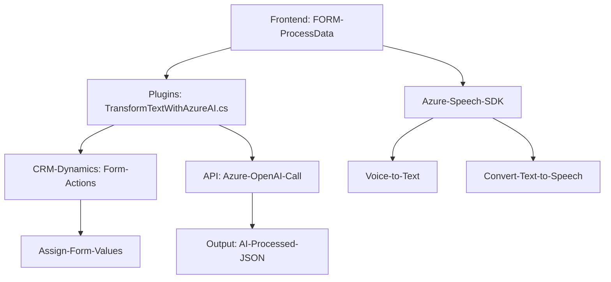

## Breve resumen técnico
El proyecto parece ser una integración entre un frontend basado en JavaScript y un plugin de Dynamics CRM, ambos trabajando en conjunto con tecnologías de reconocimiento de voz y procesamiento de texto mediante servicios en la nube como Azure Speech SDK y Azure OpenAI API. El propósito del sistema parece ser facilitar la interacción con formularios mediante voz y utilizar inteligencia artificial para transformar texto en una estructura JSON estándar.

---

## Descripción de arquitectura
La arquitectura de esta solución puede clasificarse como una de **n capas**, aunque existen elementos de integración que lo acercan a un enfoque de **arquitectura hexagonal**. Las capas principales serían:
1. **Capa de Presentación (Frontend/JS)** que interactúa directamente con los usuarios para recibir información, usando voz y formularios.
2. **Capa de Servicios Externos** para delegar procesos a Azure Speech SDK y Azure OpenAI API (en la nube).
3. **Capa de Aplicación (Plugins)** que actúa como mediador y procesa las solicitudes mediante lógica empresarial para integrarlas con el sistema Dynamics CRM.

El uso del SDK y la definición de un plugin en Dynamics CRM para ejecutar la lógica de negocio reflejan una clara orientación hacia la modularización y separación de responsabilidades. Sin embargo, existe una dependencia fuerte en un tercer sistema (Azure), lo cual podría limitar la flexibilidad si no se gestionan adecuadamente las conexiones a servicios externos.

---

## Tecnologías usadas
1. **Frontend (JavaScript)**: 
   - Procesamiento del DOM de formularios.
   - Azure Speech SDK para reconocimiento y síntesis de voz.
   - Funciones utilitarias para manejo de datos del formulario.
   
2. **Backend (C#)**:
   - Microsoft Dynamics CRM SDK para manipulación de datos en el sistema CRM.
   - Azure OpenAI API para procesamiento del texto transcrito por el reconocimiento de voz.
   - Uso de `Newtonsoft.Json` y `System.Text.Json` para manejar estructuras en formatos JSON.

---

## Diagrama Mermaid válido para GitHub

---

## Conclusión final
La solución presentada tiene un propósito específico: mejorar las capacidades de procesamiento de entrada de voz y la transformación del texto resultante en datos estructurados para su uso en un sistema de gestión empresarial (Dynamics CRM). Utiliza servicios en la nube de Azure para el reconocimiento de voz (Azure Speech SDK) y procesamiento de lenguaje natural (Azure OpenAI API). Su arquitectura, centrada en un diseño modular y separado por capas, aporta claridad y permite futuras extensiones.

Puntos de mejora:
1. **Configurabilidad:** Evitar valores estáticos como la clave del Azure Speech SDK y otras configuraciones, proporcionando opciones de configuración dinámica y segura.
2. **Manejo de errores:** El manejo básico de errores podría robustecerse e incluir registros sistemáticos más allá de los simples `alert` y `console.error` en el frontend.
3. **Seguridad:** Como se utiliza una API crítica (Azure OpenAI), asegurar que las credenciales y claves están protegidas mediante mecanismos como el almacenamiento seguro y políticas de acceso adecuadas.