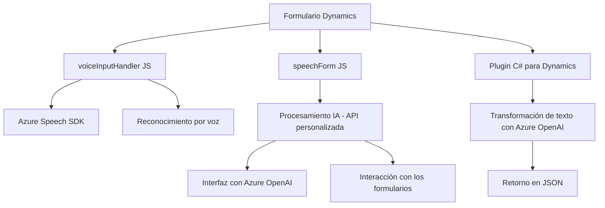

### Análisis y explicación técnica

#### **1. Tipo de solución**
Este repositorio parece contener partes de una solución empresarial que incluye una combinación de frontend interactivo (basado en JavaScript) y backend conectado a Dynamics CRM. Es una solución híbrida con las siguientes características:
- **Frontend:** Funcionalidades en JavaScript para interacción avanzada a través de reconocimiento de voz y síntesis de texto.
- **Backend:** Plugins en C# diseñados para extender la funcionalidad de Dynamics CRM, integrando servicios como Azure OpenAI.

En este caso, podemos clasificarlo como una solución que incluye:
- **Frontend interactivo para formularios de entrada de datos.**
- **Backend integrado como extensiones (plugins) de Dynamics CRM.**
- **Microservicios en forma de APIs externas (Azure Speech SDK y Azure OpenAI).**

#### **2. Tecnologías, frameworks y patrones**
**Frontend:**
- **Tecnologías y frameworks:** JavaScript, gestión dinámica de dependencias (SDK externo cargado dinámicamente).
- **Patrones:** 
  - Modularización (funciones con responsabilidades específicas como `ensureSpeechSDKLoaded`).
  - Integración con SDK externo (Azure Speech SDK).
  - Event-driven programming (callbacks para la carga del SDK).
  - Factory Method (instanciación de objetos del tipo `SpeechConfig`, `AudioConfig`).

**Backend:**
- **Tecnologías y frameworks:** 
  - `Microsoft.Xrm.Sdk` para integración con Dynamics CRM.
  - `Newtonsoft.Json` para manejo de JSON.
  - `System.Net.Http` y `System.Net.Http.Headers` para interacción con APIs externas.
- **Patrones:**
  - **Plugin architecture** para extender funciones de Dynamics CRM.
  - **Service abstraction** usando `IServiceProvider`.
  - **Static helper pattern** para separar lógica auxiliar (`GetOpenAIResponse`).
  - RESTful API communication (interacción con Azure OpenAI).
  
#### **3. Tipo de arquitectura**
La arquitectura general parece ser una combinación de:
- **N-tier architecture**:
  - División lógica entre la capa de presentación (JS para interactuar con los datos en formularios), la capa de negocio (plugins en C#) y las APIs externas.
- **Integración por microservicios**:
  - Azure Speech SDK y Azure OpenAI funcionan como componentes externos con funcionalidades bien delimitadas.
- **Plugin-based architecture**:
  - Uso de plugins para integrar funciones específicas en Dynamics CRM, permitiendo la extensión del sistema base.

#### **4. Dependencias o componentes externos**
- **Azure Speech SDK:** Para síntesis y reconocimiento de voz.
- **Azure OpenAI (GPT-4):** Para procesamiento avanzado de texto e interpretación basada en IA.
- **Dynamics WebAPI:** Funciones internas de Dynamics CRM para búsquedas y modificaciones en formularios.
- **Otros paquetes:**
  - `Newtonsoft.Json` para JSON en el backend.
  - `System.Net.Http` para comunicación REST.

#### **5. Diagrama Mermaid**

#### **Conclusión Final**
La solución está compuesta por un conjunto de módulos bien organizados que interactúan con servicios externos para habilitar funcionalidades basadas en voz y procesamiento de IA. Presenta una arquitectura híbrida entre capas y microservicios, integrando potentes SDKs y APIs de Azure para ejecutar tareas específicas. Además, el uso de plugins permite que las extensiones sean eficaces en un sistema existente como Dynamics CRM, conservando modularidad y escalabilidad.